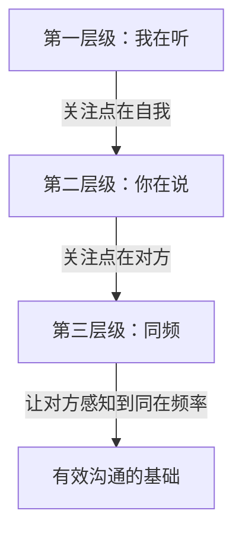

# 第01课：学会倾听与独立思考

## Learning Objectives

- 掌握倾听的三个层级，理解"同频"才是最高级的倾听
- 学会"模仿且灵活"的五字套路：下巴模仿、语言模仿、缩微化模仿
- 识别独立思考的两大陷阱：定义命物与忽略可能性的原因

## Core Idea

表达永远是双向的过程：你得先让别人感受到你在认真听他说话，他才会认真对待你接下来要说的话。

> [!TIP] Key Insight
> 倾听是一项技能，而不是竖起耳朵一言不发。真正的倾听，是要让对方感知到你们在同一个频率上。

### 倾听的三个层级



| 层级 | 名称 | 特征 | 问题 |
|------|------|------|------|
| 第一级 | 我在听 | 以自我为中心，脑子在想"我要说什么""怎么反驳" | 听着听着只能听见自己内心的声音 |
| 第二级 | 你在说 | 关注点在对方，能觉察对方说话的重点、情感 | 自己觉察到了，但对方并不一定感知到 |
| 第三级 | 同频 | 让对方感知到你在听，进入同一频率 | 需要"模仿且灵活"的套路来实现 |

### 倾听的核心套路：模仿且灵活

基于NLP（神经语言程序学），核心宗旨是：**有意的、灵活的模仿对方**。

#### 1. 下巴模仿

每个人说话时会伴随节奏和内容，下巴时而上扬、时而内收、时而偏左、时而偏右。模仿对方的下巴动作 -- 这是最容易看出动向的地方。

#### 2. 语言模仿

重复对方的**最后一句话**，不延伸、不提炼、不总结。

**示例**：客户王总把玩新得的茶壶说"这个茶壶真是绝了"

- 错误回应A：急于表现见识 -- "我认识一位大师也很厉害"（让对方感觉被反驳）
- 错误回应B：老实回答 -- "这方面我不懂"（话题立刻终止）
- **正确回应：语言模仿** -- "对呀，真绝了"

> [!WARNING] 注意事项
> 只需要重复对方想表达的意思，千万不要自己延展和提炼。因为当你还是新手时，延展的风险很大 -- 对方下一步可能抛出与你延展方向相反的内容，让你陷入尴尬。

#### 3. 灵活（缩微化模仿）

所有肢体动作都要模仿，但全部模仿会显得假。因此需要**缩微化** -- 缩小对方的动作幅度。

| 对方动作 | 你的缩微化模仿 |
|----------|----------------|
| 双手交叉抱胸 | 双手交叉放在桌子上 |
| 双手插腰 | 一手撑着腰 |
| 翘二郎腿、身体后靠、双手搭沙发背 | 双脚交叉、身体微靠、双手微摊撑在两边 |

> [!TIP]
> 这些细微的动作能在对方没有觉察的情况下，悄悄拉近心理距离。这是一种"收买对方潜意识"的行为。

### 独立思考的两个陷阱

#### 陷阱一：定义命物

习惯性地给事物画等号，把A直接等同于B。

```
例1："小王跟老大顶嘴" → 定义命物 → "目中无人、自大"
例2："小王在酒吧被骂不敢还嘴" → 定义命物 → "不是男人"
```

**问题**：明明想说的是A，最后却表达成了B。精准表达者不仅要独立思考，还应该是智者 -- 谣言止于智者。

#### 陷阱二：忽略可能性的原因

以"学区房调查"为例：数据显示住学区房的孩子平均成绩更高。


**可能的替代原因**：买学区房的父母本身就更重视孩子的学习，他们会在家庭中营造学习氛围，这才是孩子成绩好的真正原因，而不是"学区房"这个物理位置本身。

## Worked Example

**场景**：你是销售人员，去拜访客户王总。王总正在把玩新买的茶壶，对你说"这个茶壶真是绝了"。

**应用"模仿且灵活"**：

1. **下巴模仿**：随着王总说话的节奏，自然模仿其下巴动作
2. **语言模仿**："对呀，真绝了"（重复最后一句话）
3. **缩微化模仿**：如果王总身体后靠双手摊开，你也微调身体向后靠，双手微摊

王总接着说"不知道为什么现代人都烧不出这么细腻的茶壶" -- 继续模仿："确实是啊，现在很少见过这么细腻的感觉了。"

通过这样的互动，王总会潜意识中感觉与你"同频"，沟通就会顺畅自然。

## Practice

> [!QUESTION] Self-check
> 想一想：有人说"喝红酒有助于延年益寿"，因为有调查显示长期适量喝红酒的人平均寿命比不喝红酒的人长。这其中是否忽略了可能性的原因？

<details>
<summary>Reveal answer</summary>

可能的替代原因分析：

- 长期喝红酒的人，通常属于有一定经济实力、生活品质较高的人群
- 这类人群往往更注重健康管理、定期体检、医疗条件更好
- 可能存在"健康生活方式"的整体效应，而非红酒本身的作用

这正印证了独立思考的重要性：有数据有样本不一定等于因果关系。
</details>

## Next Step

继续学习 [[0002-san-duan-wei|第02课：从业余到高手的三段位]]