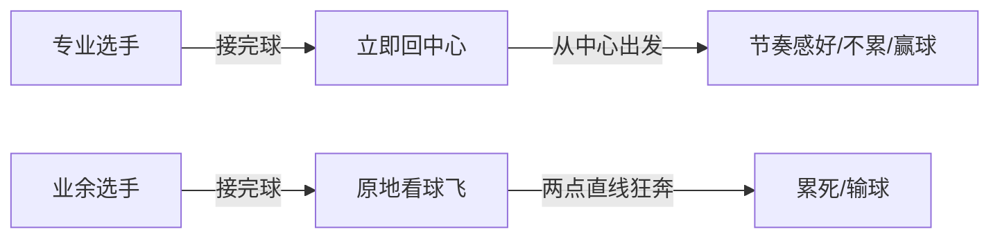
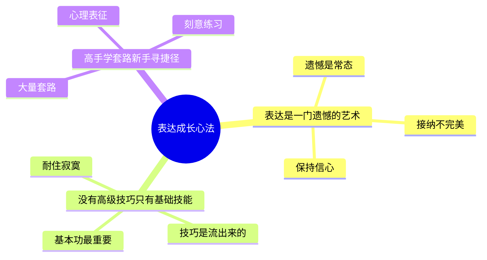

# 第02课：从业余到高手的三段位

## Learning Objectives

- 理解表达成长的三个必经阶段：好奇、孤独、刻意练习
- 掌握三句表达心法，在成长各阶段调节心态
- 区分"回中心"式的基础技能与花哨技巧，建立正确的练习观
- 理解心理表征的概念，认识套路（模型）对成为高手的关键作用

## Core Idea

练习，练习直到你忘记它 -- 只有忘掉它，这项技能才会长在你身上。

### 从业余到高手的三个必经阶段

| 阶段 | 本质 | 关键 |
|------|------|------|
| **好奇阶段** | 萌发持续兴趣，逐步构建信心 | 第一个老师的有趣程度决定孩子会不会爱上这件事 |
| **孤独阶段** | 忍受枯燥练习 | 一个人独自练习的时间长短与能否成为大师正相关 |
| **刻意练习阶段** | 掌握正确方法+有目的练习 | 一万小时只是熟练工，善用模型才有机会蜕变 |

### 三句表达心法

这三句话分别对应以上三个成长阶段，在每一个最难熬的时刻提供内在动力。

#### 心法一：表达是一门遗憾的艺术

> 对应**好奇阶段** -- 保护信心，让遗憾成为进步的开始

每次表达后（一对一或一对多），你总会懊恼：刚刚那个地方其实可以说得更好、刚刚应该这样转折、吵架时怼得不够精准。

> [!TIP] Key Insight
> 表达之后的遗憾是常态。不要因为事后遗憾而失去信心，每一次觉察到的遗憾，正是一次进步的开始。

#### 心法二：没有高级的技巧，只有基础的技能

> 对应**孤独阶段** -- 耐住寂寞，练好基本功

**业余选手 vs 职业选手的核心区别**：

职业选手往往把最基础的技能练到了炉火纯青，而业余选手在技能还不夯实的时候就总想学一些看似高级的技巧。

**羽毛球"回中心"的类比**：

> [!NOTE]
> "回中心"是最基础的技能。把它练到长在脑子里、成为本能，就已经向高手迈进了一步。技巧不是学来的，是基础技能练到炉火纯青时**流**出来的。

回到表达：你听到别人好的观点拿来传播（一葫芦画瓢），这只是初级阶段。要晋升为表达高手，更重要的是学会**提炼自己的好观点** -- 这是基础技能。

#### 心法三：高手都在学习套路，新手总想寻找捷径

> 对应**刻意练习阶段** -- 用套路替代天真的练习

**刻意练习公式**：大量套路 + 有意为之 + 及时反馈

**象棋大师实验**（《刻意练习》中的经典）：

| 实验条件 | 象棋大师 | 新手 |
|----------|----------|------|
| 看10盘符合棋法的棋局后还原 | 几乎全部还原 | 只能还原1-2盘 |
| 看10盘胡乱摆放的棋局后还原 | 成绩与新手差不多 | 成绩与大师差不多 |

**结论**：大师不是记忆力更好，而是心中存储了无数**心理表征**（套路）。他们不是一个个子记的，而是一盘盘记的。任何棋局的形式都已转化为他们心中的某种套路，看一眼就调用出来。

> [!TIP] Key Insight
> 外行看热闹，内行看门道。新手听演讲听到的是词藻华丽、故事吸引人、包袱抖得好；高手听的是整场演讲背后的结构、环环相扣的脉络、埋下伏笔到抽丝剥茧凸显主题的过程。

### 三句心法的综合作用

这三句话虽然不是具体方法，但可以帮助你在以下三方面调节得更好：

1. 遇到困难时做好心理建设
2. 看到简单套路时不急躁 -- 基础技能总是简单的，但一定要练到极致
3. 课后练习比听课更重要，刻意练习比天真练习更重要

## Worked Example

**场景**：你在部门会议上看到一位同事做了一次精彩的汇报，你非常羡慕。

**新手视角**：他讲的这个案例真生动、那张PPT图表真漂亮、这个笑话时机抓得好。

**高手视角**：他的汇报结构是"问题-原因-方案-预期结果"，每个部分之间有过渡承接；他在开头埋了一个伏笔，到结尾时才亮出来形成呼应 -- 这就是整场演讲背后的结构。

## Practice

> [!QUESTION] Self-check
> 回忆你最近一次听到的精彩演讲或汇报。以"高手视角"重新审视它：它的整体结构是什么？演讲者是如何环环相扣的？埋了什么伏笔？

Reveal answer

可以尝试从以下角度拆解：

- 开场用了什么方式吸引注意力（故事/数据/提问）？
- 主体部分有几个模块？模块之间用什么过渡？
- 结尾如何呼应开头？
- 有没有"埋包袱"之后"抖包袱"的设计？

试着把分析结果画成一张结构图，这就是在锻炼你"看棋局"而非"看棋子"的能力。

## Next Step

继续学习 [[0003-ti-lian-guan-dian|第03课：学会提炼观点]]