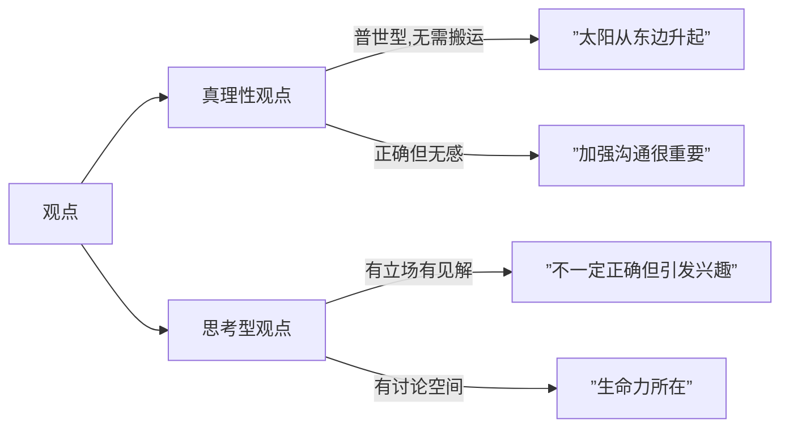
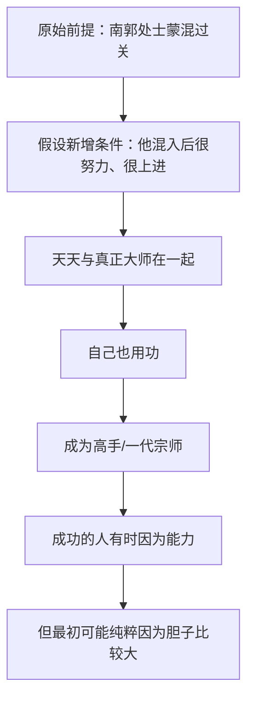
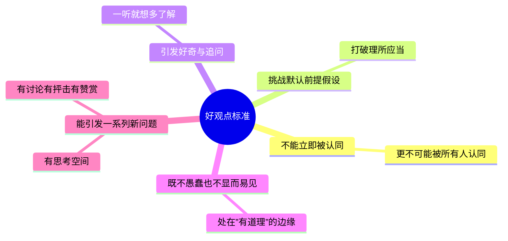

# 第03课：学会提炼观点

## Learning Objectives

- 区分真理性观点与思考型观点，理解观点是"立场+出发点+阶级利益"
- 放下追求观点完全正确的冲动，认识观点的生命力在于讨论和质疑
- 掌握提炼观点的三种方法：多立场分析、逆出发点分析、条件假设推理分析
- 记住好观点的五条标准，用于自检观点质量

## Core Idea

观点是表达的生命力发源地。有效的交流一定是双方观点碰撞、融合、再生的过程。但在工作当中，我们经常被迫扮演"滥竽充数"的角色 -- 轮到最后一个发言，能说的都被同事说完了。

### 什么是观点

**定义**：观点 = 立场 + 出发点 + 一定阶级利益

观点的两个核心类别：

| 类型 | 特点 | 听众反应 |
|------|------|----------|
| **真理性观点** | 正确的废话，普世型，没有人会不认同 | 内心默默吐槽"这还要你说" |
| **思考型观点** | 带有自己的立场和见解，不一定正确 | 引发兴趣、展开讨论、碰撞交流 |

> [!TIP] Key Insight
> **放下追求观点完全正确的冲动**。不要担心大家的讨论和质疑，观点就是用来讨论和质疑的，这才是它的生命力所在。

### 提炼观点的三种方法

使用经典典故"滥竽充数"作为案例：

> 齐宣王使人吹竽，必三百人。南郭处士请为王吹竽，宣王说之，廪食以数百人。宣王死，湣王立，好一一听之，处士逃。

#### 方法一：多立场分析

不默认站主人公（南郭处士）的角度，而是切换不同角色的立场。

| 立场 | 分析 | 可提炼的观点 |
|------|------|-------------|
| 南郭处士（常规） | 没有真才实学混进去，最终灰溜溜逃走 | 要有真本事，不能滥竽充数 |
| **国王的角度** | 机制漏洞让庸人有机可乘：群体演奏、责任共担、激励平均 | **管理当中要多质疑机制，少怀疑人** |
| 其他吹竽者的角度 | 身边混入一个不做事的人，他们是什么感受？ | （留白，自行思考） |

#### 方法二：逆出发点分析

把出发点的方向做一个逆反。通常认为滥竽充数是负面案例，如果反过来假设它是值得学习的呢？

| 逆向思考 | 分析 | 可提炼的观点 |
|----------|------|-------------|
| 南郭处士的行为有可取之处 | 善于寻找机会的缺口，捕捉到一段窗口机会的红利；进入和退出的判断精准、行动迅速 | **时代总在变化，不要试图占据全阶段的红利，懂得放弃和懂得把握同样重要** |

#### 方法三：条件假设推理分析

在原始前提的基础上增加新的假设条件，观察推理结果的变化。

> [!NOTE]
> 以上每个观点你都想反驳，但这恰恰是好事 -- 每个观点都让你有所启发。这正是思考型观点的价值所在。

### 好观点的五条标准

1. 一个好的观点，往往**不能立即被认同**，更不可能被所有人认同
2. 一个好的观点，往往**挑战着默认的前提假设**
3. 一个好的观点，你一听就想**多了解一些**，或者想问一些什么
4. 一个好的观点，往往**既不愚蠢，但也不会显而易见**
5. 一个好的观点，几乎可以**引发一系列新的问题**

> [!TIP]
> 罗振宇提出的"U盘化生存"（自带信息、即插即用）就是一个典型的思考型观点 -- 有人认同、有人抨击，这正是观点的生命力。

## Worked Example

**场景**：部门会议上，大家对新项目发表了意见，轮到最后一个发言的你，能说的都被说完了。

**应用提炼观点三法**（以"滥竽充数"为练习素材）：

| 方法 | 操作 | 产出观点 |
|------|------|----------|
| 多立场分析 | 站在国王（管理者）角度 | 管理当中要多质疑机制，少怀疑人 |
| 逆出发点分析 | 认为南郭处士的行为值得学习 | 懂得放弃和懂得把握同样重要 |
| 条件假设推理 | 假设南郭处士混入后很努力 | 成功的人最初可能纯粹因为胆子比较大 |

## Practice

> [!QUESTION] Self-check
> 选取一个你熟悉的成语故事或历史典故（如"守株待兔""刻舟求剑"），尝试用三种方法各提炼一个独特的观点：

Reveal answer

以"守株待兔"为例的参考思路：

- **多立场分析**（站在兔子的角度）：幸运不会永远降临在同一个地方，但不幸往往重复发生 -- 一只兔子撞死在同一个树桩上，说明这片树林可能存在问题
- **逆出发点分析**：宋人的"等待"并非全无价值 -- 专注等待本身就是一种策略，问题在于他放弃了其他所有可能
- **条件假设推理**（假设他边等边学习）：如果他在等待的同时不断学习提升自己，那"守株"就是一段修行的过程，最终即使没有兔子，他也已经成长为更好的人

## Next Step

继续学习 [[0004-shu-xue-si-wei|第04课：巧用数学思维]]