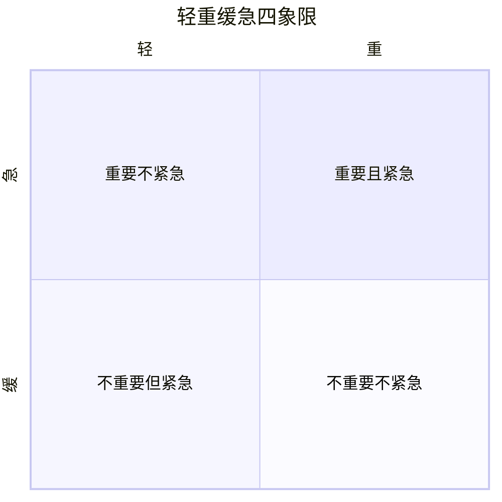
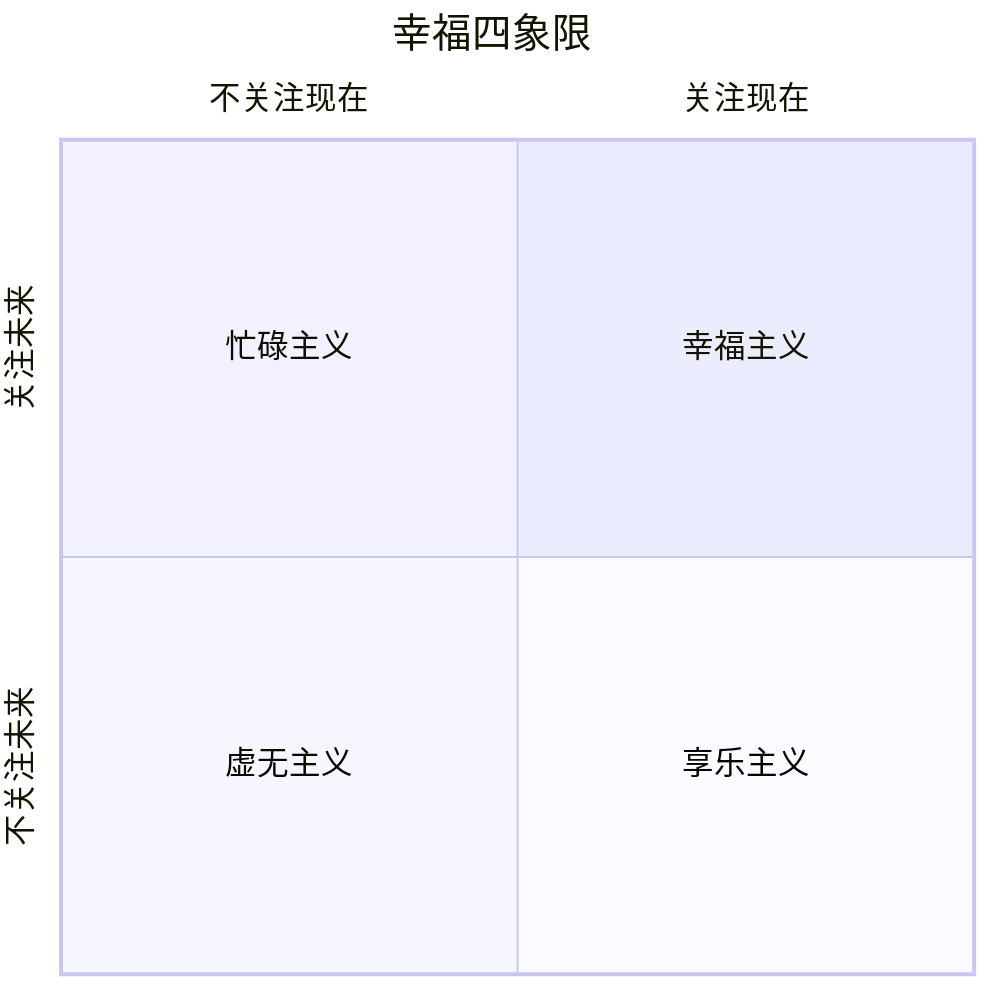
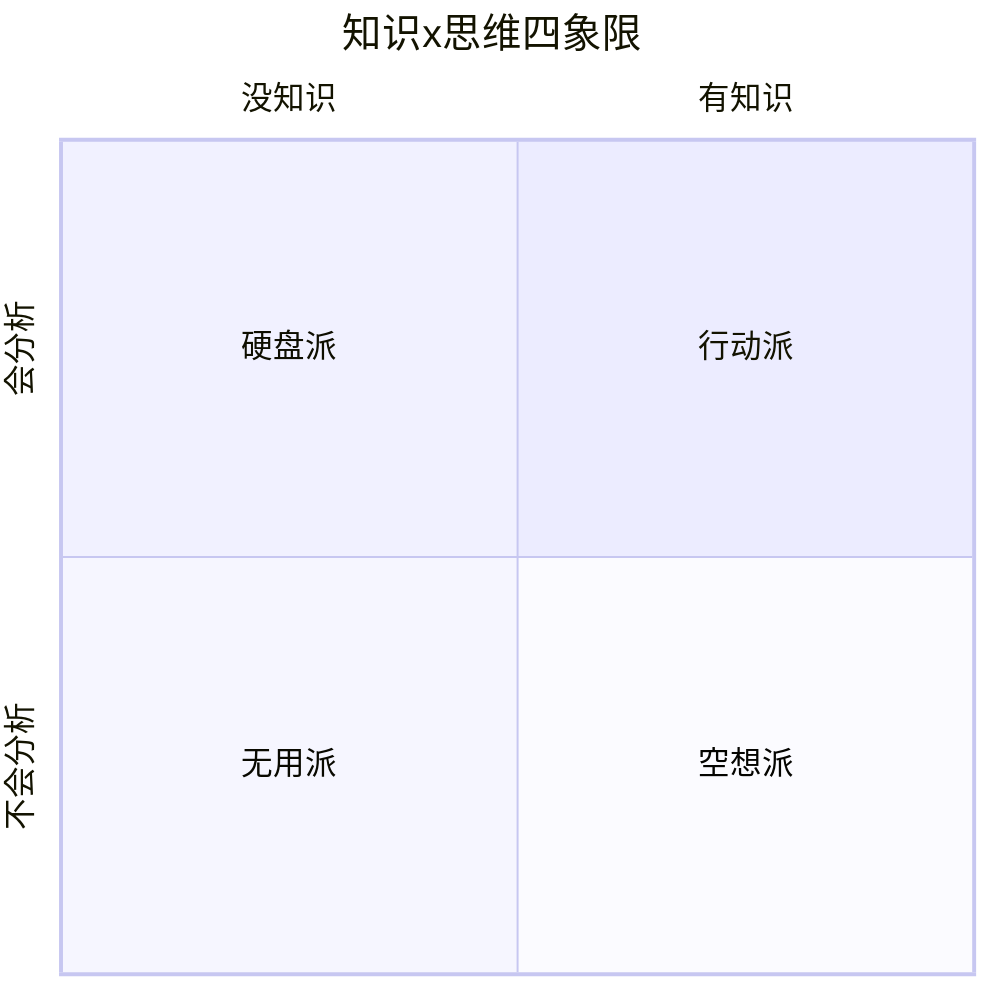
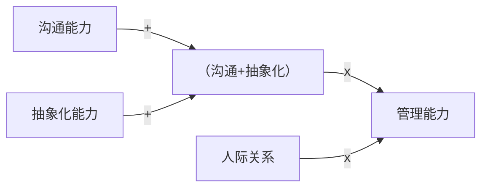
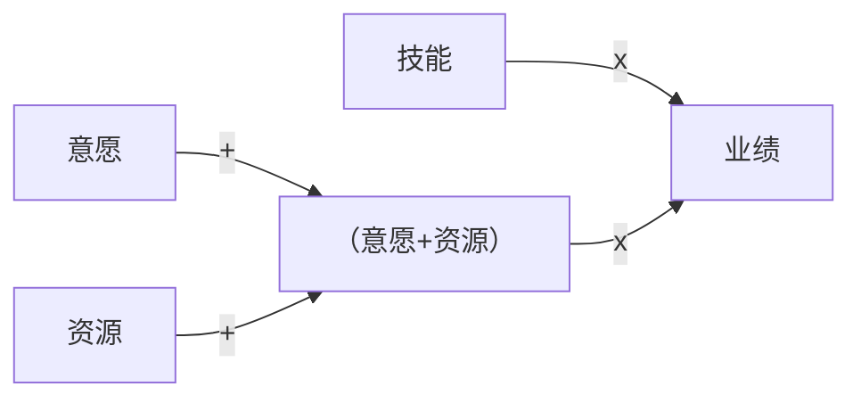

# 第04课：巧用数学思维

## Learning Objectives

- 区分一维、二维、多维观点，理解各自的使用场景
- 掌握坐标轴法呈现二维观点，让观点更直观、更有讨论空间
- 掌握公式法呈现多维观点，理清复杂要素之间的逻辑关系
- 理解加减乘除在表达中的符号含义（乘=不可或缺，加=可替代）

## Core Idea

提炼观点只是第一步，把观点清晰地传递给对方，才能实现碰撞、融合与再生。数学思维提供了一种极简的呈现方式。

### 观点的维度分类

| 类型 | 要素数量 | 特点 | 适用场景 |
|------|----------|------|----------|
| **一维观点** | 1个概念 | 高度概括化，在不同场景下可能有不同解读 | 表达一个高度概念化的东西 |
| **二维观点** | 2个要素 | 容易对比、碰撞，有思考和讨论空间 | **日常工作和生活中最实用** |
| **多维观点** | 3个及以上要素 | 逻辑关系复杂，语言难以清晰描述 | 学术报告、理论分析 |

### 二维观点的呈现：坐标轴法

数学中的X轴和Y轴天然代表两种不同维度的要素，用坐标轴呈现二维观点再合适不过。

#### 例1：时间管理四象限（轻重缓急）

- **横轴**：轻 -- 重（一个要素）
- **纵轴**：缓 -- 急（又一个要素）

#### 例2：幸福四象限（来源：《幸福的方法》）

将"幸福"这个一维概念拆解为两个维度：

- **横轴**：现在（当下的快乐）
- **纵轴**：未来（对未来的意义）

| 象限 | 状态 | 描述 |
|------|------|------|
| 幸福主义 | 关注现在 + 关注未来 | 既享受当下又规划未来 |
| 忙碌主义 | 不关注现在 + 关注未来 | 陷于未来焦虑，忘了感受当下的快乐 |
| 享乐主义 | 关注现在 + 不关注未来 | 只顾当下享乐，没有筹划未来 |
| 虚无主义 | 不关注现在 + 不关注未来 | 既不享受现在也不重视未来 |

**幸福 = 快乐 x 意义**（快乐代表现在，意义代表未来）

#### 例3：学习焦虑四象限（知识 x 思维）

| 象限 | 状态 | 类型 |
|------|------|------|
| 有知识 + 会分析 | 行动派 | 能学能用 |
| 有知识 + 不会分析 | 硬盘派 | 只会存储 |
| 没知识 + 会分析 | 空想派 | 想得多做得少 |
| 没知识 + 不会分析 | 无用派 | 什么都不行 |

> [!TIP] Key Insight
> 这种框架图不仅帮你呈现好观点，更重要的是，在把观点落到框架图的过程中，你能进一步把观点想得更完整、更深入 -- 这就是思考的深度。

### 多维观点的呈现：公式法

当观点包含三个或三个以上的要素，不要奢望用语言能清晰描述出它们之间的逻辑先后和主次关系。最好的方式是**用公式来表达**。

#### 公式示例1：人生成就公式（稻盛和夫）

> **人生成就 = 思维方式 x 热情 x 能力**

| 要素 | 分数范围 | 含义 |
|------|----------|------|
| 思维方式 | -100 ~ 100 | 方向比努力更重要 |
| 热情 | 0 ~ 100 | 努力的程度 |
| 能力 | 0 ~ 100 | 天生的才能+后天习得 |

如果思维方式为负数，整个成就就是负数 -- 方向错了，越努力越糟糕。

#### 公式示例2：管理能力公式

> **管理能力 = （沟通能力 + 抽象化能力） x 人际关系**

这个公式表达了三层逻辑关系：
- 沟通能力和抽象化能力是加法关系（可替代）
- 人际关系是乘法（不可或缺 -- 没有它，前两者的效用无法放大）

### 加减乘除的含义

| 符号 | 含义 | 说明 |
|------|------|------|
| **乘号（x）** | **不可或缺** | 任何数乘以零等于零，强调必要条件 |
| **加号（+）** | 可替代/可叠加 | 一个足够大，另一个有或没有都可以 |
| 减号（-） | 负相关 | 表示抵消或减少的关系 |
| 除号（/） | 负相关（不常用） | 用减号足矣 |

#### 公式示例3：业绩公式

> **业绩 = 技能 x （意愿 + 资源）**

- **技能 x 意愿**：技能是为零，再有意愿也没有业绩；意愿为零，技能再高也没有业绩 -- 两者不可或
- **意愿 + 资源**：资源充足的情况下，即便意愿稍弱也可以推进；资源匮乏则需要更强的意愿来弥补 -- 两者可替代

## Worked Example

**场景**：你的妹妹问你，如何选择男朋友 -- 如何用数学思维表达你的观点？

**参考框架**（二进制公式法）：

> **靠谱男友 = （人品 x 上进心） + （三观匹配 x 情绪价值）**

这是一个多维观点的公式化呈现：

- 人品与上进心是乘号关系 -- 两者不可或缺
- 三观匹配与情绪价值也是乘号关系 -- 两者不可或缺
- 两个括号之间是加号关系 -- 前两项足够好，后两项稍弱也可以接受（反之亦然）

## Practice

> [!QUESTION] Self-check
> 任选一个你在工作中常遇到的问题或观点，尝试用坐标轴法（二维）或公式法（多维）重新呈现，体会框架图如何帮你把思考深入。

Reveal answer

参考练习方向：

- **二维坐标轴**：尝试将"好员工"拆解为两个维度，如"能力 x 态度"、"执行力 x 创新力"等，画出四个象限
- **公式法**：尝试将"项目成功"或"客户满意度"用公式表达，标注哪些要素用乘号（不可或缺），哪些用加号（可替代）

对比"语言描述"和"框架图/公式"两种方式，感受哪一种更能帮你把逻辑关系理清楚。

## Next Step

继续学习 [[0005-xiao-shou-gao-shou|第05课：销售高手都在用的黄金三圈]]