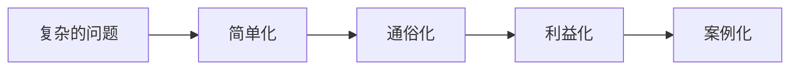

# 第05课：成为销售高手

## 为什么要学销售思维

在这个时代,每个人都在"销售"——面试时销售自己,相亲时销售自己,交朋友也是在销售自己。任何一次表达本质上都是营销:你要销售的是你的观点和立场,想获得的是别人的认同与信任。不要把销售当成工作技能,它更应是一种生活技能。

> [!TIP] 核心理念
> 销售不是卖产品,而是通过表达让对方认同你的理念和信念。

## 四化原则:客户的四个共性

客户喜欢的表达有四个共性,归纳为**四化原则**:

1. **复杂→简单**:客户不喜欢麻烦,不要罗列产品所有优点
2. **简单→通俗**:用对方能听懂的语言,降低理解门槛
3. **通俗→利益**:把客户能得到的利益显性化呈现
4. **利益→案例**:临门一脚时,有对比性的例子远胜理性分析

## 销售四诀:四个句式

四化原则可以转化为四个具体的句式:

### 句式一:"简单来说,……"

**要点**:突出与面前客户匹配的1-2个特点即可,不求多而全。

### 句式二:"它特别适合于像您这样……的人"

**要点**:借此赞扬对方,迅速提炼对方身上的闪光点,让对方觉得产品是为他定制的。可适当凸显对方身份。

### 句式三:"您使用了它之后,……"

**要点**:利益显性化,让客户感受到最直接的好处。这个好处要与第一句的产品特征关联。

### 句式四:"举个例子来说吧,……"

**要点**:
- 举人的例子:举比对方身份略高一点点的人(激发攀比心)
- 举事的例子:举具体的一到两个关键行为

> [!WARNING] 使用前提
> 每次使用销售四诀,只针对产品的1-2个特征,只针对某一类人群,切忌一次抛完所有优点。

## 应用场景演练

### 场景一:卖保温杯给商务人士

客户属性:经常出差,关注轻便和时尚,而非极致保温性能。

| 句式 | 话术 |
|------|------|
| 简单来说 | 这是一个时尚又轻便的保温杯 |
| 特别适合 | 它特别适合于像您这样经常出差又新潮的高端商务人士 |
| 使用之后 | 手拿保温杯也不会降低您的时尚感,还不用担心增加行李重量 |
| 举个例子 | 上一回我去拜访笔记侠,他们的课长几乎随身携带这款保温杯 |

### 场景二:卖保温杯给全职妈妈

客户属性:重视孩子,关注保温性能和安全性能。同一产品面对不同人群,表达内容不同但思路套路相同。

### 场景三:相亲自我介绍

活用销售四诀(注意措辞调整):

| 句式 | 话术 |
|------|------|
| 简单来说 | 我是一个体贴、善解人意的30岁单身男青年 |
| 我觉得特别适合 | 我觉得我特别适合一类能开心时一起分享、失落时相互勉励、充满正能量的女性 |
| 跟我在一起后 | 我们会成为彼此生活中开心的催化剂、伤心的舒缓剂 |
| 举个例子 | 如果我们吵架了,无论多生气,我都会每天帮你挤牙膏 |

### 场景四:向上级推荐人才

| 句式 | 话术 |
|------|------|
| 简单来说 | 小方是一位很有市场开拓能力、区域资源丰富的市场攻坚型人才 |
| 特别适合 | 我觉得她特别适合战略市场的开拓,尤其是新区域市场 |
| 能吸引过来 | 我相信市场团队不管在内部管理还是外部开拓上,她都能把握节奏感 |
| 举个例子 | 她在上一家公司短短三个季度就创下了竞争对手两年的营业额 |

## 销售四诀精髓

> [!IMPORTANT] 核心要义
> 不贪大而全,定准一到两个重点,精准表达。

## 练习

> [!QUESTION] 自我检查
> 请选择一个你熟悉的产品(或你自己),分别针对两种不同人群,用销售四诀写出两套不同的表达话术。

参考思路

1. 确定产品的1-2个核心特征
2. 分析目标人群的身份和关注点
3. 用四化原则将特征转化为对方的利益
4. 用四个句式组织语言,每个句式只说一个重点

## 本课总结

- **四化原则**:复杂→简单→通俗→利益→案例
- **销售四诀**:
  1. "简单来说,……" —— 突出匹配点
  2. "它特别适合于像您这样……的人" —— 匹配客户身份
  3. "您使用了它之后,……" —— 利益显性化
  4. "举个例子来说吧,……" —— 案例佐证
- **精髓**:不贪大而全,定准一到两个重点

## 下一步

继续学习 [[0006-huang-jin-san-quan|第06课:黄金三圈]], 了解如何用Why-How-What结构做直击人心的公众表达。