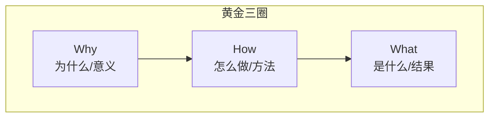
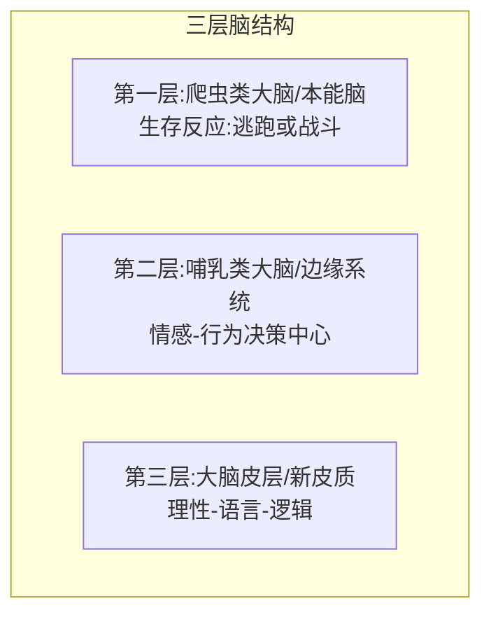

# 第06课:黄金三圈

## 黄金三圈结构

三个同心圆,从内到外依次是:

- **What**(最外层):是什么,做什么,结果
- **How**(中间层):怎么做,方法
- **Why**(最内层):为什么,意义,信念

大部分人清楚自己在做什么(What),一部分人会思考如何做得更好(How),只有少部分人经常质问自己为什么要做这件事(Why)。

## 普通表达 vs 高手表达

### 普通表达:由外向内

习惯从What开始,再说How,很少说Why甚至不说Why。因为最外层最显而易见,说着最轻松,听着也不用太费劲。

### 高手表达:由内向外

所有演讲高手的共通点——表达方式一定是反着来的:先说Why,再说How,最后说What。不要小看这个顺序的改变,它对征服对方大脑起到至关重要的作用。

## 三层脑理论

为什么由内向外表达更有效?这符合生物生理本能:

| 层级 | 名称 | 功能 | 对应黄金三圈 |
|------|------|------|-------------|
| 最内层 | 爬虫类大脑(本能脑) | 生存反应,逃跑或战斗,呼吸等本能 | — |
| 中间层 | 哺乳类大脑(边缘系统) | 情感、感知、行为决策中心 | Why |
| 最外层 | 大脑皮层(新皮质) | 理性、图形、语言、思考逻辑 | What |

人们习惯由外向内表达,罗列数据、图表、方案,但客户常说"你讲的都对,但就是缺了点什么"。原因在于没有打动负责行为决策的**第二层大脑**(哺乳类大脑/边缘系统)。一味攻击大脑皮层(展示数据、图形、逻辑),却没有用Why去打动情感决策中心。

## 案例:乔布斯的演讲逻辑

**普通销售人员介绍苹果手机**:

- What:这是我们最新的一代苹果手机,双摄像头、玻璃背板、全屏显示
- How:设计精美,界面友好,系统流畅,使用简单
- Why:(不说)

**乔布斯的演讲逻辑**:

- Why:我们存在的价值是为了改变这个世界,为了突破和创新,我们要改变普通人的生活
- How:一个好的产品要设计精美、界面友好、极致简单
- What:这款就是我们最新款的iPhone

乔布斯挖百事可乐总裁约翰-斯考利时说的不是产品有多棒,而是问了一句:"你是想一辈子卖糖水,还是想跟我一起改变这个世界?"——这说的就是**意义**。

## 案例:汽车销售

**普通销售**:
这是我们最新款的SUV,省钱、真皮座椅、空间大、无钥匙启动、越野性能好,用了哪些最新技术(都在说What和How)

**高手表达(用黄金三圈)**:
1. Why:我们一直提倡绿色出行、环保生活,同时不失时尚和人性
2. How:我们在节能技术和时尚功能上下了很多功夫,拥有一百八十项专利技术,手能触摸到的地方都用真皮,底盘设计考虑城市所有路况
3. What:这些优点都集中在你面前的这款最新SUV

只是顺序颠倒了一下,但感受大不相同。

## 黄金三圈的应用原则

> [!IMPORTANT] 两条核心原则
> - 一次销售:人们购买的不是你的东西,而是你表达的理念
> - 一次表达:人们认同的不是你的方案,而是你传达的信念

### 其他场景应用

- **面试**:你要雇佣的不只是需要一份工作的人(What),更是理念相同的人(Why)
- **婚恋**:三观一致,注重Why层面的匹配
- **教育孩子**:不要只说"妈妈希望你做这些"(What),而要说"爸爸妈妈希望和你一起进步,一起成为说话算话的人"(Why→How→What)

## 练习

> [!QUESTION] 自我检查
> 请用黄金三圈的方式,发布一款机顶盒产品(可以暂停、跳过广告、回放、记录观看习惯),写出由内向外的表达稿。

参考思路

1. Why:好的电视体验不应该被广告打扰,家庭娱乐时光值得被完整保留
2. How:所以我们设计了可以暂停、跳过广告、回放、智能记录观看习惯的功能
3. What:这就是我们最新款的智能机顶盒

## 本课总结

- **黄金三圈**:Why(意义)→How(方法)→What(结果)
- **三层脑**:本能脑(生存)→哺乳类大脑(情感决策)→大脑皮层(理性逻辑)
- **高手表达**:由内向外,先说Why再说How最后说What
- **核心洞察**:人们购买的是理念和信念,不是产品本身

## 下一步

继续学习 [[0007-han-bao-bao-fa-ze|第07课:汉堡包法则]], 掌握如何利用大脑的知觉整体性讲出引人入胜的故事。