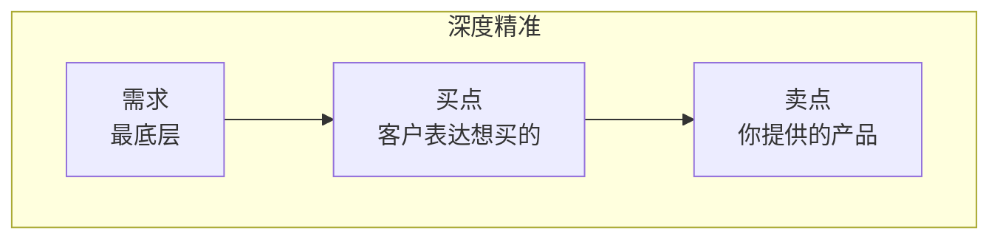

# 第08课:四两拨千斤的细节

## 细节一:精确报价

### 核心发现

报价时,精确的数字比整数更有力量。

**实验:两组成交价对比**

| 组别 | 报价 | 砍价幅度 | 最终成交价 |
|------|------|----------|------------|
| 第一组 | 2000元 | 大幅砍价 | 更低 |
| 第二组 | 1986元 | 小幅砍价(去掉零头) | **更高** |

**实验后的访谈发现**:
- 收到2000元报价的人,砍价幅度更大
- 收到1986元报价的人普遍认为商家更实在、水分更少
- 有人觉得商家一定做了充分准备、了解行情才开出具体价格

### 心理机制

精确的数字会传递出:
- 这个价格背后有充分的依据
- 对方做了认真的调研和准备
- 价格水分少,议价空间小

### 应用场景

| 场景 | 常规做法 | 精确报价做法 |
|------|----------|--------------|
| 谈加薪 | 希望涨10% | 提议涨9.7% |
| 打零工谈时薪 | 期望100元/小时 | 报价96或103元/小时 |
| 布置工作期限 | "两周后交" | "11天后准时交" |

> [!WARNING] 核心原则
> 精确报价不是随便报一个精确到个位的数字,而是要让人觉得这个数字背后有道理、有依据。

## 细节二:深度精准——透过买点看到需求

### 老太太买李子的故事

**第一个小贩**:
老太太问"李子怎么样",小贩答"又大又甜"——老太太摇头走了。
结果:没卖出。

**第二个小贩**:
老太太要酸李子,小贩拿出酸李子——卖出一斤。
结果:卖出1斤李子。

**第三个小贩**:
老太太要酸李子(因为儿媳妇怀孕想吃酸的),小贩不仅卖出酸李子,还顺势问"孕妇需要补充维生素,猕猴桃维生素最多,来一斤?",又卖出猕猴桃。
结果:卖出1斤李子+1斤猕猴桃。

### 三个关键词

| 关键词 | 定义 | 案例说明 |
|--------|------|----------|
| **买点** | 刺激客户购买欲的那个点 | 老太太说"我要酸李子" |
| **卖点** | 你产品具备的特点 | 小贩有酸李子、有猕猴桃 |
| **需求** | 客户内心的真实诉求 | 老太太想成为体贴的好婆婆 |

### 等式思维

客户的认知中:需求 = 买点A

高手的做法:基于共同的需求,创造新的等式——需求 = 买点A = 买点B

**老太太案例**:
- 老太太内心的等式:成为体贴的好婆婆 = 买儿媳妇想吃的酸李子
- 第三个小贩帮她构建:成为体贴的好婆婆 = 买儿媳妇想吃的酸李子 = 买儿媳妇更有营养的猕猴桃

### 剃须刀案例

**客户表达**:我要买待机时间长的剃须刀(买点)

**客户真实需求**:方便

**客户内心的等式**:方便 = 待机时间长

**高手的解法**:方便 = 待机时间长,但方便更可以 = 充电时间短。充电一分钟用十分钟,比待机时间长更方便。

> [!TIP] 核心洞察
> 不要因为买点跟你的卖点不匹配就放弃。再往下精准一个层次,精准到需求层面,你们达成共识的概率会有本质改善。甚至对方会觉得你比他还懂他。

## 精确报价 + 深度精准 双拳组合

| 技巧 | 对应环节 | 核心思想 |
|------|----------|----------|
| 精确报价 | 结果(价格/时间) | 精确数字传递专业和底气 |
| 深度精准 | 过程(需求挖掘) | 透过买点看到需求,创造新等式 |

## 练习

> [!QUESTION] 自我检查
> 1. 回忆一次你最近的谈判或讨价还价,如果使用精确报价会有什么不同?
> 2. 选择一个你熟悉的产品,设想客户说出的"买点"是什么,背后的"需求"是什么,尝试构建一个新的等式:需求 = 买点A = 你的卖点B

参考思路

精确报价练习:
- 找出一个你经常遇到的报价场景
- 将整数改为一个合理的精确数字(非随意编造)
- 观察对方的反应

深度精准练习:
- 客户买点:想买"静音的空气净化器"
- 客户需求:"睡眠质量好"
- 新等式:睡眠质量好 = 静音 = 智能定时(你的产品有而竞品没有的功能)

## 本课总结

- **精确报价**:精确的数字让人感觉有依据、水分少,砍价更少,最终成交价更高
- **深度精准**:透过买点看到客户最底层的需求
- **等式思维**:需求 = 买点A = 卖点B,基于需求创造新的等式
- **应用范围**:谈加薪、报工期、讨价还价、提案议价

## 下一步

继续学习 [[0009-hui-yi-gao-xiao|第09课:会议闭环且高效]], 掌握金字塔结构、AAR和NBA等会议高效工具。