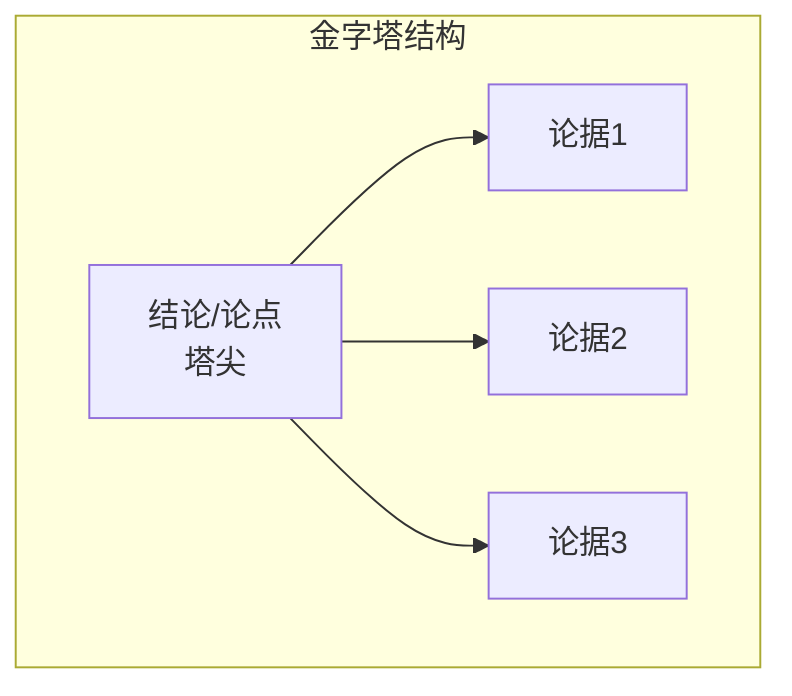

# 第09课:会议闭环且高效

## 金字塔结构:结论先行

### 核心原则

**结论先行,自上而下**——先说"所以",再说"因为"。



### 为什么需要反习惯

- **思维习惯**:自下而上(收集数据→思考归类→得出结论)
- **表达习惯**:很多人按思考过程表达,由下到上
- **问题**:前面所有铺垫都在给听众增加记忆负担

### 案例对比

**反面(自下而上,非金字塔结构)**:
"我们的营销策划案收到了很多反馈。有人认为造势预算不充裕,有人认为slogan设计特别好,还有人认为线上线下联动时间点选得不好。市场部刘总监建议用户需求调研更充分,活动往后延……"

**正面(结论先行,金字塔结构)**:
"我们的结论是:这一次活动顺延一周举行。针对目前的营销策划案,结合大家反馈,这一周内我们将对用户需求、预算、线上线下联动机制三方面做进一步论证。"

> 思考可以从下到上,但汇报永远记得:结论先行,自上而下。

## AAR:行动后反思

### 什么是AAR

AAR = After Action Review(行动后反思),原为美国陆军使用的方法。让参与者自行发现发生了什么、为何发生、如何维持优点、改进缺点。

### AAR六步骤

| 步骤 | 问题 | 说明 |
|------|------|------|
| 1 | 我们的目标/意图是什么？ | 明确最初的目标 |
| 2 | 实际上发生了什么？ | 按时间顺序重组事件,真实重现 |
| 3 | 期望目标和实际有何差距？ | 找出差距所在 |
| 4 | 从中有何学习/启发？ | 提炼经验教训 |
| 5 | 如何转化为行动？ | 短期→中期→长期行动 |
| 6 | 哪些建议可分享给别人？ | 记录并分享 |

### 用汉堡包模型理解AAR

```mermaid
graph TD
    subgraph AAR = 汉堡包模型
        A[上面包:期望目标] --> B[中间差距:问题/启发]
        B --> C[下面包:实际行动]
    end
```

- **上面包**:期望的目标
- **下面包**:实际发生的现实
- **中间的差距**:问题所在
- 差距带来启发→启发转化为行动→行动分享给别人

> [!WARNING] AAR会议注意事项
> - 必须有主持人,任务是营造和维护聚焦、开放、安全、客观的对话环境
> - 主持人是促进者,不是答案提供者,话不要太多
> - 如果某个问题特别引发兴趣,先标记,等六个问题讨论完再决定是否加开"会中会"
> - **把握会议节奏和方向**:不要因为一个点跑偏,导致原有主题没完成、新主题也没有讨论透

### AAR的延伸应用

AAR不仅适用于会议,也适用于个人每天的自我反思。孔子说"吾日三省吾身",AAR是非常好的反省套路。

## NBA:下一步最优行动

NBA = Next Best Action(下一步最优行动)

### 核心逻辑

- 会议必须有决议,决议更多是"下一步行动的决定"
- 每次会议结束时,说一句:"来,我们落一下NBA"
- NBA落成清单体表格
- **上一次会议的NBA = 下一次会议AAR的素材**,形成闭环


### NBA的5W2H要素

| 要素 | 含义 |
|------|------|
| What | 是什么 |
| Why | 为什么 |
| Who | 谁负责 |
| When | 何时完成 |
| Where | 在哪里 |
| How | 怎么做 |
| How much | 花多少资源,做到什么程度 |

每次NBA要基于这七个要素建立表格,备忘给所有参与者。

## 会前三问

在决定开一次会之前,先问自己三个问题:

1. **这次会议的目的是什么？**
2. **如果不开这个会,有其他方式更好地实现这个目标吗？**
3. **在会议中看到什么或听到什么,就代表这次会议成功了？**

> [!TIP] 最高效的开会方式
> 最高效的开会方式就是不要开。如果有更好的方式可以达到目标,连会都不用开。

### 延伸:表达前三问

在每次精准表达之前,也问自己三个问题:

1. 接下来我要说的这段话,目的是什么？
2. 如果不说这段话,有其他方式更好地实现目的吗？
3. 看到什么或听到什么,代表我的表达不仅"表"了,而且"达"了？

> 表达是两个字:一个是"表"(说出来),一个是"达"(说到对方心里去)。表是手段,达才是目的。

## 四个工具一览

| 工具 | 适用阶段 | 核心作用 | 一句话口诀 |
|------|----------|----------|------------|
| **金字塔结构** | 表达组织 | 结论先行,自上而下 | 先说"所以"再说"因为" |
| **AAR** | 会议开始 | 行动后反思,六步复盘 | 以上一次的NBA为素材 |
| **NBA** | 会议结束 | 下一步最优行动,5W2H | 产出清单,闭环到下次 |
| **会前三问** | 会议之前 | 确认必要性和目标 | 不开会才是最高效的会 |

## 练习

> [!QUESTION] 自我检查
> 1. 回想最近参加的一次会议,用金字塔结构重新组织你在会上的发言,写成"结论先行"的版本。
> 2. 针对一个你刚完成的项目或任务,做一次AAR六步反思。
> 3. 下周开会前,练习会前三问,观察会议效率是否有变化。

<details>
<summary>参考思路</summary>

金字塔结构练习:
- 先写结论(一句话)
- 再写支撑结论的2-3个论据
- 每个论据附带具体数据或事实

AAR练习:
- 拿起笔按六步顺序写下答案
- 如果不能一次完成,至少写前三步

会前三问练习:
- 准备会议前写在笔记本上
- 会议结束后回看答案和实际结果

</details>

## 本课总结

- **金字塔结构**:结论先行,自上而下,先说"所以"再说"因为"
- **AAR**(行动后反思):六步法,从目标到行动层层递进
- **NBA**(下一步最优行动):5W2H清单,闭环到下一次会议
- **会前三问**:目的是什么?不开会行吗?什么代表成功?
- **终极心法**:表是手段,达才是目的

## 下一步

继续学习 [[0010-chong-tu-niu-zhuan|第10课:冲突扭转]], 学习如何在冲突爆发前巧妙化解矛盾。