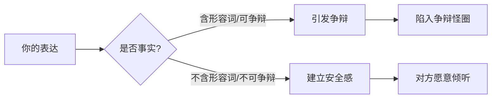
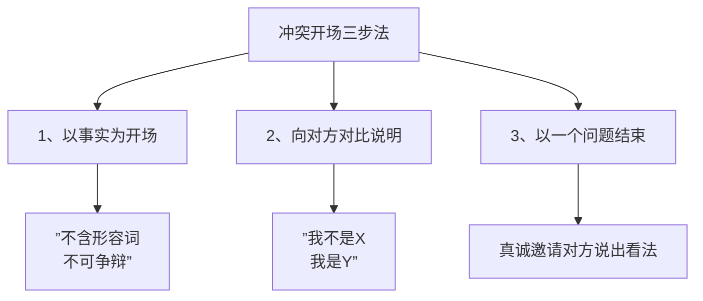
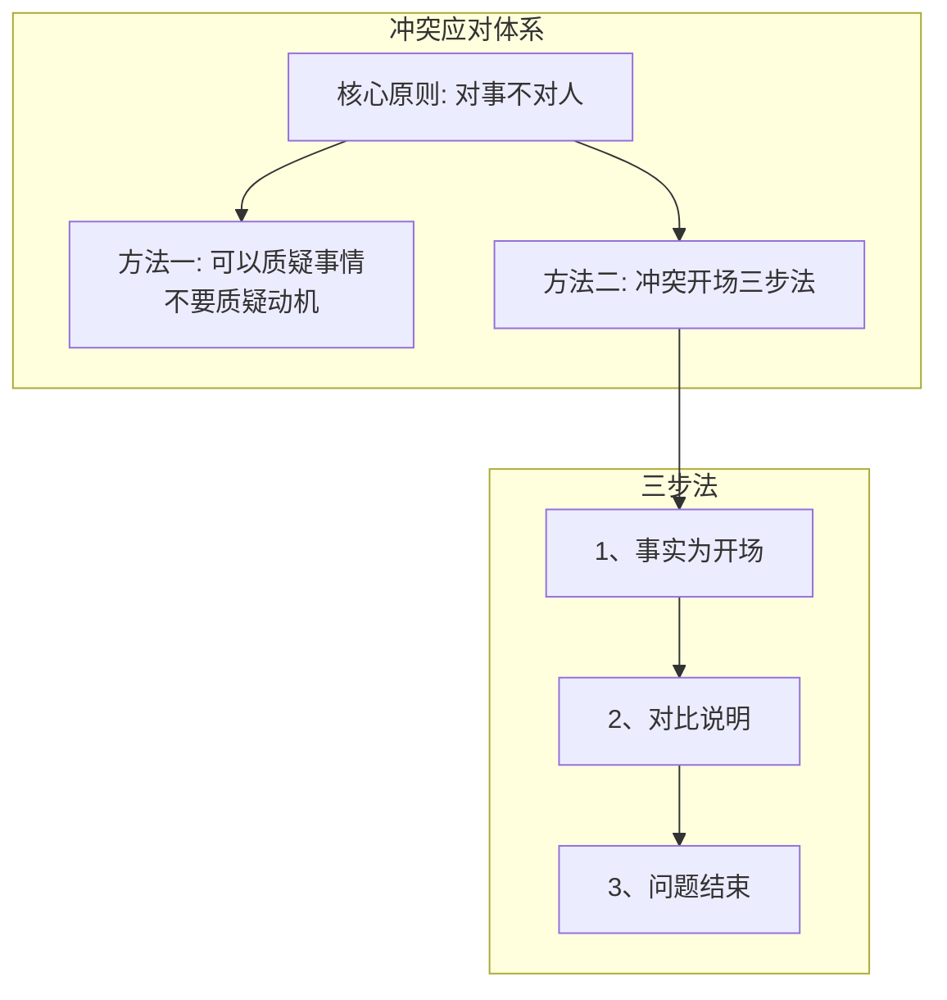

# 第10课：扭转即将爆发的冲突

## 核心原则：对事不对人

扭转即将爆发的冲突，要遵循的核心原则是**对事不对人**。原则可以帮助我们在不知道该做什么的时候知道要怎么做，以原则为基础才能以不变应万变。

### 可以质疑事情，但不要质疑动机

冲突升级的关键转折点：从质疑事情转向质疑动机。

**情侣案例**（五句话的冲突升级）：

| 轮次 | 说话内容 | 本质 |
|------|----------|------|
| 第1句 | "下班过来接我吧" | 女生发出请求 |
| 第2句 | "今天不行，晚上要加班" | 男生拒绝请求 |
| 第3句 | "你们公司怎么天天加班呢，这周都加班第三回了" | 质疑**事情本身**（尚可解释） |
| 第4句 | 男生解释加班原因 | 回应质疑 |
| 第5句 | "我就知道你不关心我" | 质疑**动机**（冲突爆发） |

> [!WARNING] 关键转换
> 第3句质疑"加班"这件事本身，男生可以解释；第5句从质疑事情变成了质疑"你不关心我"的**动机**，男生无从解释，冲突就此爆发。

**职场案例**：下属小张没带领带
- 错误做法："小张，为什么我说的话你老听不进去？"（质疑动机）
- 正确做法："小张，我觉得你戴个领带可能会更显得精神一点"（聚焦事情本身）

圣雄甘地说过：**当一个人的动机被怀疑时，他所做的一切都会蒙上污点。**

## 事实的两要素

以事实为开场是对事不对人原则的精髓。判断是否为事实的标准：

1. **不含形容词**："天气很热"不是事实（"热"是形容词）——"今天气温31℃"是事实
2. **不可争辩**："小王总是迟到"不是事实（"总是"可争辩）——"小王这周迟到了四回"是事实

每一次成功的冲突应对，都是以**安全感**为前提的。一旦让对方觉得被夸大、被误会，对方就会陷入争辩的怪圈。

## 冲突开场三步法

针对可预见的冲突，准备一个应对模型：

### 第一步：以事实为开场

最难的一步。要用"不含形容词、不可争辩"的事实在对话开始时建立安全感。

### 第二步：向对方对比说明

明确表达"我不是X，我是Y"，在双方之间寻找共同目标。

> 不要误会，我不是不喜欢跟你合作，实际上我对咱们的合作我很满意。我只是想和您探讨一下，我们如何共同决策的问题。

这句话包含了"**我不是什么，但我是什么**"的对比说明，能让双方有意识地寻找共同目标。

### 第三步：以一个问题结束

向对方发出真诚的邀请，请他们说出自己的看法。问完问题后，记得使用[[0001-qing-ting-yu-du-li-si-kao|第01课]]中讲过的倾听技巧。

### 完整案例：跨部门同事三次缺席会议

**场景**：跨部门活动的协作中，有位同事连续三次答应参会但都没来。

**三步表达**：

1. **事实**："小雅，这个月有三次会议你都没有来参加，而且我记得事先你都是答应要来的。"
2. **对比说明**："我想跟你谈这个事情，不是想事后追责，我只是想探讨一下，我们两个部门怎么样能更好地合力完成这个活动。"
3. **以问题结束**："小雅，可能你有些情况我也不太了解，所以如果你有什么想法可以更好地帮助我们来推进这件事情，我想先听听你的想法，你看可以吗？"

## 总结

"上医治未病"，在冲突爆发之前通过适当的方式将其扭转到更好的局面。

## 练习

> [!QUESTION] 自测
> 你的同事在一次团队会议上多次打断你的发言，你感到不快。请用冲突开场三步法设计一段话，在会议结束后与他沟通。

参考示例

**事实**："刚才的会议上，我发言时被你打断了三次。"

**对比说明**："我想跟你聊这个，不是要指责你，而是希望我们以后的协作沟通能更顺畅。"

**以问题结束**："可能你有你的想法，我想听听你的看法，你觉得怎么样？"

## 下一课

继续学习[[0011-fei-bao-li-gou-tong|第11课：非暴力沟通]]，掌握如何在表达异议和不满时不尴尬、不伤关系。