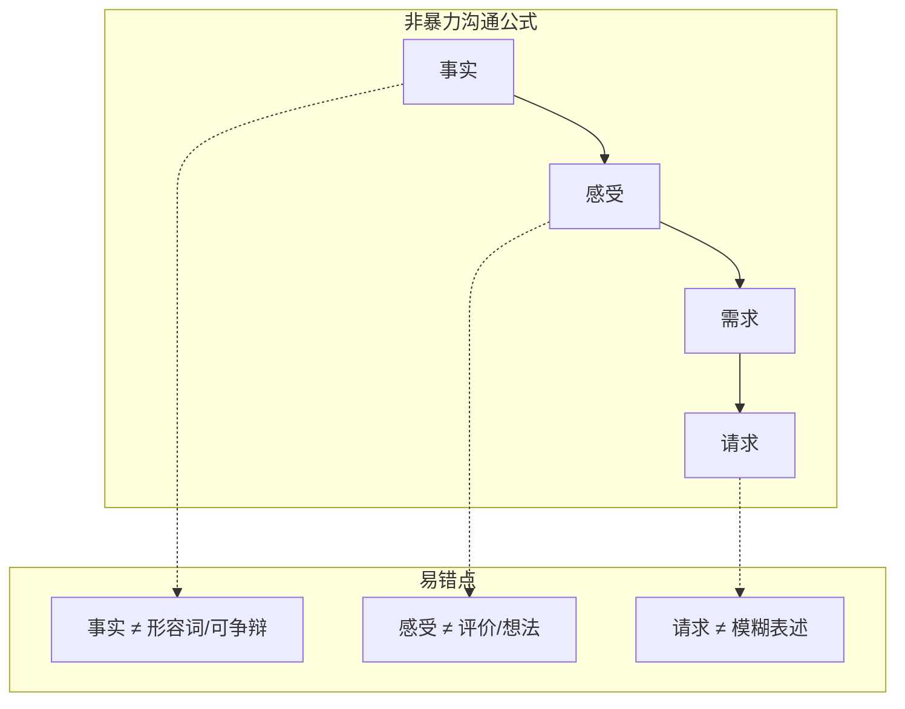

# 第11课：非暴力沟通

## 非暴力沟通公式

非暴力沟通的核心套路是一个包含四个步骤的公式：

**事实 + 感受 + 需求 + 请求**

这四个步骤层层递进，帮助我们既表达不满又不伤害关系。建议按顺序学习本系列课程，因为很多模型是层层递进的。

### 第一步：事实

沿用[[0010-chong-tu-niu-zhuan|第10课]]中讲过的标准：事实的两个要素——**不含形容词、不可争辩**。

"浑身酒气"不是事实，因为可以争辩（"哪里浑身酒气了，我不就喝两杯啤酒吗"）。

### 第二步：感受

表达感受的好处是拉近人与人之间的距离。

> [!WARNING] 感受 vs 评价/想法
> "我觉得我的字写得不好看"——这是**评价**，不是感受。
> "我觉得我的字写得不好看，所以我很**难过**，甚至有点**失落**"——「难过」「失落」才是感受。
>
> "我觉得自己被打扰了"——这是你的**想法**，不是感受。
> "我觉得自己被打扰了，所以我很**烦躁**"——「烦躁」才是感受。

**建立感受词汇表**：

| 需求满足时的感受 | 需求未满足时的感受 |
|-----------------|-------------------|
| 欣慰、高兴、兴奋 | 担心、忐忑、焦虑 |
| 满足、陶醉、幸福 | 生气、灰心、绝望 |

### 第三步：需求

不要说"我也是为你好"，这是最没有力量的话。要说自己**最真实的需求**。如果可能，这个需求最好能凸显出对方的重要性。

### 第四步：请求

请求一定要**足够具体**。

> 你希望别人拉你一把，那么你得告诉别人你的手在哪。

- "这周能不能早点回家"——不够具体（"早"是形容词）
- "每周至少有两个晚上七点前回家"——够具体

## 案例应用

### 案例一：老公晚归

**背景**：丈夫连续五个晚上过了半夜十二点回家，身上有酒气。

| 步骤 | 表达内容 |
|------|----------|
| **事实** | "老公，这一周有五个晚上你都过了半夜十二点才回家，回家的时候身上还有酒气。" |
| **感受** | "所以我觉得很伤心。" |
| **需求** | "你看我们的孩子刚刚升入初中，初中又是特别容易叛逆的时期，所以我特别希望一周当中有几个晚上我们都能跟孩子一起吃吃晚饭。有些问题妈妈好谈，但是有些问题爸爸显得更重要。" |
| **请求** | "所以我在想，从下周开始，你能不能每周至少有两个晚上在晚上七点前回家？我和孩子一起等你吃晚饭。" |

### 案例二：老程迟到

**背景**：下属老程（资历比你深）这一周已经迟到三次。

| 步骤 | 表达内容 |
|------|----------|
| **事实** | "今天周四，这一周你已经迟到三回了。而且根据我的观察，你每次迟到都超过了半小时。" |
| **感受** | "我有些失望。" |
| **需求** | "你也知道我经验不足，老程，我非常需要你的支持，你的支持对我来说非常重要。" |
| **请求** | "所以你看这样行吗？从下周开始，如果你要请假，麻烦你提前一天给我发个邮件；如果实在有事情没办法发邮件，那能不能在当天早上在我们部门的微信群里面给所有人发一下你的行程报备，免得大家有疑问。老程你看这样可以吗？" |

> [!TIP] 核心认知
> 非暴力沟通可以概括为两个着力点：
> 1. **以事实为着力点**——不在事实中妄加评论（你的工作态度不好、你不尊重我都是对人的评价）
> 2. **以人为着力点**——明确表达对人的需求和请求，不让对方被误解或摸不着头脑

我们太习惯于表达"我不要什么"，但没有习惯精确地表达"我要什么"。这个套路也许不能百分百让你实现目标，但一定会让你和对方离共同的目标越来越近。

## 练习

> [!QUESTION] 自测
> 你的室友（或合租的同事）连续一周没有洗碗，厨房水槽堆满了脏碗碟。请用非暴力沟通公式写一段话与他/她沟通。

参考示例

**事实**："这周有五天，厨房水槽里都堆着用过的碗碟没有洗。"

**感受**："我看到的时候会觉得有些不太舒服。"

**需求**："我们住在一起，我希望公共区域的卫生能保持整洁，住起来大家心情都比较好。"

**请求**："从下周开始，我们能不能约定用完碗后就马上洗掉？如果实在来不及，当天晚上睡觉前也洗好，可以吗？"

## 下一课

继续学习[[0012-biao-yang-pi-ping|第12课：让表扬有趣让批评有用]]，探索表扬与鼓励的巨大差异。