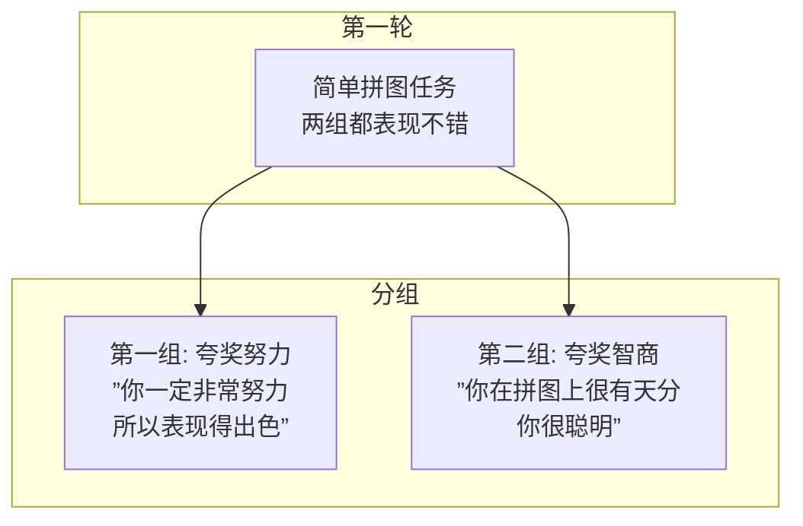
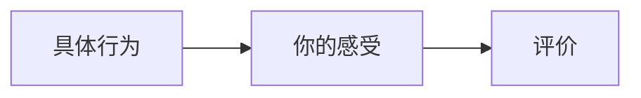
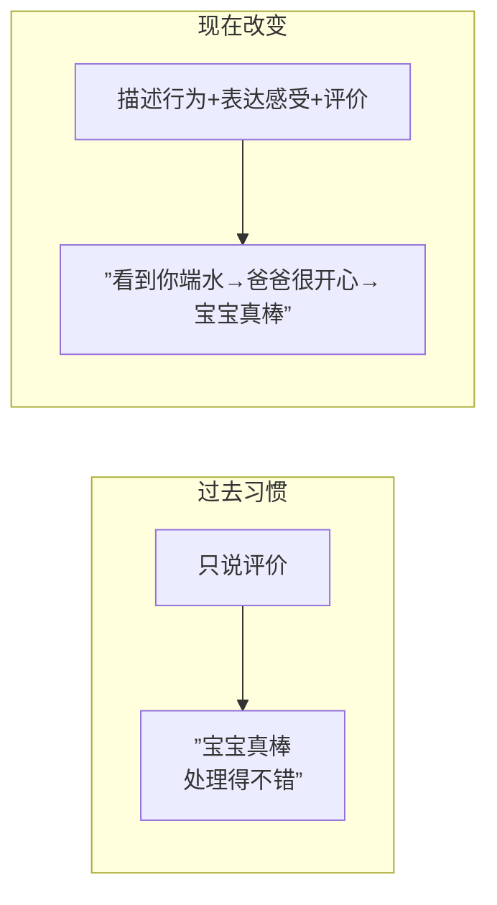

# 第12课：让表扬有趣让批评有用

## 斯坦福拼图实验

斯坦福大学著名心理学家在十年间对纽约20所学校近500名五年级学生进行了一项研究，包含四轮测试。

### 后续三轮测试结果

| 测试轮次 | 被夸努力组（鼓励） | 被夸聪明组（表扬） |
|----------|-------------------|-------------------|
| 第二轮：自由选择任务难度 | **90%**选择难度较大的任务 | 大部分选择简单的任务 |
| 第三轮：故意设置难题 | 虽失败但从容，"这是我喜欢的测试"，认为失败是因努力不够 | 紧张、抓耳挠腮、沮丧 |
| 第四轮：回到简单任务 | **分数比第一轮提高约30%** | **分数比第一轮退步约20%** |

> [!WARNING] 关键发现
> 一句不经意的夸奖方式，对孩子产生的影响截然相反。

### 鼓励 vs 表扬

| 维度 | 鼓励 | 表扬 |
|------|------|------|
| 对象 | 努力、用功（态度/过程） | 聪明、天赋（结果/成效） |
| 给人感觉 | 成败掌握在自己手中 | 成败不由自己掌控 |
| 面对失败 | 从容，认为是努力不够 | 沮丧，甚至直接放弃 |
| 后续选择 | 愿选有难度的挑战 | 避开挑战，怕被说不聪明 |

**结论：多鼓励少表扬，多描述少评价。**

## 行为 + 感受 + 评价 公式

这个公式完全符合[[0010-chong-tu-niu-zhuan|第10课]]中"对事不对人"的原则。如果把行为说得足够清楚、感受表达足够清晰，评价甚至可以不用说了。

### 生活案例：宝宝端水

**场景**：劳累一天下班回家，五六岁的孩子主动端了一杯水说"爸爸妈妈辛苦了，来喝水"。

| 步骤 | 传统表达（只有评价） | 公式表达 |
|------|--------------------|---------|
| **行为** | -- | "宝宝看到爸爸妈妈下了班回来，还主动给爸爸端水" |
| **感受** | -- | "爸爸感到好开心哦" |
| **评价** | "宝宝真棒/真乖/真厉害" | "宝宝真棒" |

> [!TIP] 关键洞察
> 传统表达只说"宝宝真棒"——这是**评价**；公式表达先描述**行为**，再说**感受**，最后才说**评价**。评价一定是针对前面所描述的行为。

### 批评场景应用

**场景**：孩子在大人聊天时吵闹打人。

| 步骤 | 表达内容 |
|------|----------|
| **行为** | "刚刚爸爸妈妈在跟叔叔聊天，你在边上一直吵一直吵，说了也不听，还打了叔叔一下。" |
| **感受** | "爸爸妈妈真的有点生气了。" |
| **评价** | "我觉得你今天的表现不太好。" |

### 职场应用：对下属处理投诉的表扬

**场景**：下属小王昨天成功处理了一个客户投诉。

**传统方式**："小王，昨天的投诉处理得不错，处理得很好。"（浮于表面）

**公式应用**：

1. **行为**："小王，我认真观察了你昨天的客户投诉处理，特别是当你说出`XXX`那句话的时候，那个客户的眼睛都亮了。"
2. **感受**："我看到你这么好的表现，也听到了别人对你的肯定，我觉得特别的欣慰。"
3. **评价**："小王，我发现你在捕捉客户心理感受的能力真的是很厉害啊。"

> [!NOTE] 效果
> 用这种方式表扬，几乎可以预知一个结果：未来当他再次面对客户投诉时，信心会提升，这个好的行为会被自己强化和放大。

## 核心洞见

心理学有句话：**人性中最深刻的本能，就是被欣赏的渴望。而欣赏又不等于泛泛的表扬。**

以前我们做了太多泛泛的表扬——只说评价，不说行为和感受。现在要改变：先描述行为，再表达感受，最后做评价。

## 练习

> [!QUESTION] 自测
> 你的同事小李主动留下来帮你完成了一个紧急项目到晚上九点。请用"行为+感受+评价"公式对他进行表扬。

参考示例

**行为**："小李，昨天我那个紧急项目的截止时间快到了，你主动留下来帮我一起做到晚上九点才走，特别是你帮我把数据表格重新整理了一遍。"

**感受**："我当时觉得特别感动，也特别踏实。"

**评价**："小李，你真的是一个特别靠谱又热心的伙伴。"

## 下一课

继续学习[[0013-ti-wen|第13课：如何问出好问题]]，掌握提问这一越来越值钱的能力。