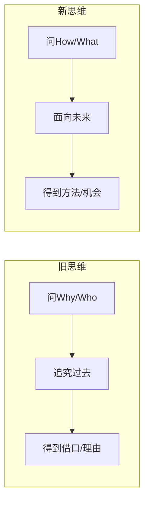

# 第13课：如何问出好问题

## 提问：一种越来越值钱的能力

传统教育让我们习惯向问题要答案，但这个时代正在改变:

- **信息爆炸**:知识存量不断变大，学到博士后也无法用一辈子
- **搜索工具发达**:找到答案的速度和质量趋于同一水平
- **答案易被挑战**:确定性的答案基于过去经验，易被快速变化的环境挑战

**爱因斯坦**:"提出一个问题往往比解决一个问题更重要，因为解决问题也许仅仅只是一个数学或实验上的技能，而提出新的问题却需要有创造性的想象力，而且标志着科学真正的进步。"

爱因斯坦小时候问自己:"如果和光线一起旅行，你会看到什么呢？"这个问题引导了他一生的探索。

**蒙文通教授**:民国时期大历史学家，期末考试不是出题考学生，而是让学生出题考他——通过考察学生能否提出有水平的问题来判断学生有没有学习。

**犹太人教育**:中国学生回家被问"今天学到什么新知识了"，犹太学生回家被问"今天问了什么好问题"——前者的落脚点是学知识，后者的落脚点是提问题。

### 好问题的三个特征

1. 不能被立即回答，但能激发人们离目标更近一点
2. 与能否得到正确答案无关
3. 处于已知和未知的边缘

## 16字原则

> [!TIP] 提问方法论
> **没有问题只有机会，没有过去只有未来。**



## 多问How/What，少问Why/Who

大脑面对"为什么"(Why）会启动**自我保护机制**,给出借口而非真相:

- 问"为什么迟到" → 答案十有八九是"堵车"
- 问"为什么打架" → 答案是"他先打我的"

### 转化对照表

| 旧问题(Why/Who） | 新问题(How/What） |
|------------------|-------------------|
| "老张，为什么没有按计划实现目标？" | "老张，接下来我们可以做些什么，才能更快地赶上进度？" |
| "为什么桌子这么乱？" | "下节课开始我们怎么分工一下，桌子可以更整齐呢？" |
| "事情为什么会这样？" | "事已至此，接下来我们可以如何改善呢？" |
| "谁该为此事负责？" | "下一次我们该如何规避这类失误？" |

同样的事情，换一种问法，得到的答案将从一堆理由和借口变成一堆方法和可能性。

### 会议主题对比

- **错误主题**:"这次会议我们要讨论一下，为什么员工不积极主动。" → 氛围沉默
- **正确主题**:"这次会议我们要讨论一下，我们可以做些什么，才能让员工变得更积极主动。" → 更有建设性

> 一次会议的主题几乎决定一次会议的成败。

### 孩子考试不及格案例

**场景**:孩子回家说"妈妈，今天发了数学考卷，我考了55分不及格。"

| 旧问法 | 新问法 |
|-------|--------|
| "为什么会考不及格呢？" | "宝宝，下一次考试如果我们要争取考70分，你觉得接下来这两个月我们可以一起做些什么事情呢？" |

新问法的优势:
1. 有明确目标(70分是垫垫脚尖能够得着的)
2. 引导关注实现目标的机会
3. 问题中用的是"我们"而不是"你"

## 两个建议

1. **把问题的中心词放在动词上(行动上)**——也就是放在机会上
2. **问题中包含"我/我们"**,而不是"你/你们/他/他们"

## 喂养机会，饿死问题

现代管理学之父彼得·德鲁克总结的八个字:

> **喂养机会，饿死问题。**

```mermaid
graph TD
    A[你的时间和精力<br/>(狗粮有限）] --> B{分配给谁？}
    B -->|多给| C[机会小狗<br/茁壮成长]
    B -->|少给| D[问题小狗<br/自然饿死]
```

时间和精力就像狗粮是有限的。你希望哪只小狗长得更壮？唯一的办法就是把有限的狗粮多给叫"机会"的那只小狗。

## 练习

> [!QUESTION] 自测
> 你的下属小刘这个月的业绩目标只完成了70%。请用这节课的方法，设计两个面向未来的问题来和他沟通。

<details>
<summary>参考示例</summary>

1. "小刘，接下来的半个月我们可以做些什么，来缩小剩下的30%差距？"
2. "从这次经验来看，下个月我们调整什么策略，能让你更稳定地达成目标？"
</details>

## 下一课

继续学习[[0014-wei-xi-guan|第14课：微小启动成习惯]，了解如何用微习惯策略持续提升精准表达能力。