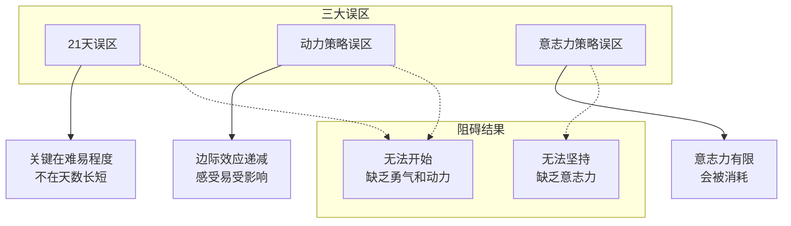
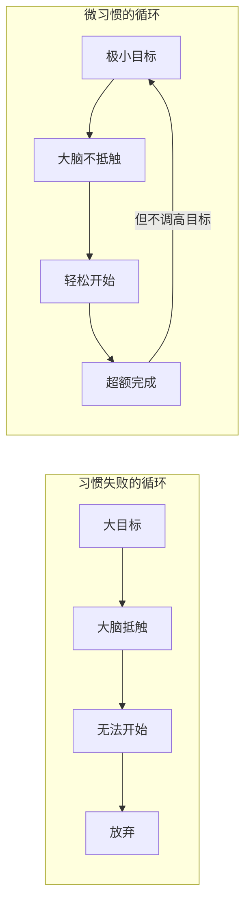

# 第14课：微小启动成习惯

## 习惯养成三大误区

### 误区一：21天养成习惯

这是一个误解。21天说法最初来源于一位外科医生——他发现截肢或整容手术的患者大约需要21天才能适应肢体或面容的变化。但不知怎么就被畅销书翻译成了"坚持21天就可以养成习惯"。

> [!WARNING]
> 培养习惯的关键因素在于**习惯的难易程度**，而不在于天数的长短。很多人兴致勃勃坚持了21天，到了第22天发现没养成习惯，那股劲一下子就泄了。

### 误区二：动力策略

在床头贴健美运动员照片激励自己健身——这是动力策略。

问题：
1. 动力是人的感受，容易受外界影响而变化
2. **边际效应递减**：重复做同一行为，每次带来的愉悦感和成就感会降低，坚持的难度越来越大

### 误区三：意志力策略

完全相信自己的自律和毅力——这是意志力策略。

问题：
- 人的意志力是**有限的**，会被消耗
- 意志力受很多因素影响（比如吃没吃饱、血糖浓度）

## 微习惯策略

> [!TIP] 微习惯的定义
> **设定一个小到连自己都鄙视的目标，而且不要轻易调高目标，就这么傻傻地坚持着，你会发现你几乎不可能失败。**

### 微习惯的例子

| 大目标 | 微习惯目标 |
|-------|-----------|
| 每天做100个俯卧撑 | 每天做**1个**俯卧撑 |
| 每天写3000个字 | 每天写**50个字** |
| 每天看1小时书 | 每天看**1页**书 |

### 为什么微习惯有效

1. **容易开始**：目标足够小，小到不可思议，大脑不会抵触这个行为的开始
2. **容易坚持**：目标足够小，只要多做一点点就超越预期，没有坚持的压力
3. **几乎不可能失败**：这个特性不会给你造成任何负担，具有超强的欺骗性——大脑还没来得及对这个行为产生抗拒，行为本身就已经发生了

### 注意事项

在环境能力允许时，尽可能超额完成，但**不要轻易调高目标**。

## 精准表达15件小事

结合精准表达全课程，针对不同角色罗列15件可以立即启动的小事：

### 通用原则

1. 表是手段，答才是目的。如果有办法比"表"更好地实现"答"，那么能不表就不表。
2. 听到别人的结论，不盲目信也不排斥不信，在大脑里多问一句"还有其他的可能性吗？"（[[0001-qing-ting-yu-du-li-si-kao|独立思考]]的起点）
3. 倾听时灵活模仿对方微动作，比你绞尽脑汁回应可能更有效。（[[0001-qing-ting-yu-du-li-si-kao|倾听技巧]]）
4. 有时候不妨说一两个极端一点的观点，等待别人反驳，碰撞可能创造新的路。
5. 只要条件允许，为表达配上一张简单的图。**能图不表，能表不字**——能用图就不用表格，能用表格就不用文字。

### 角色专属建议

6. **新人/普通职员**：抓住每次汇报工作的机会，用[[0002-san-duan-wei|金字塔结构]]呈现。你的领导不一定思路清晰，但他一定喜欢思路清晰的人。
7. **资深专家**：答案来源于固定经验，经验会被变化的环境挑战。学会问好问题，胜过直接给答案。（[[0013-ti-wen|第13课]]）
8. **企业高管**：学会[[0010-chong-tu-niu-zhuan|对事不对人]]。表达不满时，别人不尴尬才是改善结果的起点。
9. **创业者**：讲一个好故事比讲一堆道理更有效。故事是有冲突的，人们会对想补上知识的坑充满好奇。（[[0007-han-bao-bao-fa-ze|汉堡包法则]]）
10. **教育工作者**：用[[0006-huang-jin-san-quan|黄金三圈]]备课——Why（讲这节课的意义）、How（如何学得更好）、What（这节课主要讲什么）。
11. **销售人员**：每次约访客户前想清楚"产品的哪个特点匹配客户的哪个特征"，练熟[[0005-xiao-shou-gao-shou|销售四诀]]。
12. **部门经理**：以[[0009-hui-yi-gao-xiao|AAR开始，以NBA结束]]，每次会议更高效，结果有效落实。
13. **HR**：学会[[0011-fei-bao-li-gou-tong|非暴力沟通]]——事实+感受+需求+请求。
14. **市场人员**：影响客户决策有两种小而准的方式——精准报价、透过买点看到客户需求。（[[0008-bo-qian-jin|第08课]]）
15. **父母**：停止泛泛的表扬（有隐患），用好[[0012-biao-yang-pi-ping|行为+感受+评价]]，让表扬有趣让批评有用。

> [!NOTE] 启动建议
> 以上15件小事，选择某一件离你最近、让大脑最无压力、最无负担的快速启动。不要试图一下子全做到。

## 练习

> [!QUESTION] 自测
> 回顾上面的15件小事，找到与你当前角色最匹配的一件，把它设计成微习惯目标（小到连自己都鄙视的那种）。

参考示例

如果你的角色是普通职员：每次向领导汇报工作前，先在草稿纸上用金字塔结构列出"结论→三个要点→论据"，哪怕只有三行字也算完成。每天一次，坚持就好。

## 下一课

继续学习[[0015-ke-yi-lian-xi|第15课：刻意练习成高手]]，了解如何通过刻意练习成为精准表达的高手。