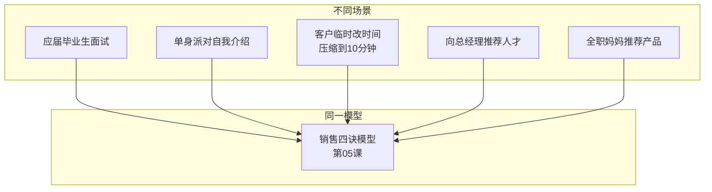
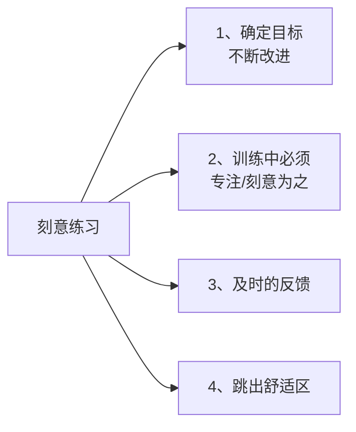

# 第15课：刻意练习成高手

## 课程回顾总览

### 第一篇章：必备技能（两种习惯 + 三个锦囊）

- **两种习惯**：[[0001-qing-ting-yu-du-li-si-kao|倾听]]和独立思考
- **三个锦囊**（心理建设三句话）：
  1. 表达是一门遗憾的艺术
  2. 没有高级的技巧，只有基础的技能
  3. 高手都在学习套路，而新手总想寻找捷径

### 第二篇章：多元思维

- 如何提炼独一无二的观点，让观点具有个人属性（[[0003-ti-lian-guan-dian|第03课]]）
- 用[[0004-shu-xue-si-wei|数学思维]]让观点呈现更有深度且通俗易懂（第04课）

第一、二篇章属于**必备技能**，不管用什么模型都会用到。

### 第三篇章：模型应用

角色型场景和应用型场景，至少讲了十几种模型，每个模型都从具体案例中提炼：

- [[0005-xiao-shou-gao-shou|销售四诀]]（第05课）
- [[0006-huang-jin-san-quan|黄金三圈]]（第06课）
- [[0007-han-bao-bao-fa-ze|汉堡包法则]]（第07课）
- [[0008-bo-qian-jin|细节影响]]（第08课）
- [[0009-hui-yi-gao-xiao|会议高效]]（第09课）
- [[0010-chong-tu-niu-zhuan|冲突扭转]]（第10课）
- [[0011-fei-bao-li-gou-tong|非暴力沟通]]（第11课）
- [[0012-biao-yang-pi-ping|表扬与批评]]（第12课）
- [[0013-ti-wen|提问技巧]]（第13课）

## 模式归纳

不同场景可以识别为同一种模型。学会做模式归纳，你会发现案例的表象千奇百怪，但透过表象其实属于同一种模型场景。

不要一下子把每个模型都想练好，这样反而会乱。可以先针对性地练习某一种模型，有意识地把**练好一招胜过练好多招**。

## 刻意练习四特征

> 如果你没有进步，并不是因为你缺少天赋，而是因为你没有用正确的方法去练习。——《刻意练习》

有些人是在做**天真的练习**，而真正有用的练习是**有目的的练习**。

### 特征一：确定目标，不断改进

每个阶段只确定一个目标。比如这个月把黄金三圈模型练得得心应手，就在这段时间尽可能在任何场景都套用这个模型。

### 特征二：训练中必须专注

要刻意为之——你很清楚自己就是为了套这个模型而改编的，改编的结果要让自己觉得比原来的习惯方式更好。

### 特征三：及时的反馈

- **最佳反馈**：找个人，把改编前和改编后的情况分别说给他听，让他作为听众表达直观感受
- **替代方案**：用手机录下来（音频或视频），自己回听回看

> [!NOTE]
> 回听自己的音频或回看自己的视频其实是一件很恐怖的事情，好多人看一半就看不下去了。这说明回听和回看能让你发现很多细微的问题。

### 特征四：跳出舒适区

练习时会不习惯——以前的表达不加思索脱口而出，现在要按照套路去练，会觉得别扭。这种别扭和麻烦，恰恰就是你在**突破舒适区**的感觉，是成长的必经之路。

## 心理表征

心理表征是认知心理学的名词，指在思考事物时对应的某种心理结构——其实就是一直说的**模型或套路**。

### 象棋大师实验（回顾[[0002-san-duan-wei|第02课]]）

新手和专家看问题的深度和高度不同，差别就在于心理表征的不同（即模型和套路的不同）。不断有目的地训练，会让心理表征成为越来越固化的心理结构，未来碰到同类型表达时，大脑会自动调用这个结构。

> 我们只有努力地去复制杰出人物的成就，失败了就停下来思考为什么会失败，才有可能创建有效的心理表征。——《刻意练习》

## 先复制模仿，再改良创新

1. **先复制化地模仿**——完全复制，完全模仿
2. 把复制化的东西做得足够熟练
3. 在某个应用过程中，自动自发地进一步改良

## 练习

> [!QUESTION] 自测
> 选择本课程中的任意一个表达模型（如黄金三圈、汉堡包法则、非暴力沟通等），设计一个为期两周的刻意练习计划，要求包含刻意练习的四个特征。

参考示例（以黄金三圈为例）

**目标**：两周内熟练运用黄金三圈结构做即兴发言。

1. **确定目标**：第一周每天找到一个话题用黄金三圈写草稿，第二周尝试在真实对话中使用。
2. **专注刻意**：每次写草稿或发言前，明确告诉自己"我在练习黄金三圈"。
3. **及时反馈**：每天录一段自己的演练录音，睡前回听；周末请一位朋友听你的前后对比。
4. **跳出舒适区**：从写草稿到真实对话，从熟人聊天到工作会议，逐步挑战更难场景。

## 下一课

本课是正式课程的最后一课。如需继续探索效率提升主题，可学习[[0016-zui-zhong-yao-de-shi|第16课：破除成功的谎言]]。