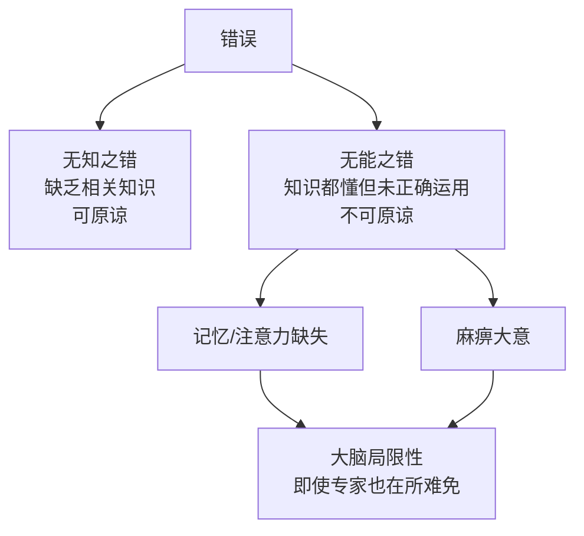

# 第18课：清单革命

## Learning Objectives

- 区分无知之错与无能之错，理解无能之错的严重性
- 掌握三种清单的使用场景和方法
- 学会在复杂项目中设置检查点

## Core Idea

清单看起来简单，但恰恰因为简单，大家觉得"自己懂"反而很少真正去落实它。

### 无知之错 vs 无能之错



> [!DANGER] 无能之错的代价
> 很多严重错误造成的巨大损失，恰恰都是无能之错——明明可以做对的事情却做错了。飞行员犯错、医生犯错、建筑工程师犯错，每一个都可能是人命关天。

### 三种清单

**三类问题：**
1. 简单问题（如开车、换滤芯）
2. 复杂问题（如做手术、开飞机）
3. 不确定性的极端复杂问题（如建摩天大楼）

```mermaid
flowchart LR
    subgraph ”三类问题与对应的清单”
        A[简单问题] --> B[执行清单<br/>列出来，做完打勾]
        C[复杂问题] --> D[核查清单<br/>按步骤逐一核查]
        E[极端复杂问题] --> F[沟通清单<br/>重点事项多方沟通]
    end
```

> [!TIP] 执行清单——解决简单问题
> 把要做的事情罗列出来，按步骤执行，做完打勾。核心在于"列出来避免忘记了"。

> [!TIP] 核查清单——解决复杂问题
> 再厉害的飞行员在起飞前依然要拿核查清单逐项检查。不是怀疑能力，而是大脑有局限性。
>
> **霍普金斯医院静脉置管清单（仅5步）：**
> 1. 用消毒皂洗手消毒
> 2. 用洗必泰消毒液对病人皮肤消毒
> 3. 给病人整个身体盖上无菌手术单
> 4. 戴医用帽、医用口罩、无菌手套，穿手术服
> 5. 导管插入后，在插入点贴上消毒纱布
>
> 结果：10天感染率从11%降到0%，15个月内仅出现2起感染，防止了43起感染和8起死亡事故，为医院节省200万美元。

> [!TIP] 沟通清单——解决极端复杂问题
> 在极端复杂的事情中，事先确定哪些重点事项一定要多方沟通达成。这些事项不能由某一方单独决策。
>
> **花旗大厦案例：** 设计公司设计底座采用焊接方式，承包公司自行改为铆钉，但没有通知设计公司、没有多方沟通。结果，大厦被建筑系学生发现承受不了11级台风——只需11级以上台风，大厦就会从30楼开始断裂坍塌。最终连夜在关键200处焊上5厘米厚钢板才消除隐患。

### 设置检查点

> [!NOTE] 海伦乐队巧克力豆的故事
> 海伦乐队每次演出合同中都有一条：化妆间要有一盘巧克力豆，且不能出现棕色巧克力。否则整场演出取消，违约金由主办方承担。
>
> 这不是耍大牌——这是一个"检查点"。因为乐队人多、乐器大，对舞台有复杂要求。通过巧克力豆检验主办方是否详细阅读合同。有一次后台确实有巧克力豆但出现了棕色巧克力，触发全面检查后发现舞台承重力不够——如果乐队全员和乐器上去，演出半途就可能坍塌。

### 关联课程

- [[0016-zui-zhong-yao-de-shi|第16课：最重要的事只有一件]]——执行清单与"成功清单"的配合
- [[0017-xin-xi-chao-zai|第17课：信息超载下有效工作]]——大脑局限性是清单必要性的理论基础
- [[0014-wei-xi-guan|第14课：微小启动]]——清单本身也是一种微小习惯

> [!QUESTION] 反思练习
> 你日常工作中最容易出现的"无能之错"是什么？如果为此设计一份清单，应该包含哪些步骤？

## Worked Example

**个人效率清单（核查清单版）：**

| 步骤 | 事项 | 完成？ |
|------|------|--------|
| 1 | 确认今日最重要的三件事 | [ ] |
| 2 | 检查是否有截止日期在今天的事项 | [ ] |
| 3 | 为每件事预估所需时间 | [ ] |
| 4 | 安排一段离线时间 | [ ] |
| 5 | 确认是否有待回复的重要消息 | [ ] |

## Practice

> [!QUESTION] Self-check
> 为你工作中最常出现的一个复杂流程设计一份核查清单（5-10个步骤）。比如会议准备清单、出差行李清单、项目上线检查清单等。

<details>
<summary>Reveal answer</summary>

清单设计要点：
1. 步骤要具体、可操作，每一步都是一个明确动作
2. 步骤尽可能按顺序排列
3. 操作时逐项打勾，不要跳步
4. 设置1-2个"检查点"——如果清单中某一项异常，触发全面复查

**参考：** 参考霍普金斯医院的5步清单——简单但严格，顺序也不能错。
</details>

## Next Step

继续学习下一课，了解未来社会需要的六种能力：[[0019-liu-zhong-neng-li|第19课：未来社会需要的六种能力]]。