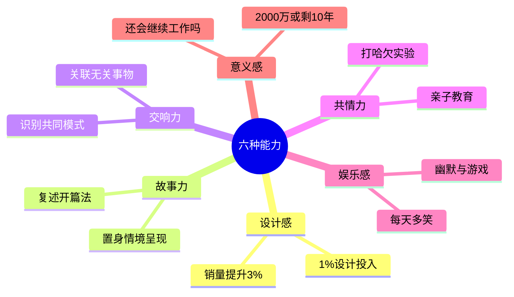

# 第19课：未来社会需要的六种能力

## Learning Objectives

- 理解从工业时代到概念化时代的转变
- 掌握未来社会需要的六种能力
- 将六种能力与精准表达课程内容对应

## Core Idea

丹尼尔-平克在《全新思维》中提出：从工业时代进入"概念化时代"，需要培养高概念能力和高感性能力。

### 从左脑时代到全脑时代

```mermaid
flowchart LR
    subgraph ”工业时代”
        L[左脑主导<br/>逻辑/分析/流程/标准]
    end
    
    subgraph ”概念化时代”
        R[右脑觉醒<br/>情感/全局/设计/共情]
    end
    
    subgraph ”全脑时代”
        B[左右脑协同<br/>全脑思维]
    end
    
    L --> R --> B
```

**左脑 vs 右脑示例：** 老婆说"去吧去吧好好喝，晚上不用回来了"。左脑推断：老婆允许去，还可以不回家——纯字面推理。右脑结合全局语境判断：这句话要反着理解。左右脑一合计——算了不去了。

### 六种能力



> [!TIP] 1. 设计感
> 医院采光变好、玻璃擦干净，病人使用止痛药比例大幅降低。多投入1%的设计费用，往往让销量提升约3%。
>
> 关联表达课：不同的表达模型让每次表达都"有设计感"。

> [!TIP] 2. 故事力
> 把一件事置身于情境中呈现，让人产生身临其境的感受。为什么释迦牟尼、孙悟空、舒克贝塔、七个小矮人这些名字一辈子都忘不了？因为每个名字背后都有一个故事。
>
> **训练方法：复述开篇法**——拿起一本书（最好是小说类），看第一段后停下来，自己构思如何接续故事，再和原文对比。
>
> 关联课：[[0007-han-bao-bao-fa-ze|第7课：汉堡包法则]]——讲故事的模型。

> [!TIP] 3. 交响力
> 两个维度：一是迅速把无关的事物联系在一起，二是从不同事情中识别共同模式。
>
> **训练方法：多做比喻，就地取材**——看到钓鱼联想到营销：营销就像钓鱼，要给鱼爱吃的东西，先给予才可能有收获。
>
> 关联课：[[0003-ti-lian-guan-dian|第3课：学会提炼观点]]——多元化提炼观点，就是交响力的体现。

> [!TIP] 4. 共情力
> **打哈欠实验：** 别人打哈欠你容易跟着打，代表共情能力较好。
>
> 亲子教育案例：孩子摔倒，不要说"不疼不疼"否定对方感受，而要说出孩子那一刻可能的感受。作者带两岁半女儿打预防针，提前三次做心理建设，告诉她会疼、可以哭，结果女儿挨了两针都没哭。
>
> 关联课：[[0011-fei-bao-li-gou-tong|第11课：非暴力沟通]]——说出感受拉近心理距离。

> [!TIP] 5. 娱乐感
> 即使不具备幽默细胞，每天多笑一笑。一个孩子每天笑几百次，成年人好几天都不笑一次。
>
> 关联课：[[0012-biao-yang-pi-ping|第12课：表扬与批评]]——让表扬和批评不那么严肃，需要娱乐感。

> [!TIP] 6. 意义感
> 两个问题：如果突然获得2000万，或者突然被告知只能再活10年，你还会继续目前的工作吗？如果答案是"会"，那么这份工作一定带给了你某种特殊的意义。
>
> **幸福公式：** 幸福 = 快乐 x 意义（快乐是当下体验，意义是对未来的期许，乘号意味着两者缺一不可）。
>
> 关联课：[[0006-huang-jin-san-quan|第6课：黄金三圈]]——遵循Why-How-What三层逻辑，就是为了突出意义感。

### 六种能力与精准表达课程的对应

| 能力 | 对应课程 |
|------|---------|
| 设计感 | 各种表达模型让表达有设计感 |
| 故事力 | [[0007-han-bao-bao-fa-ze|第7课：汉堡包法则]] |
| 交响力 | [[0003-ti-lian-guan-dian|第3课：提炼观点]] |
| 共情力 | [[0011-fei-bao-li-gou-tong|第11课：非暴力沟通]] |
| 娱乐感 | [[0012-biao-yang-pi-ping|第12课：表扬与批评]] |
| 意义感 | [[0006-huang-jin-san-quan|第6课：黄金三圈]] |

> [!QUESTION] 反思练习
> 六种能力中，你觉得自己最擅长哪一项？最需要提升哪一项？如何在日常表达中训练它？

## Worked Example

**复述开篇法练习步骤：**
1. 选一本小说，看第一段
2. 停下来，自己构思后续故事发展
3. 回去看原文，对比自己的构思和作者的写法
4. 留意：别人好在哪里？自己欠缺在哪里？

这种"对比"不会损害自信，而是让你看到自己可以提升的方向。

## Practice

> [!QUESTION] Self-check
> 尝试用"复述开篇法"找一本书或一篇文章练习，写下你的练习感悟。或者尝试回答：如果今天获得2000万，你还会继续现在的工作吗？

<details>
<summary>Reveal answer</summary>

复述开篇法没有标准答案，关键在于：
1. 训练的是"构思"的能力，而不是"猜对"的能力
2. 对比不是为了否定自己，而是为了看到不同的可能性
3. 长期坚持可以显著提升故事力和交响力

**关于意义感：** 如果答案是不确定或否定，不必焦虑。意义感需要深度思考后提炼出来，它不是天生的，而是可以主动构建的。
</details>

## Next Step

继续学习最后一课，从人类历史的三次革命看认知升级：[[0020-ren-zhi-sheng-ji|第20课：认知升级]]。