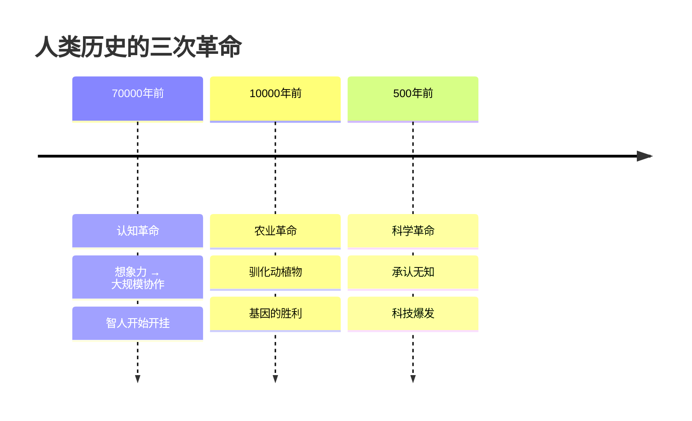
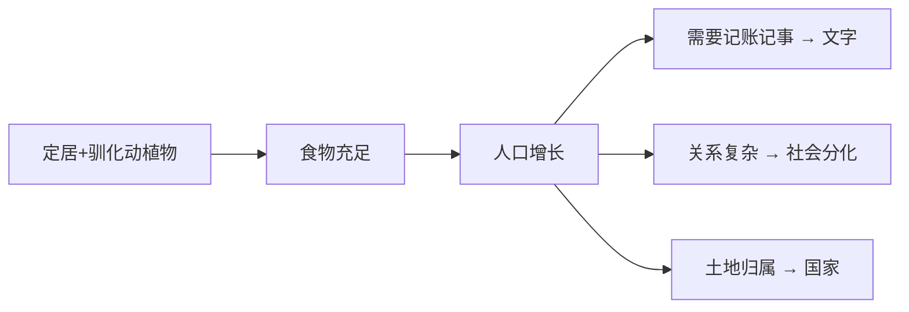
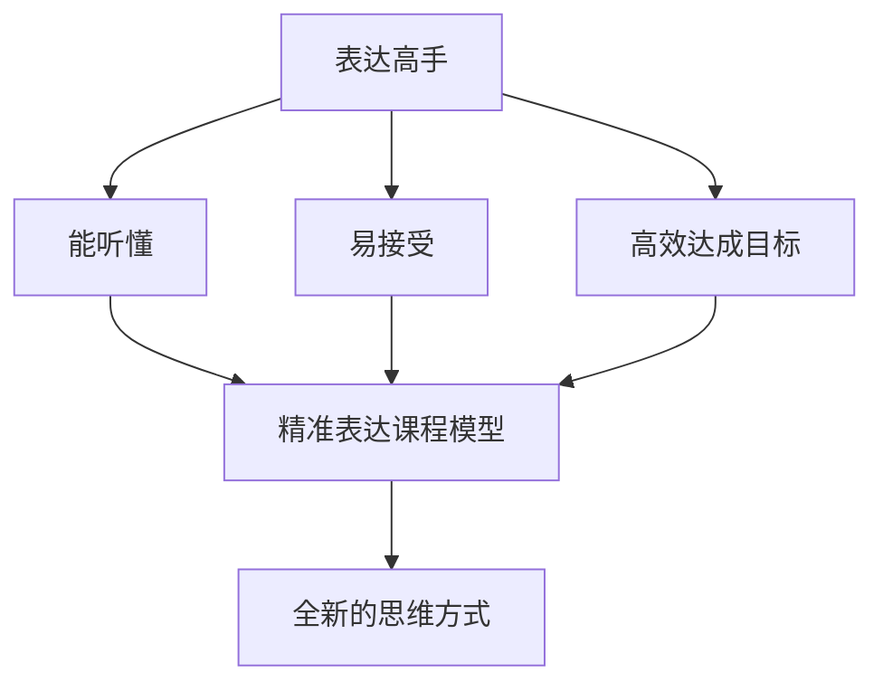

# 第20课：认知升级

## Learning Objectives

- 理解人类历史三次重大革命及其商业启示
- 掌握指数型进化曲线的意义
- 回顾并总结精准表达课程的核心思想

## Core Idea

尤瓦尔-赫拉利的《人类简史》以大视角的历史演变揭示商业演化的底层逻辑。人类历史的进程可以概括为三次革命。

### 三次革命



#### 认知革命（7万年前）

约600万年前，一个"猴奶奶"生下两只猴，一只演化为猩猩，一只演化为人类。200万年前地球上至少存在6种人，智人只是其中一支。

智人进化出大脑前额叶，拥有了**想象力**——这是第一次认知革命的核心。

有了想象力，智人可以做其他人种无法做的事：**大规模协作**。一次大规模协作需要策划、讨论、制定对策、分配战利品——这一切需要在事情发生前就"想象"出来，并且需要听者也能理解这种想象。

> [!NOTE] 想象力的力量
> 猴子无法理解"把香蕉给我就能上天堂"——它无法想象天堂的存在。而人可以牺牲当下利益去追求来生的福报，是因为想象力让我们相信那件事是真的。
>
> 宗教就是这样来的：山上的大石头就是守护神——没有人见过它显灵，但当所有人都相信这种想象时，它比真实的力量更强大。

智人从东非出发，短短6万年灭绝了其他人种，还灭绝了地球上大部分大型动物。

**商业启示：** 真正的竞争是认知的竞争。当看待世界的角度变了，虽然个人能力没有提升，但从种群角度已经不在同一个维度上——这就是"降维打击"。

#### 农业革命（1万年前）

驯化动物和植物：小麦、马铃薯、葡萄、玉米、猪、马、牛、羊、狗。

有了固定食物来源和住所，人口变多，触发连锁反应：
- 需要记账记事 → 符号 → 文字
- 人际关系变复杂 → 社会分化、三六九等、分工（士农工商）
- 粮食依赖土地 → 土地归属概念 → 国家



> [!TIP] 农业革命是"基因的胜利"还是"骗局"？
> 作者赫拉利提供了一个思考角度：农业革命并没有让个体生活更幸福。人类本已从四脚着地进化成两脚着地解放双手，农业革命却让人又弯腰到田里——腰椎间盘突出、颈椎病等"现代病"由此而来。被驯化的动物幸福指数也在下降：今天量产的家畜，第一次见到阳光可能是在去屠宰场的路上。
>
> **到底是人类驯化了小麦，还是小麦驯化了人类？** 小麦从一种普通野草变成目前种植面积最大的植物——这是基因的胜利。

#### 科学革命（500年前）

过去5000年的变化加起来都没有最近500年的变化大。

**科学革命的起源：人类开始承认自己的无知。**

以前人们认为圣人和先知已经把一切搞清楚了，不懂只是因为不够了解先知的智慧。但从牛顿的力学定律、培根的"知识就是力量"开始，人们发现自己无知，发现世界上有很多规律可以了解并利用——科技由此爆发。

> [!NOTE] 碾压式胜利
> 今天随便一艘战舰回到哥伦布时代，就能轻松打败整个舰队。哥伦布时代连牛顿都还没出生，那是一个没有物理学的时代——这种战争没有悬念。

### 指数型进化曲线

```mermaid
flowchart LR
    subgraph ”人类进化加速”
        A[700万年前<br/>人类演化起步] --> B[7万年前<br/>认知革命<br/>智人开挂]
        B --> C[1万年前<br/>农业革命<br/>社会雏形]
        C --> D[500年前<br/>科学革命<br/>科技爆发]
    end
```

每一次真正的进步都源于人类共同的认知进步。**一次认知升级带来的效益，抵得上过去上百万年的能力积累。**

### 课程总结

> [!QUOTE] 精准表达的核心
> **"表示过程，答才是目标。"**
>
> 精准表达不是教你把话说得更优美、用一堆金句或排比句、让听众煽然泪下。而是结合大脑特性、结合听众心理，给你一个一个高效实现目标的模型。

**表达的三大误解澄清：**
1. 滔滔不绝不等于表达高手
2. 出口成章不等于表达高手
3. 妙语连珠不等于表达高手

**表达高手的唯一衡量标准：** 让对方能听懂、易接受。哪怕普通话不太标准、甚至有点口吃，都不影响你成为表达高手。



### 关联课程

- [[0016-zui-zhong-yao-de-shi|第16课：最重要的事只有一件]]——认知升级是找到最重要之事的底层能力
- [[0017-xin-xi-chao-zai|第17课：信息超载下有效工作]]——认知识别大脑局限性
- [[0018-qing-dan-ge-ming|第18课：清单革命]]——认知决定我们用什么工具
- [[0019-liu-zhong-neng-li|第19课：未来社会需要的六种能力]]——认知升级与未来能力的关系
- [[0000-fa-kan-ci|发刊词：善用精准表达]]——课程起点与终点的呼应

> [!QUESTION] 结课反思
> 回顾整个精准表达课程，你觉得最大的收获是什么？哪一课的内容对你的改变最大？

## Worked Example

**认知升级在商业中的应用：**

当你是"认知革命"之前的视角，你思考的是如何把现有的事情做得更好（线性增长）。

当你是"认知革命"之后的视角，你思考的是"看待世界的方式是否出了问题"（指数增长）。

案例：诺基亚在功能机时代做到极致，但智能手机的认知升级让功能机时代的一切积累都失去意义——这就是"降维打击"。

## Practice

> [!QUESTION] Self-check
> 回答这个贯穿课程始终的问题：什么是你理解的"精准表达"？对比学习前后的理解有哪些变化？

<details>
<summary>Reveal answer</summary>

**课程核心主线回顾：**

01 倾听与独立思考 → 02 三段位 → 03 提炼观点 → 04 数学思维 → 05 销售高手 → 06 黄金三圈 → 07 汉堡包法则 → 08 四两拨千斤 → 09 会议高效 → 10 冲突扭转 → 11 非暴力沟通 → 12 表扬与批评 → 13 提问 → 14 微小启动 → 15 刻意练习 → 16 最重要的事 → 17 信息超载 → 18 清单革命 → 19 六种能力 → 20 认知升级

整体系列课从"术"到"道"，从"表达技巧"到"认知升级"，希望你收获的不是几句金句，而是一套全新的思维方式。

**"表示过程，答才是目标"——这是整个精准表达课程的灵魂。**
</details>

## Next Step

恭喜你完成了精准表达系列课的全部课程！学习没有终点，请继续在实践中精进。