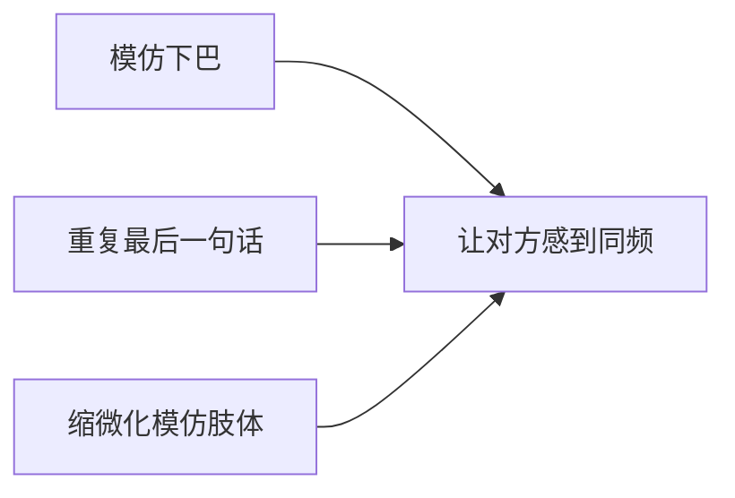
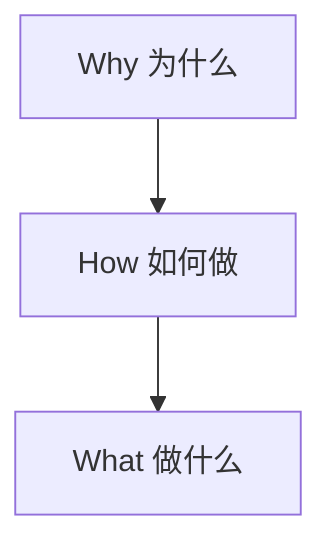
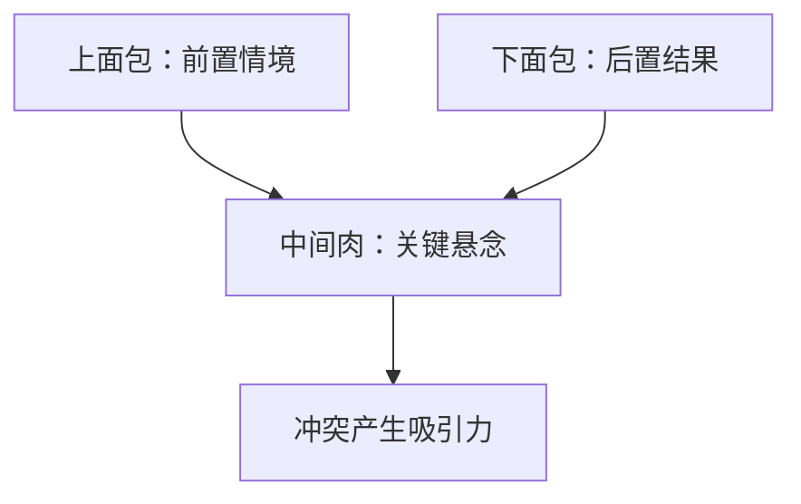

# 表达模型速查表

## 倾听模型

### 模仿且灵活



## 观点提炼模型

### 提炼观点三法

| 方法 | 操作 | 案例（滥竽充数） |
|---|---|---|
| **多立场分析** | 站在不同角色角度 | 国王角度→管理要多质疑机制少怀疑人 |
| **逆出发点分析** | 反转默认出发点 | 南郭处士→善于捕捉机会窗口 |
| **条件假设推理** | 增加新假设条件 | 假设他很努力→成为一代宗师 |

## 表达结构模型

### 黄金三圈（演讲/说服）



**要点**：由内向外表达，先说Why再说How最后说What。

### 金字塔结构（汇报/会议）

```
  结论/论点（先说）
  ├── 论据1
  ├── 论据2
  └── 论据3
```

**要点**：结论先行，自上而下。思考可以从下到上，但表达必须从上到下。

## 角色场景模型

### 销售四诀

| 步骤 | 句式 | 要点 |
|---|---|---|
| 第一诀 | "简单来说，……" | 突出一到两个匹配特点 |
| 第二诀 | "它特别适合于像您这样……的人" | 匹配对方身份/闪光点 |
| 第三诀 | "您使用了它之后，……" | 利益显性化 |
| 第四诀 | "举个例子来说吧，……" | 举人（身份稍高）或举事（关键行为） |

### 汉堡包模型（讲故事）



**要点**：先讲上面包（开始），再讲下面包（结局），制造冲突落差，留出中间最精彩的部分。

## 谈判模型

### 精确报价

| 场景 | 常规做法 | 精准做法 |
|---|---|---|
| 购物还价 | 报整数（230/280） | 报精确数（263） |
| 谈加薪 | 要求10% | 提出9.7% |
| 定工期 | 两周后交 | 11天后交 |

### 深度精准（买点→需求）

```
需求（底层）
   ├── 买点A（客户以为的等式）
   └── 买点B（你创造的新等式）
```

**要点**：买点是表面的，需求是底层的。透过买点看到需求，就可以创造新的等式。

## 会议管理模型

### AAR 六步骤

1. 目标和意图是什么？
2. 实际上发生了什么？
3. 期望目标与实际的差距？
4. 有何学习与启发？
5. 如何转化为行动（短/中/长期）？
6. 哪些建议可分享给别人？

### NBA 5W2H

| 要素 | 含义 |
|---|---|
| What | 做什么 |
| Why | 为什么做 |
| Who | 谁负责 |
| When | 何时完成 |
| Where | 在哪里做 |
| How | 怎么做 |
| How much | 做到什么程度/多少资源 |

**公式**：上次会议的NBA = 下次会议的AAR素材

## 冲突化解模型

### 开场三步

1. **以事实为开场**（不含形容词、不可争辩）
2. **对比说明**（"我不是X，我是Y"）
3. **以问题结束**（真诚邀请对方表达）

### 非暴力沟通四步

```
事实 + 感受 + 需求 + 请求
```

- **事实**：不含形容词，不可争辩
- **感受**：非评价非想法（建立感受词汇表）
- **需求**：真实具体，不说"我也是为你好"
- **请求**：具体可执行（告诉别人"你的手在哪"）

## 表扬/批评模型

### 行为 + 感受 + 评价

```
具体行为 → 我的感受 → 针对性评价
```

**要点**：行为描述要充分（时间、地点、人物），感受要真实，评价依附于前面描述的行为。

## 提问模型

### 多How/What 少Why/Who

```
❌ "为什么没完成计划？" → 得到借口
✅ "接下来我们可以做什么赶上进度？" → 得到方案
```

### 16字原则

> 没有问题只有机会，没有过去只有未来。

### 两个建议

1. 问题的中心词放在动词（行动）上
2. 问题中尽可能包含"我/我们"

## 习惯养成模型

### 微习惯

**原理**：设定小到连自己都鄙视的目标，大脑不抵触，几乎不可能失败。

**应用**：

| 理想目标 | 微习惯版本 |
|---|---|
| 每天100个俯卧撑 | 每天1个俯卧撑 |
| 每天写3000字 | 每天写50字 |
| 每天看书1小时 | 每天看1页书 |

### 刻意练习四特征

1. 确定目标并不断改进
2. 训练中必须专注
3. 有及时的反馈
4. 跳出舒适区