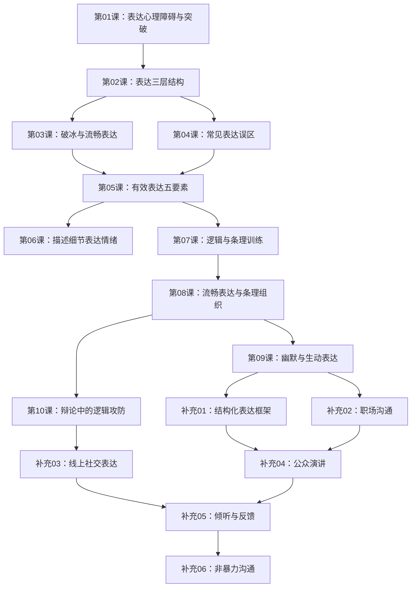

# 课程地图

## 学习路径依赖

## 模块学习说明

### 模块一：表达心理基础（第01-02课）
从根源上理解"为什么不会说"。深入探讨无话可说背后的心理原因，以及表达的三层结构模型。

**学习目标**：
- 理解表达障碍的深层心理原因
- 掌握态度→情绪→想法三层表达结构
- 建立"表达即自我存在"的核心认知

### 模块二：有效表达方法（第03-06课）
从实战角度学习"怎么说清楚"。涵盖破冰技巧、常见误区规避、有效表达五要素、情绪表达方法。

**学习目标**：
- 掌握状态+感受的聊天模式
- 学会制造挑战推动深度交流
- 掌握有效表达五要素
- 学会用细节表达情绪

### 模块三：逻辑与条理（第07-08课）
解决"说得乱、说不长"的问题。建立表达的逻辑框架，让说话有条理、有层次。

**学习目标**：
- 建立事件之间的逻辑联系
- 掌握结构化表达基础
- 学会长时间流畅表达

### 模块四：生动与幽默（第09-10课）
从"说清楚"进阶到"说得好"。学习幽默的表达逻辑和辩论的攻防技巧。

**学习目标**：
- 理解幽默的"情理之中，意料之外"公式
- 掌握夸张+合理逻辑的幽默方法
- 了解辩论中的逻辑攻防

### 补充课程（补充01-06）
针对原课程不足的专项加强。涵盖结构化表达框架、职场沟通、线上社交、公众演讲、倾听反馈、非暴力沟通。

**学习目标**：
- 掌握PREP/SCQA等结构化表达框架
- 学会职场场景下的专业表达
- 提升线上文字沟通能力
- 掌握基础公众演讲技巧
- 学会有效倾听与反馈
- 实践非暴力沟通

## 学习建议

1. **每周节奏**：每周学习2-3课，配合课后练习，约4-6周完成
2. **练习优先**：表达能力的提升靠练不靠看，每课后的练习至少做3遍
3. **录音回听**：每次练习后录音，回听自己的表达并改进
4. **从生活开始**：先用课程方法描述自己的日常经历，再应用到社交场景
5. **反思循环**：说→反思→改进，形成正向循环