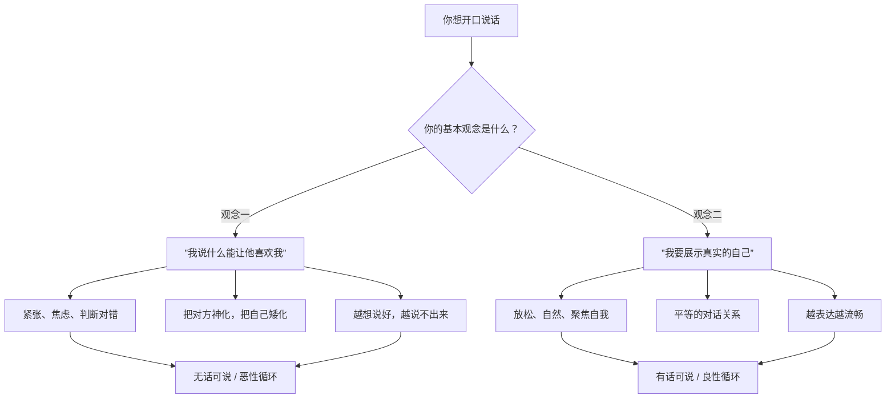
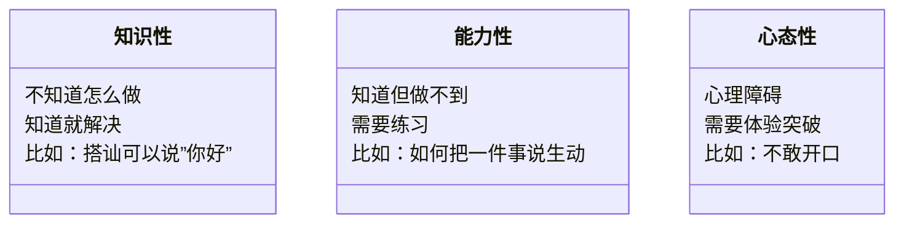
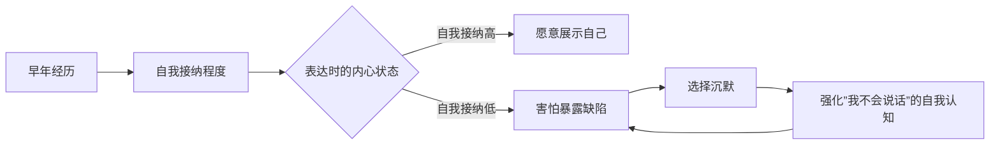

# 第01课：深入表达的心理障碍与突破

## Learning Objectives

- 识别"无话可说"背后的心理根源而非表面方法问题
- 理解表达的本质是自我存在的一种体现方式
- 区分"为获得反馈而表达"与"为展示自我而表达"两种心态
- 掌握突破心理障碍的第一步：行动优先于完美

## 核心概念：表达的两种基本观念

我们在学习表达技巧之前，首先需要厘清一个根本问题：**你为什么要表达？**

绝大多数人在思考"怎么说话"时，其实是在思考"我说什么才能让对方对我有好感"。这个看似理所当然的思路，恰恰是表达障碍的根源。

### 观念一：表达是为了获得对方的好反馈

这个观念的逻辑是：我的表达直接决定对方对我的反馈。如果我表现得好，对方就喜欢我；如果我表现得不好，对方就会排斥我。这个观念之所以有害，是因为它把一个你无法完全控制的事情（别人的反应）变成了你表达的唯一目标。

> [!WARNING] 基本误区
> 别人对你的反馈，**并不完全由你的行为决定**。对方当天的心情、对方自身的性格和经历、环境因素等都会影响反馈。如果你认为"只要我说对话，对方就会喜欢我"，那么当反馈不如预期时，你只会归咎于自己"不会说话"，从而加剧焦虑。

### 观念二：表达是自我存在的体现

阮琦老师在课程中反复强调一个基本原理：**"我言故我在"** —— 当我们开口说话、描述生活、表达想法时，我们不仅以物理方式存在于这个世界上，更通过语言让自己的存在被感知、被确认。

这个观念之所以重要，是因为它把你的表达动机从"取悦他人"转变为"展现自我"。当你不再把别人的反馈作为唯一目标时，你的心态会变得轻松得多。

> [!TIP] 关键洞察
> 一个真正自信的人是这样想的："当我看到一个我喜欢的人，我会预设那个人也不会讨厌我。我很愿意把自己是什么样子展示给那个我喜欢的人看。" 如果你觉得自己不值得被了解，你就不会有表达的欲望。

## 无话可说：一个心理问题

阮琦老师在课程中把表达问题分为三个层面：

"无话可说"在大多数成年人身上，早已不是一个"不知道说什么"的知识性问题，而是一个**心态性/心理问题**。它已经形成了某种条件反射式的经验：一旦置身于某些场景（面对重要的人、面对陌生人、面对众人），大脑就自动进入空白状态。

### 心理问题的形成机制

一个人如果在成长过程中没有得到足够的接纳和认可，就很容易形成"我不值得被关注""我说的话没有价值"的深层信念。当这种信念根深蒂固时，即使学了再多的表达技巧，也很难真正开口——因为**你内心并不觉得自己值得被倾听**。

## 突破的第一步：把表达当作冒险

阮琦老师提出了一个非常重要的观点：**改变本身就是一次冒险**。

> [!NOTE] 冒险的本质
> 当你尝试一种从未有过的表达方式时，结果只有两种——成功或失败。失败可能会让你尴尬，但失败的后果是你可以承担的；而成功一次，就足以改变你的自我认知。

你多年来习惯于在某些场合保持沉默，这个状态虽然不理想，但至少是"安全"的。现在要改变，就意味着你要放弃这个安全区，去尝试一种新的可能。这个过程中，你的表达可能生硬、不自然、甚至可笑——但这都是改变的一部分。

### 改变心态的三步法

1. **认识到改变没有捷径**：没有一种神奇的方法能让你在不经历尴尬的情况下就变成表达高手
2. **把表达当成任务**：不要追求完美，完成比完美重要。只要你在原本沉默的场合说了话，无论说得如何，你已经赢了
3. **游戏心态**：像打游戏一样，每一次开口都是一次"经验值"的获取，无论成败都有收获

> [!QUESTION] 自我检查
> 回忆一下，你在哪些场合最容易"无话可说"？是面对领导、面对喜欢的异性、还是面对一群陌生人？你能想到一个具体的场景吗？

参考思路

试着把你的场景归类：
- **权威场景**（面对领导、老师、长辈）——害怕说错话被评判
- **亲密场景**（面对喜欢的人）——害怕暴露真实自我不被接受
- **陌生场景**（面对陌生人）——没有共同话题，担心尴尬

不同场景的深层原因不同，但突破方法的第一步是一样的：**先开口，再完善**。

## 实践练习：本周挑战

根据课程的要求，本周请完成以下任务：

> [!QUESTION] 本周任务
> 在你最不习惯表达的场景中（比如同事聚餐、与喜欢的对象相处、与领导同处一个空间），强迫自己完整地说一段话——讲一个故事、表达一个看法、释放一种情绪。无论说得好坏，无论别人是否认真听，你必须**把它说完**。

这周任务的意义不在于给别人留下好印象，而在于**完成对自己的承诺**——你正在打破多年来"我在这个场合不说话"的习惯。

任务提示

如果不知道说什么，就从"状态+感受"开始：
- 状态：我今天刚从XX地方过来 / 我刚做了XX事
- 感受：我觉得挺累的 / 那个地方让我感觉很特别
- 引申：由此我又想到了一件事……

不用担心对方是否感兴趣。你的任务只是"说出来"，不是"让对方感兴趣"。

## 总结

本课的核心要点：

1. **表达的两种基本观念**：为获得反馈而表达（不健康）vs 为展示自我而表达（健康）
2. **无话可说往往是心理问题而非能力问题**，源于对自我的不接纳
3. **改变需要冒险精神**，不能期待不经历尴尬就脱胎换骨
4. **行动的时机至关重要**：听到新理念后要马上行动，拖延会产生"耐药性"

## 下一步

本课我们从心理层面理解了表达障碍的根源。下一课将学习表达的具体结构模型——[[0002-biao-da-san-ceng-jie-gou|第02课：表达的三层结构——态度、情绪、想法]]，帮你理清在社交中应该如何循序渐进地表达自己。

在进入下一课之前，请务必完成本周的实战任务。只有行动起来，这些理念才会真正转化为你的能力。