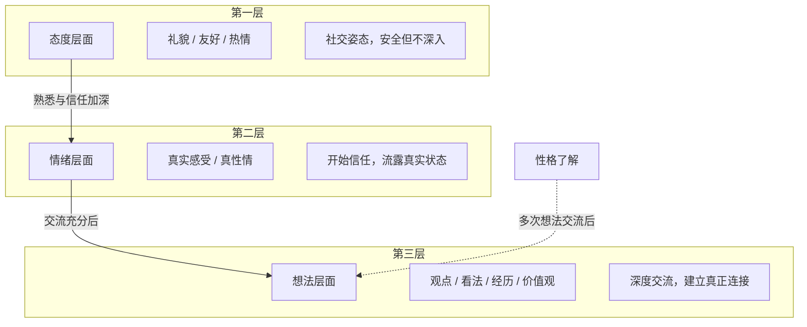
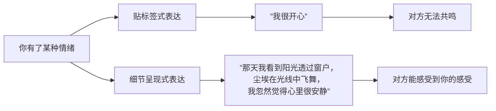

# 第02课：表达的三层结构——态度、情绪、想法

## Learning Objectives

- 理解社交表达的三层递进结构：态度、情绪、想法
- 识别在不同社交阶段应该使用哪一层表达
- 掌握用细节表达情绪的方法，而非贴标签
- 理解"制造挑战"作为高级聊天技巧的原理

## 核心模型：态度-情绪-想法三层结构

阮琦老师提出了一个非常重要的社交表达模型：人与人之间的交流，按照由浅入深的顺序，可以分为三个层面。

### 第一层：态度层面

这是交流的最浅层。在这个层面，你向对方展示的是一个**社交姿态**——礼貌、客气、热情。这些姿态可能是你真实状态的一部分，但它更多的是由你与对方的关系决定的，而不是由你当下的真实情绪决定的。

典型场景：初次见面时的寒暄、敬酒、问候。这一层的特点是：**安全，但停留在表面**。

> [!WARNING] 常见陷阱
> 很多人——尤其是在酒桌文化中——在第一层用力过猛。拼命敬酒、过度热情，以为这样可以拉近关系。但事实上，停留在态度层面的过度友好并不能真正建立连接。这就是为什么很多酒桌上的"兄弟"第二天就不再联系。

### 第二层：情绪层面

当两个人有一定的信任基础后，交流可以进入第二层——真实情绪的表达。这里说的"情绪"不是贴标签（"我很开心""我很难过"），而是**把你的真实感受通过细节呈现出来**。

这一层的关键词是：**真性情**。它不是装出来的友好，而是你当下真实的状态——哪怕这个状态不那么"正能量"。

### 第三层：想法层面

当情绪交流充分之后，就可以进入更深层的想法交流。这一层涉及的是：**你对事物的看法、你的价值观、你的人生经历、你做决策的深层逻辑**。

想法层面的交流，是建立真正友谊和亲密关系的关键。你会发现，那些你能够无话不谈的朋友，往往都在这个层面有过深入的交流。

> [!TIP] 关键洞察
> 很多时候我们觉得和一个人"聊得来"，不是因为找到了什么"正确的话题"，而是因为交流顺利地经过了态度→情绪→想法这三个层次。话题本身不重要，交流的层次才重要。

## 三层结构的实战应用

### 场景一：初识破冰

刚认识一个人时，先保持在态度层面。用友好的姿态开始交流，但不要贪多。几句话的友好就足够了，然后要有意识地向情绪层面过渡。

示例（来自课程案例）：
> 你和一个人在办公室相遇，对方养了一盆红色叶子的植物。一般的回答是：  
> **错误**："这是什么植物？"（提问，给对方压力）  
> **更好**："你们办公室真好，还有这么漂亮的植物。我们办公室太单调了，回头我也得种点东西。"（说自己的状态，态度友好）

### 场景二：从友好到真性情

课程中有一个经典案例：一个男生和女生在微信上聊工作，一板一眼地提问和回答，陷入僵局。后来男生用开玩笑的方式把话题引向情绪层面——聊到"最可爱的人"的典故，女生开始表达对老板和工作的一些真实情绪。**关系一下子就活了。**

> [!NOTE] 过渡技巧
> 从态度到情绪的过渡，可以用**夸张**、**角色扮演**、**幽默反差**。比如对方说"我是小鸭子"，你可以回应"我是大狗熊，一天没吃饭了，正好烤只小鸭子"——这就进入了情绪层面的互动。

### 场景三：从情绪到想法

课程中提到一个规律：很多男女关系进展到互相开玩笑、打情骂俏的阶段就停滞不前了。这时候需要主动推进到想法层面。

要点是：**交流那些与情绪相关的具体事件和判断**。比如：
- "我最近遇到一件事，挺烦的，不知道该怎么办"
- "你对XX事是怎么看的？"
- "我以前的经历让我形成了这样一种看法……"

> [!QUESTION] 自我检查
> 你和一个朋友/约会对像的关系，目前停留在三个层面的哪一个？你们只是客气寒暄（态度层），还是能表达真实感受（情绪层），还是能交流深层想法（想法层）？

分析提示

如果你觉得和某人的关系"浮在表面"，很可能是你们卡在了态度层，没有进入情绪层。这时候可以主动做一些"破冰"：开一个小玩笑，或者表达一点自己的真实感受（哪怕是负面感受），观察对方是否接招。

如果你觉得和某人关系很好但"没法再深入"，可能是卡在了情绪层。这时候需要主动分享一些你的想法、困惑、价值观——这需要勇气，但回报是更深的关系。

## 情绪表达的实操方法：画面细节法

课程中最精彩的练习之一，是"印象最深刻的画面"练习。这个练习的核心目的是：**通过描述画面细节来表达情绪，而不是贴情绪标签**。

### 为什么要用画面表达？

因为直接说"我很开心""我很感动"是一种**理性总结**，它跳过了你的感受本身。而当你描述一个画面中的细节时——光线、颜色、声音、动作——你实际上是在**让对方经历你的感受**。

### 阮琦老师的示范

阮老师的印象最深刻画面是"阳光下的尘埃"：
> 我上幼儿园的时候，有时候不想去，家人把我锁在房间里。他们告诉我，"你看那些飞舞的尘埃，他们是小精灵，你可以和他们说话。"我真的信了。我对着尘埃说话，发现如果我急速呼吸，尘埃就飞舞得更快；如果我屏住呼吸，他们就安静下来。那一刻我觉得尘埃真的在和我互动……

注意这一段的表达方式：
1. **画面本身**：阳光中的尘埃
2. **细节描述**：尘埃随呼吸变化飞舞的快慢
3. **情绪蕴含其中**：不是直接说"孤独"，而是通过细节让你感受到那种独特的充实的孤独

> [!TIP] 练习方法
> 找一个让你印象深刻的画面（不一定是美好的，也可以是让你恐惧或悲伤的），尝试：
> 1. 先描述画面本身：你看到了什么？光线如何？颜色如何？
> 2. 再说画面中的细节：有什么动作？什么顺序？
> 3. 最后才说这个画面带给你的感受
>
> 注意：不要急着说事件情节（"然后发生了什么"），而是停留在画面本身。

## 实践练习

> [!QUESTION] 练习一：三层结构识别
> 请分析以下这段对话中，双方处于哪一个层面：
>
> 男："你做什么工作的？"  
> 女："我做物流的，快到年底了特别忙。"  
> 男："听起来确实辛苦，你们公司的配送范围覆盖全国吗？"  
> 女："嗯，主要做华东地区。"

分析

这段对话停留在 **态度层面**。双方都很礼貌友好，但交流的都是客观信息，没有任何真实情绪流露。如果继续这样聊下去，很快就会陷入尴尬。应该适时加入一些情绪元素，比如开个玩笑："这么忙，你们老板该给你加工资啊！"

> [!QUESTION] 练习二：把标签转化为细节
> 把以下"贴标签"的表达改写为"细节呈现"的表达：
> > 1. "我今天很开心"  
> 2. "那个人很友善"  
> 3. "我很难过"

参考答案

1. "今天下午的阳光特别好，我走在路上，忽然听到街角有人在弹吉他，那旋律很熟悉，是我的大学校歌。我站在那里听了好一会儿，嘴角一直带着笑。"  
2. "他说话的时候总是微微欠着身子，眼神很专注。我讲到一半卡壳了，他也不催，就安静地等我想起来。"  
3. "我坐在沙发上，手机屏幕亮着，是那条消息。房间里很安静，只听到冰箱嗡嗡的响声。我想做点什么，但就是不想动，手就那么垂着。"

## 总结

本课的核心要点：

1. **表达有三层结构**：态度层（安全）、情绪层（真实）、想法层（深入）
2. **交流需要层层递进**：不能跳过，也不能停滞在某一个层次
3. **用细节表达情绪**比贴情绪标签更有感染力
4. **紧张和拘束往往是该进入情绪层时还停留在态度层**造成的

## 下一步

本课学习了表达的层次结构。下一课我们将深入探讨一个最实际的问题——[[0003-po-bing-yu-liu-chang-biao-da|第03课：破冰与流畅表达]]，学习如何在与陌生人交谈时打破沉默，以及如何提升表达的流畅度。

在学习下一课之前，请在现实生活中观察你与他人的交流目前处于哪个层面，并尝试主动推动到更深一层。与[[0001-shen-ru-biao-da-xin-li-zhang-ai|第01课]]中提到的心理突破相结合，你会发现自己正在逐渐打开表达的大门。