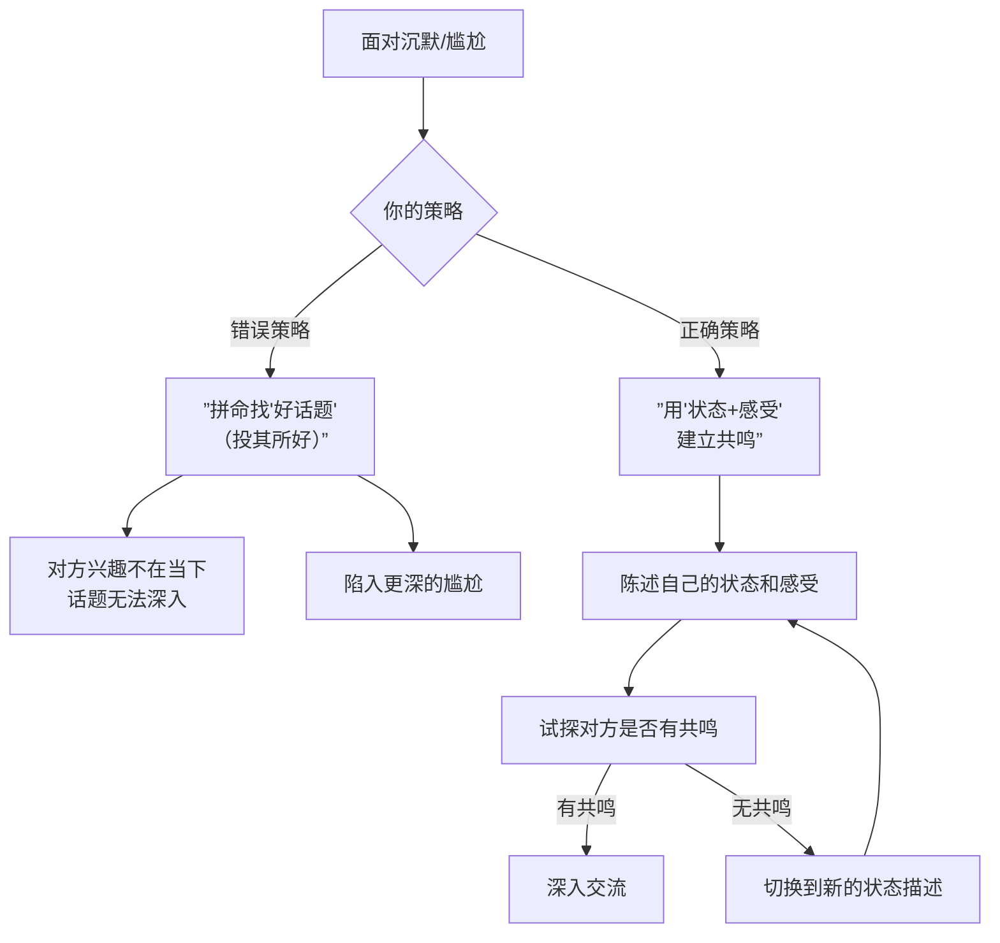
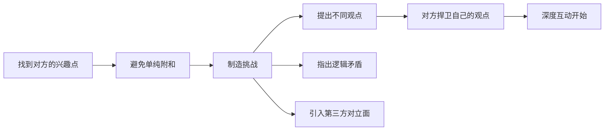
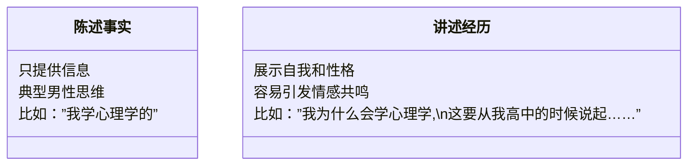

# 第03课：破冰与流畅表达

## Learning Objectives

- 掌握"状态+感受"破冰法，避免无话可说的尴尬
- 理解"制造挑战"在深度聊天中的作用
- 学会通过描述个人经历来展示自我
- 区分"陈述事实"与"讲述经历"的差异

## 破冰方法论：从无话可说到有话可说

破冰的核心问题只有一个：**如何让沉默的场面变成有话可说的状态？**

很多人的第一反应是"找一个好话题"。但阮琦老师在课程中指出，这个思路本身就是错的。真正让聊天热起来的，不是某个特定的"话题"，而是**情绪状态的对频**。

### 策略一：状态+感受法

这是避免无话可说尴尬的**基础方法**。原理很简单：**当你不知道该说什么的时候，就说你自己——说你此刻的状态和你对这件事的感受。**

"状态"包括两个要素：
- **现象**：你观察到的外界事物
- **行为**：你正在做什么或做过什么

"感受"包括两个要素：
- **情绪标签**：开心、困惑、紧张
- **主观判断**：我觉得……，我认为……

#### 案例示范

在搭讪或初次见面的场景中，对方可能很矜持不说话。这时候你不需要提问，而是用"状态+感受"来打开局面：

> "我家住得离这比较远，今天是第一次来这个商场。刚才转了一圈，这地方太大了，我都逛晕了。"

分析这段话的结构：
- 状态1（现象）："第一次来"
- 状态2（行为）："转了一圈"
- 感受："逛晕了"

对方可能会如何回应？
- 如果对方也经常迷路，就会产生共鸣："是啊，我第一次来也找不到北。"
- 如果对方没有这个经历，你可以继续延伸："我这人就是路痴，到了一个陌生地方就发懵。"

> [!NOTE] 核心原则：少问多说
> 很多人一尴尬就喜欢提问——"你做什么的？""你哪里人？"连续提问会让对方感到被审问，反而增加压力。更好的方式是**说自己**，给对方一个机会选择是否加入话题。

### 策略二：制造挑战

"状态+感受"法解决的是"有话可说"的问题。但如果想让聊天真正热起来、深入下去，你需要**制造挑战**。

阮老师在课程中举了一个生动的例子：

> 一次朋友聚餐，一开始四个人互相客气，聊不起来。后来大家聊到"什么是美女"，有人提出"看腿"，有人提出"看气质"，有人不同意对方的说法，于是开始争论——气氛一下子热烈了。

**注意**：制造挑战不是吵架，而是用善意的、好奇的方式提出不同的角度。比如：

- "你说得对，但我在想另一种情况……"
- "我之前也这么认为，直到有一次……"
- "你的观点很有意思，不过如果反过来看呢？"

> [!TIP] 关键洞察
> 一场好的聊天，本质上和一部好电影一样——需要有冲突。冲突带来情绪的起伏，情绪的起伏让聊天变得有趣。但冲突的前提是：讨论的是双方都感兴趣的事物。

#### 如何制造挑战而不冒犯

| 方式 | 做法 | 示例 |
|------|------|------|
| 直接对立 | 提出相反观点，适合已熟悉的人之间 | "我觉得你说得不对，因为……" |
| 虚拟第三方 | 转述一个"别人"的观点来引发讨论 | "我有一个朋友说……，但我不确定他说的对不对" |
| 好奇质疑 | 表现出不解，请对方解释 | "很有意思，但我想知道为什么你会这么想？" |

## 讲述经历的艺术

破冰之后，如何让交流变得有深度？关键在于**讲述你的经历**。

阮老师在课程中强调了一个重要区分：

### 讲述经历的四个要素

要让一段经历讲述变得有吸引力，需要包含以下要素：

1. **前后的状态变化**：我之前如何 → 后来如何
2. **变化的原因（内因）**：我的性格、兴趣、想法如何影响了选择
3. **变化的原因（外因）**：外界的事件、人物如何影响了轨迹
4. **因果关系的连接**：把这些要素用逻辑串联起来

#### 阮老师的示范

> 我上高中的时候，学习不算太好，不太用功，喜欢玩。那会儿正好看到一条新闻——一个年轻人去漂流长江牺牲了。报纸上都在讨论这事，大多数持批评态度。但我无意中看到另一个观点，说人的能量——心理学叫"力比多"——需要通过某种方式释放和升华。我当时正处在青春期，对"性"充满了困惑，看到这个一下子就觉得找到了答案——原来心理学可以解答我生活的困惑。我本来以为自己学了理科，和心理学无缘了，结果填志愿前一天，一个女生告诉我心理学是理科。就那一句话，改变了我的人生方向。

这个示范为什么有效？
- 有状态变化：从"不喜欢学习"到"找到了人生方向"
- 有内因：叛逆性格，对性的好奇
- 有外因：那条新闻，那个女生的那句话
- 有因果逻辑：因为这些原因，所以我选择了心理学

> [!WARNING] 常见错误
> 很多人在讲述经历时，只讲事件本身，不讲自己的主观反应。比如："我大学学的是机械，毕业后转了行，做了销售。"——这只给了信息，没给"你"。正确的做法是加入你的感受、你的性格、你当时的想法。你的独特之处，恰恰体现在**你对事件的反应方式**中。

## 破冰与流畅表达的实战案例

### 案例一：办公室等待陌生人

**场景**：你去某办公室找人，那人不在，只有他同事在。你先夸奖了他的一盆植物：
> 你："你这草好特别，很少见到红色的叶子。"  
> 对方："是啊。"  
> 你："这个东西叫什么？"  
> 对方："我也不知道。"  
> ——然后卡住了。

**问题出在哪里？** 你连续提问，但对方并不健谈。提问越多，对方压力越大。

**突破方法**：改用"状态+感受"法
> 你："你们办公室真好，还有这么漂亮的植物。我们办公室太单调了，回头我也得种点东西。"

这时候你在说自己的状态和计划，对方可以选择接话，也可以不接。不接的话，你继续说自己的——"我们办公室那种绿萝养都养不活，我这人是不是不适合养植物……"——只要你在**说自己**，你就不会卡住。

### 案例二：和喜欢的女孩散步被推开

**场景**：过马路时你拉了她的手，她躲开说"不行"。

**错误反应**：尴尬地沉默，收手，整段路无话。

**正确方法**（来自课程）：
> 用夸张的情绪回应："在这么好的气氛下、这么好的环境中，你竟然把我拒绝了。我感觉比表白被拒二十次还伤心。不行，我得找辆车钻进去——小车装不下我，我得找一大卡车！"

注意：**你没有退出情绪层面，而是用更高能量的情绪覆盖了尴尬**。对方可能会被逗笑，气氛就活了。

> [!TIP] 关键原则
> 当对方已经处于情绪状态（害羞、紧张、抗拒）时，**不要退回到态度层面**（礼貌地道歉、退缩），而是用情绪回应情绪。对方害羞，你就用开玩笑化解；对方生气，你用幽默缓解。

## 实践练习

> [!QUESTION] 练习一：把"陈述"变为"讲述"
> 以下是很多人会说的"陈述"版本，请改写为"讲述经历"的版本：
>
> 原文："我大学学的是计算机，毕业后做了产品经理。"

参考答案

"说来也挺有意思的。我大学学的计算机，但我其实不太喜欢整天对着代码。有次我参加一个项目，我负责和技术团队对接需求——我发现我特别享受这个过程，把用户的需求翻译给程序员，看着一个功能从无到有做出来。那时候我才意识到，我喜欢的不是写代码本身，而是用技术去解决问题。所以毕业以后我就选了产品经理这条路。不过也挺折腾的，刚入行那半年，经常被开发怼，每天都在怀疑自己是不是选错了路……"

注意对比：原版只给了"什么"，新版给了"为什么"，以及过程中的挣扎和感受。

> [!QUESTION] 练习二：制造挑战
> 假设你在和一个喜欢旅行的人聊天。你不想只是说"我也喜欢旅行，那地方真好"，请尝试用"制造挑战"的方式来推进对话。

参考答案

几种思路：
1. **提出对立观点**："我其实觉得自由行和跟团各有好坏。自由行自由但太累，跟团轻松但太赶。你更倾向哪种？为什么？"
2. **虚拟第三方**："我一个朋友特别喜欢去东南亚，说性价比高。但我觉得好像少了点文化冲击，你怎么看？"
3. **好奇质疑**："你说你喜欢一个人旅行，我很好奇——一个人旅行不孤独吗？还是说孤独本身就是旅行的一部分？"

关键：提出一个可以让对方"捍卫"或"解释"自己观点的挑战。

## 总结

本课的核心要点：

1. **破冰不是找话题，而是对频情绪状态**
2. **"状态+感受"法**让你永远不会无话可说——说你自己就够了
3. **"制造挑战"**让聊天从平淡变为深入——差异带来热度
4. **讲述经历的艺术**：不要只给信息，要给人——加入你的性格、感受、选择的原因
5. **不同情绪场景用不同的应对方法**：对方在态度层，你用态度层；对方在情绪层，你要用更高的情绪能量去匹配

## 下一步

本课学习了破冰和流畅表达的技巧。结合之前的[[0001-shen-ru-biao-da-xin-li-zhang-ai|第01课：心理障碍与突破]]和[[0002-biao-da-san-ceng-jie-gou|第02课：三层结构]]，你已经掌握了从心理认知到具体方法的完整工具箱。

接下来，请在实际生活中刻意练习：
1. 找一个你平时会保持沉默的场景，用"状态+感受"法开口说话
2. 在已经熟悉的对话中，尝试一次"制造挑战"，看看效果如何
3. 准备一个关于你自己的"经历讲述"（3-5分钟版本），在下次和朋友的聊天中自然地讲出来

真正的改变不在于听了多少，而在于做了多少。