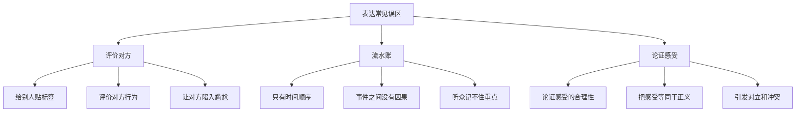
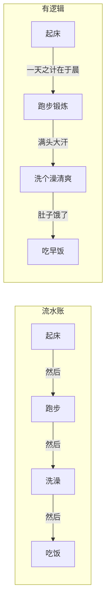

# 第04课：表达训练中的常见误区

## Learning Objectives

- 识别并克服表达中"评价对方"的惯性，学会用行为和事实替代评价
- 理解"流水账"式表达的弊端，掌握事件间的逻辑连接方法
- 认识"论证感受"的问题，学会纯粹表达情绪而不自我辩护

## 三大常见误区

表达训练中，绝大多数人都会陷入三个典型误区。这些误区根深蒂固，往往源于我们从小接受的思维训练和语言习惯，尤其是理工科背景的人更容易中招。让我们逐一分析。

### 误区一：评价对方

这是最常见、最隐蔽的表达错误。在与人交流时，尤其是与不太熟悉的人交谈时，我们习惯性地去评价对方——评价对方的外表、评价对方的性格、评价对方的作品。这看似是在表达善意，实际上却让对话陷入尴尬。

**为什么评价对方是错的？**

因为当你评价对方时，对方处于一个两难境地：承认你的评价显得自大，否认你的评价又是在否定你的好意。就像有人说"你的书写得真好"，你既不能说"你说得对"，也不能说"你说得不对"，只能尴尬地说"哪里哪里"——这就是中国文化中"抬轿子"式的说话方式，无法打开真正的话题。

**正确的替代方式：说行为，不说评价**

行为有两种：
- **面向未来的行为**：描述你打算做什么
- **面向过去的行为**：描述你做过什么

> [!TIP] Key Insight
> 评价是把对方"束缚住"，而行为是开放式的邀请。当你描述一个未来的行为时，对方可以自然地加入讨论。

**案例对比：**

| 错误（评价） | 正确（行为） |
|---|---|
| "阮老师，你的书很厉害！" | "阮老师，看完你的书后，我也对搭讪跃跃欲试，这次来北京出差，明天准备自己试一试。" |
| "老板，今天的菜真不错！" | "老板，这地方真不错，我打算春节也带家人过来吃。" |
| "你很特别！" | "刚才看到你从电梯上走下来，那一瞬间我觉得如果能够认识你，一定很开心。" |

这两种说法的差别在于：评价让对话终结，行为让对话开启。第二种说法天然地邀请对方进入你的世界，而第一种则把对方推到了一个尴尬的位置。

### 误区二：流水账

什么是流水账？就是把自己经历的事情按照时间顺序一件一件罗列出来，却没有建立事件之间的联系。

**流水账的表现：**
- "我起床，然后跑步，然后洗澡，然后吃饭，然后做作业，然后出去玩。"
- 每个事件之间只有"然后"，没有"因为......所以......"

**正确的做法：建立事件之间的逻辑联系**

流水账和逻辑叙述的区别在于：前者只有时间顺序，后者有因果关系。

**案例：宿舍问题的三段式**

在SRC-04中，老师讲了一个经典的案例：你和几个室友住在一起，他们抽烟、乱扔垃圾，你很不开心。如何表达这个问题？

**步骤一：描述现状（事实）**
> "你看看咱们的房间，每次一推门进来，就是烟雾缭绕，地上都是烟头，床上也都是垃圾，窗户上都是灰尘。"

这是客观事实，没有加油添醋，对方无法否认。

**步骤二：表达感受**
> "我每次一回到这个房间，心情都觉得非常压抑，非常不开心。本来我觉得回到自己的房间应该是一个很放松、很舒适的休息场所，但一回来，甚至比待在外面还让我觉得难受。"

**步骤三：提出请求**
> "我希望今后咱们能够共同维护好宿舍的卫生，不要在宿舍里抽烟了，也不要再乱扔垃圾。"

这个三段式就是有效表达的雏形——它和流水账最大的区别是：**有逻辑、有层次、有目的**。

### 误区三：论证感受

这是最隐蔽、也最影响人际关系的一个误区。当表达自己的感受时，人们往往会不自觉地论证自己的感受"多么正确"、"多么应该"——而这恰恰会破坏沟通。

**什么是论证感受？**
- "我很气愤，因为他们在别人发言时切切私语，这是不尊重人的表现！"（后半句就是论证）
- "我感到很委屈，因为我照顾妈妈半个月，老师居然批评我！"（后半句就是论证）

**感受不需要论证。** 感受就是感受，它没有对错之分。你只需要：
1. 论证感受的**真实性**——它真实存在
2. 论证感受的**强弱**——它有多强烈

你不需要：
- 论证感受的**合理性**——它为什么应该存在
- 论证对方**不应该**让你有这样的感受

> [!WARNING] 追女孩中的致命错误
> 很多男生在表白失败后，会向女生表达自己的伤心和失望。但他们在表达感受的同时，总是不由自主地论证自己的感受多么正确——"我对你这么好，你怎么能这样对我"、"你应该接受我"。
> 
> 这种表达方式让女生听起来极其反感。**越表白感受的合理性，越让人讨厌。**
> 
> 正确的做法是只说感受本身："我很伤心，我很难过。"
> 不做任何补充："但是你不应该......"、"你应该......"

**关键区分：**

| 正确 | 错误 |
|---|---|
| "我感到很气愤，手都在发抖。"（论证感受的强弱） | "我很气愤，他们怎么能够在别人发言时切切私语！"（论证感受的合理） |
| "我觉得很委屈。"（表达感受本身） | "我觉得很委屈，因为他们根本不通情达理！"（论证感受的合理） |

## Practice

> [!QUESTION] 练习一：改写评价为行为
> 请将以下评价式的表达改写成行为式的表达（面向未来）：
> 
> 1. "你真的很优秀。"
> 2. "老师你讲得真好。"
> 3. "王总，你们公司太厉害了。"
> 
> 尝试着用"行为"来替换"评价"，让对话可以继续下去。

参考答案

1. "你之前那个项目完成得很好，我很想知道你是怎么做到的，有机会能聊聊吗？"
2. "老师，听完这节课，我打算回去就用这个方法和女朋友沟通试试。"
3. "王总，我看到你们公司最近发布了新产品，我们正在寻找合作伙伴，希望能有机会深入聊聊。"

核心原则：**把对"人"的评价，转化为"事"的探讨**，最好是指向未来的行动。

> [!QUESTION] 练习二：从流水账到有逻辑
> 下面这段话是一段典型的流水账，请改写成有逻辑联系的叙述：
> 
> "我早上起床，然后刷牙洗脸，然后出门，然后坐地铁，然后到公司，然后开会，然后中午吃饭。"
> 
> 加上因果关系，让听众能理解"为什么"你会做这些事。

参考答案

"今天早上有个重要的会，所以我很早就起床了。起床后简单洗漱一下，因为时间比较紧就没来得及吃早饭。出门坐地铁，早高峰人特别多，在地铁上我还把今天要汇报的材料在脑子里过了一遍。到了公司直接进会议室，上午主要就是开这个会。开了两个多小时，等开完已经十二点多了，这才去吃了午饭。"

变化的核心：**在事件之间加入"因为...所以..."**，把行动串联起来。

> [!QUESTION] 练习三：只说感受，不做论证
> 想象一个场景：你的朋友约了你吃饭，但你等了四十分钟他才到。请用两种方式表达：
> 
> 方式A（错误）：论证感受的合理性
> 方式B（正确）：只表达感受本身和感受的强弱

参考答案

**方式A（错误）**：
"你怎么这么晚才来？你知道我等了多久吗？你这个人太不守时了！"

这种表达把感受和对他人的评价混在一起，容易引发冲突。

**方式B（正确）**：
"我等了四十分钟，刚开始还挺期待的，后来看着时间一点点过去，觉得有点着急，也有点失落。说实话现在心情不太好。"

只描述感受本身，不指责对方。对方反而更容易接受并道歉。

## Summary

本节课我们学习了表达训练中最常见的三个误区：

1. **评价对方**：用评价代替行为描述，让对话陷入死胡同。解决方法是**多说行为，尤其是面向未来的行为**。

2. **流水账**：只有时间顺序没有因果逻辑。解决方法是**在事件之间建立"因为...所以..."的联系**。

3. **论证感受**：一边表达感受一边论证感受的合理性。解决方法是**只表达感受的真实性和强弱，不论证感受的应该性**。

这三个误区是所有表达问题的根源。克服了它们，你的表达就会从"说不清楚"变成"说得清楚"。

## Next Step

[[0005-you-xiao-biao-da-wu-yao-su|下一课：有效表达五要素]]

继续学习如何用"现状-感受-原因-需求-后果"五步法进行完整的有效表达。