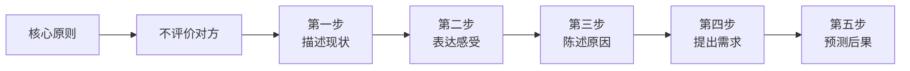
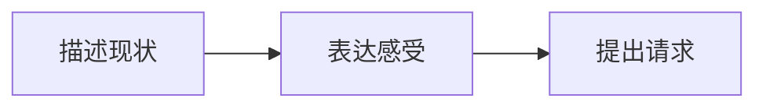
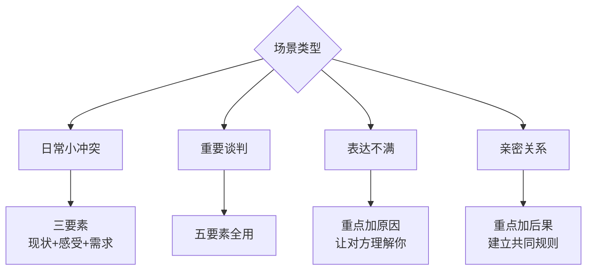

# 第05课：有效表达五要素

## Learning Objectives

- 理解有效表达五要素的结构和逻辑
- 掌握从三要素扩展到五要素的方法
- 学会通过"原因"增加表达的说服力，通过"后果"增强执行力

## 有效表达五要素结构

当我们需要表达自己的需求或不满时，往往容易陷入情绪化的指责。对方稍微一反驳，对话就变成了争吵。那么，怎样才能做到冷静、理智地表达，同时又不压抑自己的情绪呢？

有效表达五要素提供了一个完整的框架：

### 三要素版本（基础版）

其实最基本的是三要素，这也是最通用的版本：

在面对大多数日常沟通场景时，三要素已经够用。五要素是在三要素的基础上增加了"原因"和"后果"两个环节。

## 第一步：描述现状

描述现状是一切有效表达的基础。它的核心要求是：**只说客观事实，不做任何评价**。

**好的现状描述：**
- "咱们的房间，每次一推门进来就是烟雾缭绕，地上都是烟头。"
- "这周的工作汇报，我已经发了三次邮件，但还没有收到任何回复。"
- "我们的会议原本定的是两点开始，现在已经两点二十了。"

**糟糕的现状描述（混入了评价）：**
- "你们把房间弄得又脏又乱！"
- "你从来不回我邮件！"
- "你总是迟到！"

> [!TIP] Key Insight
> 描述现状是"下切"（用具体细节），评价对方是"上堆"（用抽象标签）。**具体的事实无法被否认，而抽象的标签可以轻易被反驳。** 这就是为什么描述现状比评价对方更有力量。

## 第二步：表达感受

在客观描述现状之后，需要说出你的真实感受。这里要注意我们在[[0004-biao-da-xun-lian-chang-jian-wu-qu|上一课]]中学到的：**只说感受，不论证感受的合理性**。

**好的感受表达：**
- "我每次回到这个房间，心情都觉得非常压抑。"
- "反复发邮件但没有回音，我觉得很焦虑。"
- "等了二十分钟，我感觉自己没有被重视。"

**糟糕的感受表达（混入了论证）：**
- "我感到很压抑，因为你们太自私了！"（论证合理性）
- "我很焦虑，你知不知道你的拖延影响了整个团队！"（指责对方）

感受表达的目的是让对方理解你的状态，而不是让对方承认错误。

## 第三步：陈述原因（五要素新增）

这是从三要素到五要素扩展的关键一步。为什么需要说明原因？

原因的作用在于：**当你说出你的原因时，你和对方之间就建立了一个"成本比较"。**

有一个经典的案例：

> 一个骑马的人经过村庄，踩坏了农民在家门口晒的谷子。双方争执起来，农民要求赔偿，骑马的人说"你们把谷子晒在路上，害我的马摔跤，你们也该赔"。法官的判决是：**谁改变的成本低，谁就该做出改变。** 骑马的人只需要多留神一下前方情况，绕一下道就可以了，成本很低；而农民要改变世代相传的收割和晾晒习惯，成本很高。因此骑马的人责任更大。

这个"成本最低原则"在人际交往中同样适用。当你说明原因时，你实际上在告诉对方：**我的困难成本更高，所以请你们配合我。**

**案例：宿舍抽烟问题**

如果你只说"不要在宿舍抽烟了"，抽烟的室友可能会反驳："我们五个人都抽烟，就你一个人不抽，凭什么我们五个人要顺着你一个人？"

但如果你加上原因：

> "因为我有哮喘病，对空气质量要求比较高。闻到烟味我就会咳嗽、喘不上气。"

那么对方就无法反驳了。身体上的疾病带来的痛苦，远远大于他们不抽烟的不适感。这个原因让你的请求变得不可抗拒。

## 第四步：提出需求

提出需求是这个表达框架的落脚点。它必须是**具体的、行为导向的**，而不是抽象的愿望。

**好的需求：**
- "我希望今后咱们不要在宿舍里抽烟了。"
- "能否在明天下班前给我一个回复？"
- "下次我们约定时间，能不能准时到？"

**糟糕的需求（太抽象）：**
- "我希望你们素质高一点。"
- "你要负责任一些。"
- "希望得到应有的尊重。"

> [!TIP] 需求 vs. 愿望
> 很多人说自己"想要什么"，说的其实是"想要什么样的感受"——想要成功、想要幸福、想要被尊重。这些是愿望，不是需求。
> 
> **真正的需求 = 我想要采取的行动 + 由此带来的可衡量的结果。**
> 
> 比如：不是"我想要被尊重"，而是"我希望在发言的时候，其他人不要插话"。

## 第五步：预测后果

最后一步是预测后果——如果对方不配合，会发生什么？

这个步骤的目的是让对方意识到不配合的代价，从而主动配合。但它必须建立在双方共识的基础上，不能是威胁。

**好的后果预测：**
- "如果咱们还是维持现状，我可能会向楼委会投诉，毕竟在公共场所抽烟、乱扔垃圾本身就是违反规定的。"
- "如果再收不到回复，我可能需要把这个情况升级到主管那里。"
- "如果我们每次都这样干等，以后的活动效率会很低。"

**糟糕的后果预测（变成了威胁）：**
- "如果你再不回，我就去找你领导！"
- "你们等着被处分吧！"

后果预测要基于**客观规则**，而不是基于你的情绪反应。这样对方会觉得"你说得有道理"，而不是"你在威胁我"。

## 完整案例

让我们把宿舍的案例从头到尾说一遍：

> **第一步·描述现状**："你看看咱们的房间，每次一推门进来，就是烟雾缭绕，地上都是烟头，床上也都是垃圾，窗户上都是灰尘。"
>
> **第二步·表达感受**："我每次一回到这个房间，心情都觉得非常压抑，非常不开心。本来我觉得回到自己的房间应该是一个很放松、舒适的休息场所，但一回来，甚至比待在外面还让我觉得难受。"
>
> **第三步·陈述原因**："我有哮喘病，对空气质量的要求比较高。闻到烟味我就会咳嗽，严重的时候晚上都睡不着。"
>
> **第四步·提出需求**："我希望今后咱们能够共同维护好宿舍的卫生，不要在宿舍里抽烟了，也不要再乱扔垃圾。"
>
> **第五步·预测后果**："如果继续这样，我可能不得不向楼委会投诉。毕竟在宿舍里抽烟、乱扔烟头本身就违反了宿舍管理条例，到时候大家都不方便。"

这个表达全程没有评价对方，没有指责，没有情绪化地宣泄，但非常有力量。

## 五要素的灵活运用

五要素不一定每次都要全部使用。可以根据场景灵活调整：

## Practice

> [!QUESTION] 练习一：识别三要素
> 请找出下面这段话中的三要素（描述现状、表达感受、提出需求）：
> 
> "今天下午的会议，我从两点等到两点二十，其他人才陆续到齐。当时我感觉挺失望的，也觉得自己的时间没有被尊重。我希望以后开会，大家都能尽量准时到。"
> 
> 分别指出对应的是哪句话。

参考答案

- **描述现状**："今天下午的会议，我从两点等到两点二十，其他人才陆续到齐。"
- **表达感受**："当时我感觉挺失望的，也觉得自己的时间没有被尊重。"
- **提出需求**："我希望以后开会，大家都能尽量准时到。"

注意感受部分没有论证合理性——她只是说"我觉得失望"和"觉得不被尊重"（感受），并没有说"你们不尊重我"（评价）。

> [!QUESTION] 练习二：从不完整到完整
> 下面这段话缺少两个步骤，请补充完整：
> 
> "亲爱的，你每次都把碗留着明天洗。我觉得很烦。你能不能现在就洗了？"
> 
> 请加上"原因"和"后果"两个步骤，让表达更有说服力。

参考答案

**完整版：**

"亲爱的，最近这周我发现，厨房的碗筷都是第二天早上才洗。（描述现状）

每次晚上看到水池里堆着的碗，我都觉得有点心烦，因为我喜欢在睡前看到一个干净整洁的厨房。（表达感受）

我从小肠胃就不太好，隔夜的碗筷容易滋生细菌，我早上起来闻到那个味道就会不舒服。（陈述原因）

我希望咱们吃完饭就顺手把碗洗了，顶多花十分钟。（提出需求）

要不然的话，我可能会提议咱们每天轮班洗碗，轮到谁谁负责当天洗掉。你觉得这个方案怎么样？（预测后果）"

> [!QUESTION] 练习三：改写冲突对话
> 以下是一段典型的冲突对话，请用五要素改写：
> 
> A："你每次都迟到！你这个人太不负责任了！"
> B："我怎么不负责任了？我迟到是因为工作忙！"
> A："忙就可以迟到吗？你根本就没有时间观念！"
> B："你少在这儿教训我！"

参考答案

**五要素版本：**

**描述现状**："这周我们约了三次见面，第一次你晚了十五分钟，第二次晚了二十分钟，今天也晚了十分钟。"

**表达感受**："等待的时候，我感到有些失落和着急。因为我觉得我们的见面很重要，我本来很期待的。"

**陈述原因**："我之所以特别在意准时，是因为我从小家里的习惯就是守时。迟到会让我觉得对方并不重视这次见面。"

**提出需求**："以后如果我们约了时间，你能不能尽量安排好工作准时来？如果实在有事要晚到，提前跟我说一声就好。"

**预测后果**："如果我们能互相守时，咱们的见面就会轻松很多，我也就更愿意多约你出来。不然的话，等待的焦虑会影响我的心情。"

**对比：**
- 原版本：指责→反驳→升级→争吵
- 五要素版：事实→感受→原因→需求→解决方案

## Summary

本节课我们学习了有效表达五要素：

| 步骤 | 内容 | 要求 |
|---|---|---|
| 第一步 | 描述现状 | 只说客观事实，不做评价 |
| 第二步 | 表达感受 | 只说感受，不论证合理性 |
| 第三步 | 陈述原因 | 说明你为什么有这种感受/需求 |
| 第四步 | 提出需求 | 具体的、行为导向的请求 |
| 第五步 | 预测后果 | 基于客观规则的合理预测 |

五要素的核心精神是：**不评价对方，不说对错，只说我看到了什么、我感受到了什么、我需要什么。** 这种表达方式既保护了对方的面子，又清晰地传递了你的信息，是成年人之间高效沟通的基础。

## Next Step

[[0006-miao-shu-xi-jie-biao-da-qing-xu|下一课：描述细节，表达情绪]]

继续学习如何通过描述画面细节来精准表达情绪，让你的表达不再干巴巴。