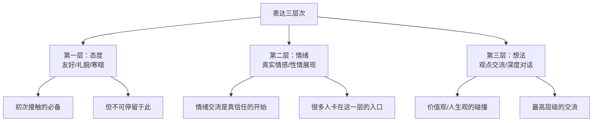
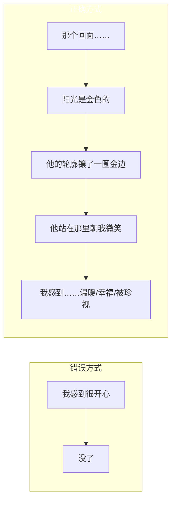

# 第06课：描述细节，表达情绪

## Learning Objectives

- 理解"态度→情绪→想法"三层表达结构
- 掌握用画面细节表达情绪的方法，替代空洞的情绪标签
- 学会在日常交流中通过细节挖掘来丰富情感表达

## 表达的三层结构

人与人之间的交流可以分为三个层次：



### 第一层：态度

当我们第一次见到陌生人，我们展示的是"态度"——友好的态度。在聚会上，我们和每个人都热情地打招呼、寒暄，这很好。但问题在于：**很多人停留在这个阶段就出不来了。**

你会发现许多社交场合，人们从头到尾都在客气地"友好"，喝了很多酒，说了很多漂亮话，但结束后你会发现——你和这些人根本没有真正的联系。

这其实就是"伪情绪"——看起来很有情绪，实际上只是在表达友好而已。

### 第二层：情绪

真正的情绪交流是信任的开始。当你可以向对方展示真实的情绪——不只是开心，也包括失落、焦虑、困惑——对方才会觉得你是一个"真实的人"。

### 第三层：想法

在情绪交流的基础上，你们可以进入更深层次的"想法"交流——分享你对某个事件的看法、你的价值观、你的人生经历。这时候，你们就从熟人变成了朋友。

## 细节是情绪的载体

很多人说"我不会表达情绪"，发出的话总是干巴巴的。这是为什么呢？

因为大多数人在表达情绪时，**只贴情绪标签，不描述细节**。



**画面细节 → 对应的情绪**

| 只说标签（差） | 描述细节（好） |
|---|---|
| "我很感动。" | "当时外面很冷，但他还是站在楼下等了我半个小时，看到我的时候先笑了一下，搓了搓手说'来了啊'——那个笑容我现在都记得。" |
| "我很开心。" | "那天傍晚，夕阳把整个院子染成了金色。我回头的时候看到他就站在路中间等我，光从他身后透过来，把轮廓勾出了一条金边。他看到我，笑了。那一瞬间我觉得特别幸福。" |
| "我很焦虑。" | "我盯着手机屏幕，明明只是两分钟，却觉得过了两个小时。手心一直在出汗，每隔五秒就要点亮一下屏幕看看有没有新消息。" |
| 画面细节让情绪变得可感可触，别人才能真正"感受到"你的感受。 |

> [!TIP] Key Insight
> 情绪标签（开心、难过、愤怒）只是情绪的"名字"，而画面细节才是情绪的"身体"。**你一说出画面的细节，情绪就自然流动出来了。**

## 印象最深的画面练习

这一课的核心练习是：**找到你脑海中印象最深刻的一个画面，然后细致地描述它。**

这个画面可以是：
- 童年时的一个场景
- 一个让你感动的人的笑容
- 某个瞬间的光影和颜色
- 一个重复出现的梦境

**关键是：先画面，后感受。不要说故事，先说画面。**

### 老师的案例：阳光下的尘埃

老师举了自己的例子——他脑海中印象最深的画面是"阳光下的尘埃"：

> 阳光从窗户射进来，我在房间里头，一缕阳光照射的地方，旁边的区域比较暗，所以阳光里那些尘埃就特别热闹地飞舞。
>
> 当我急速喘气的时候，尘埃就飞舞得更快；当我屏住呼吸，它们也就飞舞得慢了，甚至很安静地漂浮在空气中。这本来是正常的物理现象，但给年幼的我一种感觉——好像我的情绪和状态可以和它们互动。
>
> 这个画面让我感受到的不是孤独或枯燥，而是一种特别充实、美好的情绪。我发现即使一个人待在家里，也可以不那么无聊。

注意：老师没有说"小时候的独处经历让我变得善于思考"，而是先描述了画面本身的细节——尘埃如何飞舞、如何随着呼吸变化——然后才说这个画面引发的情绪。

### 学员的案例：金灿灿的等待

一个学员分享的画面非常生动：

> 我在公园里找回了丢失的钥匙，急匆匆往回赶。他还在原地等我，最先出现的是他的头——慢慢慢慢地，随着我越走越近，他的头、脖子、肩膀、身体一点一点地从地平线浮现出来。
>
> 那时候是傍晚，太阳快下山了，阳光刚好给他的轮廓描上了一层金边。他站在路中间看着我，对我笑。他是一头短发，旁边的松树也是金灿灿的。

这个学员的描述之所以好，是因为他捕捉到了**画面中具体、动态的细节**：

- "最先出现的是他的头"——用视觉的渐进呈现重逢
- "他的轮廓描上了一层金边"——光线和色彩
- "他站在路中间"——空间位置
- "短发"、"松树"——细节物体

## 情节 vs. 细节

这是大多数人在表达情绪时最大的问题：**把情节当成了细节。**

```mermaid
flowchart TD
    subgraph 情节
        A1[我小时候掉进水里] --> A2[大人把我拉起来] --> A3[后来我再也不敢游泳了]
    end
    
    subraph 细节
        B1[水下的气泡往上冒]
        B2[光线透过水变成绿色]
        B3[有一种从未见过的视觉]
        B4[那个画面让我既恐惧又好奇]
    end
    
    style 情节 fill#ffa94d,clor:#fff
    style 细节 fill#69db7c,clor:#fff
```

**情节**是：A发生了，然后B发生了，然后C发生了。

**细节**是：在那个画面中，你看到了什么？颜色、光线、形状、动作、声音、温度……？

男生描述画面时，最容易犯的错误就是**把细节跳过去直接说情节**。比如一个学员描述被爸爸锁在门外，他先是完整叙述了"为什么被锁"、"爸爸怎么锤门"、"钥匙怎么转动"——这是一个完整的故事，但是**没有细节**。

老师在点评时说：

> 你要描述的是：门的锁芯是怎么转动的？那扇门在你的视觉里是什么样的？你躲在书桌底下的时候，桌面的纹理是不是离你的脸很近？

**细节是相对静态的，而情节是动态的。** 细节让你"看见"那个画面，情节只是让你知道发生了什么。

**为什么要先描述细节，再描述感受？**

因为细节中天然蕴含着情绪。你在回忆画面细节的过程中，情绪会自然而然地浮现出来。你不需要生硬地告诉别人"我很害怕"，而是通过描述门锁转动的声音、书桌下的黑暗、地板的冰凉来让听众自己感受到恐惧。

## 从社交角度看细节表达

为什么细节表达对社交如此重要？

因为在真实的社交中，**情绪交流是建立信任的关键环节**。

第一阶段（态度）：你和所有人都友好，但所有人都和别人一样。
第二阶段（情绪）：你展示真实的自己，有人和你产生共鸣。

怎样展示真实的自己？不是靠说"我是一个真实的人"，而是靠**描述你内心深处记住的那些画面**。画面的细节就是你的"私密语言"，是只有你才知道的东西。你愿意分享它，就意味着你愿意敞开自己。

> 如果你跟一个人聊天，每次都是讲兴趣爱好、聊工作，永远在中间地带徘徊，你就无法进入对方内心。而当你肯分享一段经历中的细节，描述那些只有你才看得到的画面时，对方会觉得——他在被你信任，你们的暗改变了。

## Practice

> [!QUESTION] 练习一：把标签变成画面
> 请把以下情绪标签改写成画面式表达：
> 
> 1. "我很想念我爷爷。"
> 2. "当时真的很尴尬。"
> 3. "那天的夕阳真美。"
> 
> 选择一个，不要直接说出情绪，而是用画面细节让读者自己感受到这种情绪。

<details>
<summary>参考答案</summary>

**1. 想念爷爷：**
"我印象中最深的画面是爷爷坐在老房子的阳台上，阳光从他左侧照过来，他手里持着二胡，眼睛微闭着，一个人的背影。那个画面让我坐在楼梯上看了很久很久——明明身边很安静，但就是觉得安心。"

**2. 尴尬：**
"我正在会上发言，说着说着突然发现下面有人笑了。我停了一下，不知道他们在笑什么。想继续说吧，声音已经不自信了——手上拿着的笔不知道什么时候被我拧开了盖子，墨水漏了一手。会议室安静了三四秒，但我觉得像是过了一个世纪。"

**3. 夕阳美：**
"站在阳台上，整个天从我的左边到右边，依次是深蓝、紫色、橘红、再到天边的淡金。云的边缘像被烧过了一样，有一道亮边。我不自觉地把手机放下了一一不是因为不想拍，而是觉得拍下来的肯定不对。"

</details>

> [!QUESTION] 练习二：找出你印象最深的一个画面
> 闭上眼睛，让一个画面自动浮现出来。不要去想"哪个画面最有意义"，而是让"第一个冒出来的画面"出现。然后回答：
> 
> 1. 这个画面中你看到了什么？列出5个具体的视觉元素（颜色、形状、光线、物体、人物的姿态等）。
> 2. 这个画面发生在什么时间、什么地点？
> 3. 这个画面引发了你怎么样的情绪？是单一的情绪，还是混合的情绪？
> 
> 试着把这个画面写成一则100-150字的描述。

<details>
<summary>参考答案示例</summary>

**示例画面：高中教室的午后**

教室很安静，只有头顶风扇转动的声音。阳光从窗户斜射进来，在地板上映出一道齐整的光块，光块里有细细的灰尘在浮游。

我的课桌在靠窗第三排，桌面上刻着不知是谁留下的字。窗外是一棵老榕树的树冠，叶子在风里轻轻抖动，反着光。

时间应该是高二某个下午的自习课。

情绪很混合——既有一种懒洋洋的安宁，又有一丝毕业将近的不舍。那个画面让我觉得，这样的午后以后不会再有第二次了。

**方法总结**：
不需要写"感慨万千"，只需要写"阳光从窗户斜射进来，在地板上有光块"。细节自己就会携带情绪。

</details>

> [!QUESTION] 练习三：从友好到情绪——模拟三层对话
> 假设你要和一个新认识的朋友从寒暄走向深入聊天，请设计三段对话：
> 
> **阶段一（态度）**：一段友好的问候和开场
> **阶段二（情绪）** ：分享一个真实的情绪/一段有画面感的回忆
> **阶段三（想法）**：表达一个具体的看法或价值观

<details>
<summary>参考答案</summary>

**阶段一（态度）：**
"第一次来这边。没想到这里环境这么好，交通也方便。听说你是做设计的？"

**阶段二（情绪）：**
"说起来，我今天来之前经过一个公园，看到有人坐在长椅上拉二胡。那个画面让我一下子想起小时候我爷爷，他也是这样，一个人坐在阳台上拉二胡。阳光从他左边照过来，照在他身上，他闭着眼睛，完全不急不慢的样子。每次看到那种画面，我就觉得整个人的节奏慢下来了。"

（这个阶段没有抱怨、没有"我近压力很大"这种概括，而是分享了一个具体的、有画面感的回忆。这就是"情绪交流"。）

**阶段三（想法）：**
"其实我一直觉得，一个人能找到一件让自己完全沉浸的事情很重要。我看到你设计的东西，能感受到你在其中的投入。——你说的对，我可能也是一个需要'沉浸'才能做好事情的人。"

（从情绪交流自然延伸到价值观的探讨。）

</details>

## Summary

本节课我们学习了：

1. **三层表达结构**：态度 → 情绪 → 想法。真正的社交深入发生在情绪和想法层面，而不是停留在友好层面。

2. **细节是情绪的载体**：不要只说情绪标签（开心、难过、愤怒），要描述引发那个情绪的画面细节——光线、颜色、动作、声音、温度。

3. **画面优先，情节次之**：画面细节相对静态，情节是动态的。先说画面中的"看到了什么"，再说"发生了什么"。这个顺序决定了你的表达是"有感情"还是"干巴巴"。

4. **画面练习的价值**：通过挖掘"印象最深的画面"的细节，你可以触及自己真实而复杂的情绪，从而在表达中更生动、更准确。

## Next Step

[[0007-luo-ji-yu-tiao-li-xun-lian|下一课：逻辑与条理训练]]

学习如何在流畅的情绪表达基础上，建立清晰的逻辑框架。