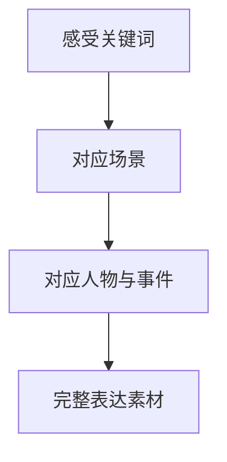
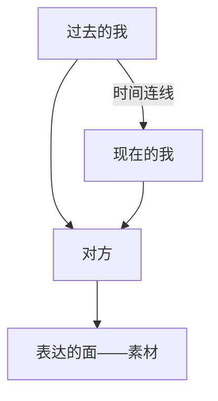

# 第07课：逻辑与条理训练

## Learning Objectives

- 理解表达四境界的层级关系及其比喻
- 掌握"从感受到素材"的表达构建方法
- 学会使用**关键词法**突破无话可说的困境
- 运用三角模型建立表达的条理框架

## 表达的四境界

表达能力的提升遵循一个清晰的阶梯。做这样一个比喻：表达如同用积木搭建社区——

> [!NOTE] 积木社区比喻
> - **表达完整** = 把材料聚齐：房子、街道、电线杆、窗户——先把需要的积木都搬到桌面。
> - **表达准确** = 拼出像样的建筑：邮局像邮局,车像车。
> - **表达流畅** = 合理布局,在一条线索上把不同功能的建筑串连起来。
> - **表达生动** = 艺术化的社区设计：美观、有感觉,能够唤起人的情绪。

四个境界层层递进,而**表达完整**是最基础的一步——如果你连要说的材料都没有,后续一切无从谈起。

## 表达不完整的两个根源

### 根源一：心理障碍

上一课讨论过的自信问题——即使脑子里有内容,因为社交压力不敢说。

### 根源二：大脑空白

这是更普遍的情况——当事人确实不知道该说什么。典型例子是鲁迅笔下的**阿Q**：走到吴妈面前,憋了半天只有一句"吴妈,我想跟你睡觉"。

> [!WARNING] 目的导向陷阱
> 很多人在表达时只有**终极目标**(加微信、签合同、表白),跳过所有中间内容。这就好比阿Q只剩一句"我要跟你睡觉"——他忽略了自己的感受,而感受恰恰是表达素材的源泉。

## 核心方法：从感受到素材

那么如何打破"大脑空白"？方法是：**先找感受关键词,再对应人物和事件**。

### 关键词法

生活中常出现一种现象：直接问对方"你遇到什么事了？",对方往往说不出来。但如果让TA写三个关键词,反而容易入手。关键词不针对具体的人和事,绕过了羞怯和回避的本能,但方向不会歪曲。

> [!EXAMPLE] 阿Q的表白升级版
> 如果阿Q先找三个面对吴妈时的关键词：
>
> | 关键词 | 对应场景 | 对应事件 |
> |--------|---------|---------|
> | 紧张 | 看到她的时候 | 她一说话我就接不上 |
> | 期待 | 想象和她在一起 | 幻想我们未来的互动 |
> | 开心 | 曾经见过她的场景 | 她某次对我笑了一下 |
>
> 从这三个词出发,可以构建出一段完整的表白：从第一次见到她的场景,到当时的感受,再到后续的期待——而不只是一句"我想跟你睡觉"。

### 三角模型

把"没话说"的问题再抽象一步：

一条直线从"我"到"对方"没有内容。但加上时间维度——"过去的我"经历过某些事件产生感受,再到"现在的我"与对方相遇——这三点构成一个**面**,这个面就是表达的素材。

> [!TIP] 应用场景
> - **闲聊时**：为什么此时此刻想起对方？因为昨天经过上次一起吃饭的地方——这就是"过去的我"到"现在的我"的连线。
> - **回应对方**：对方说"在吃饭",你可以向前延伸(昨天我们一起去的那家……)或向后延伸(饭后加个甜点就完美了),或者对当下做评价(这家看起来真有胃口)。
> - **商务场景**：跟客户不只是签条款,聊聊"之前那段时间不容易,直到遇见您这个合作伙伴才有今天"——这个三角就是内容。

## 实战应用：引导对方表达

这个方法也可以用于引导别人说更多。

> [!QUESTION] 换个问法
> 女朋友说"今天工作好不开心"——
>
> 你如果直接问"怎么了？",她可能说"算了没事"。
>
> 换一种问法：是哪种不开心？生气、委屈,还是觉得很倒霉？
>
> 用具体关键词引导她定位感受,再从感受到人物和事件——她就愿意说了。

为什么这样更有效

直接让对方说"事件",对方需要克服羞怯和回避本能。但让对方说一个词("担心""恐惧""厌恶")不针对具体的人,更容易出口,同时方向没有歪曲。从词切入,再慢慢引导到具体事件,整个过程自然顺畅。

## 为什么闲聊是有意义的

很多不善表达的人(尤其男性)认为,闲聊没有意义——"我就是来谈合作的,为什么要聊爱好和天气？"

> [!TIP] 闲聊的真正意义
> 闲聊的核心目标不是获取信息,而是**通过了解对方的情感情绪,获得安全感和信任感**。你跟人聊天气、聊吃喝、聊爱好——你的语言、神态、动作、内容——让对方知道你是什么脾气、什么性格、情绪控制能力如何。对方的了解越多,跟你打交道时的稳定感和信任感就越强。

## 练习

> [!QUESTION] 自我训练
> 想一个你最近在生活中遇到的"没话说"的场景。用关键词法写出三个感受关键词,再扩展成一段可以说的内容。

参考答案框架

1. **场景**：和一位不太熟的同事一起吃午饭,沉默了。
2. **关键词**：尴尬、好奇、想逃离
3. **扩展**：
   - 尴尬 → 这个沉默让我想起上次团队活动……
   - 好奇 → 我不知道他平时下班做什么……
   - 想逃离 → 但既然都在这里了,不如聊聊最近那个项目……
4. **串起来**：三个关键词对应三个可以展开的方向,选择最合适的一个开口。

## 下一步

掌握表达完整之后,下一节课将学习如何将这些素材**流畅地组织起来**——见 [[0008-liu-chang-biao-da-yu-tiao-li]]。