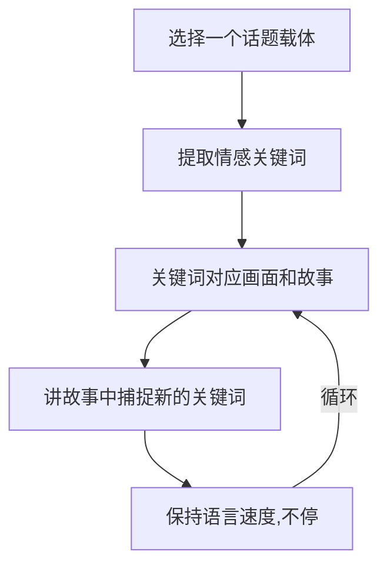

# 第08课：流畅表达与条理组织

## Learning Objectives

- 理解表达流畅的本质与核心动力
- 掌握"情感线索驱动法"实现滔滔不绝
- 学会在流畅训练中暂时放下准确性焦虑
- 运用关键词-场景-故事链条组织长段表达

## 表达流畅的本质

表达流畅,顾名思义就是说话时行云流水,不停地说,而且说得有条理。做这样一个比喻——

> [!NOTE] 河流比喻
> 流畅就像水从高原流下,一路奔涌不停,最后流向大海。河道因不同地貌形成不同形态——有的湍急、有的平缓、有的蜿蜒。表达流畅也没有统一标准,但有一个根本条件：**必须有源源不断的动力**,就像河流的源头。

很多人做不到滔滔不绝,不是因为没话说,而是**自我意识压抑了表达的动力**。一说话就想"我刚才说得好不好""别人怎么看我"——这个念头一出现,表达的流就断了。

## 两个关键启示

### 启示一：加速法

电影中有一个场景：一位老师训练一个不敢说话的小男孩。老师让他站在台上,闭上眼睛,不停地说,不能停。每次孩子一放慢,老师就在后面催促"别停,继续！"说着说着,孩子越说越激动,最后不知不觉说了好几分钟的独白。

> [!TIP] 加快语速的技巧
> 在训练表达流畅的阶段,**加快说话速度**是一个有效的方法。速度快了,你就没时间去想"外界怎么看我",注意力更集中在自己要说的内容上。当然,到了表达生动的阶段反而要控制节奏——但那是后话,当前的目标是流畅。

### 启示二：情感线索法

另一部电影中,一位作家教小女孩写作。他把女孩带到门口,指着一条大路说："你看着这条路,告诉我你想到什么。"女孩一开始说"没想到什么"。作家说："继续看,用心看。"渐渐地,女孩说出了一大堆想象中的神奇事物。

换成我们的视角——如果让你看着**自己家门前的那条路**,你能说多久？这条路是你每天走的路,承载了无数回忆。关键是：**你要先从情感入手**。

这条循环链条就是滔滔不绝的秘密。

> [!EXAMPLE] 家门前的那条路
> - 想到多年前来看房子,周围是一片高粱地 → 关键词：**久远、沧桑**
> - 想到开车带女朋友开进高粱地,发现一个加油站 → 关键词：**浪漫、梦幻**
> - 想到如今高楼林立,农田消失 → 关键词：**变迁、感慨**
>
> 一个关键词引出画面,画面引出故事,故事又刺激出新的情感关键词——理论上可以说个没完。

## 情感记忆优先于形象记忆

心理学有一个确定的结论：**人的情感记忆优先于形象记忆**。

回忆起多年前的一个人,大脑中首先反映出来的是情感——"这个人让我开心"或"这个人让我讨厌"——然后才去回忆具体发生了什么。有时候时间太久,事件都忘了,但情感还记得。

> [!WARNING] 常见误区
> 很多人说话只有"内容线索",没有"情感线索"。
>
> 问：你的爱好是什么？
> 答：喜欢打游戏。打完这个打那个。没了。
>
> 这是只有内容检索。如果先检索**情感**——"打游戏时印象最深的感受是什么",然后从那个感受出发去找对应的场景和故事——内容就丰富了。

## 流畅的另一个证据：喝醉的人

观察喝醉的人——他们为什么能做到滔滔不绝？因为酒精让他们完全不在乎外界的评价。而且他们的表达模式很清晰：

1. 先说出情绪： "我今天高兴"/"我今天不开心"
2. 回到事件："我为什么高兴/不开心？是因为……"
3. 在描述事件中又被新的情绪触发,转到下一个话题

这个模式恰好就是情感线索法的自然体现。清醒的时候,理性压抑了这种本能,但你可以有意识地练习它。

## 训练原则：先流畅,后准确

> [!WARNING] 训练的重要原则
> 在训练表达流畅时,**先把表达准确放一放**。
>
> 如果说到一半脑子里找不到合适的词——别停下来！用一个不太准确的词代替也没关系,上下文会帮听者理解。一旦断下来,节奏被打乱,对整体表达的损害远比一个不准确的词更大。

生活中也能看到：有些人学历不高、读的书不多,但很能说——他们就有这种习惯。个别不准确的词放在整体表达中,对理解不构成太大干扰。

## 总结：流畅表达的步骤

## 练习

> [!QUESTION] 两个话题训练
> 试着围绕以下两个话题,各讲一段5分钟的内容。先写出3个情感关键词,再展开。
>
> 话题A：聊一聊你的大学生活
> 话题B：有人问你的学校怎么样(对方的孩子正在你的学校和另一所学校之间选择)

参考答案框架

**话题A——大学生活的关键词示例：**
- **自由**：第一次离开家,没人管了,通宵打游戏/看球赛的夜晚……
- **迷茫**：大二大三不知道未来做什么,在操场上和室友聊到半夜……
- **热血**：比赛、社团活动、为一个目标拼尽全力的日子……

**话题B——介绍学校的关键词示例：**
- **底蕴**：学校里那座老图书馆,据说建校就有了……
- **活力**：每年校庆时,全城校友都会回来……
- **务实**：老师教的不是纸上谈兵,是真的能用的技能……

切忌用"就是追溯时间线"的叙事方式。每个关键词都先描述**感受**,再讲对应故事。

## 下一步

掌握了流畅表达之后,下一课将学习如何让表达更加**生动有趣**——见 [[0009-you-mo-yu-sheng-dong-biao-da]]。