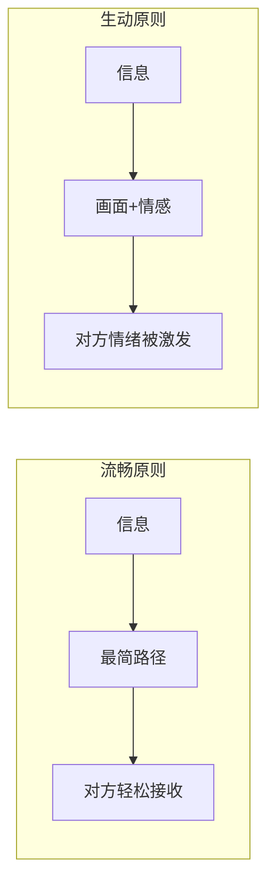
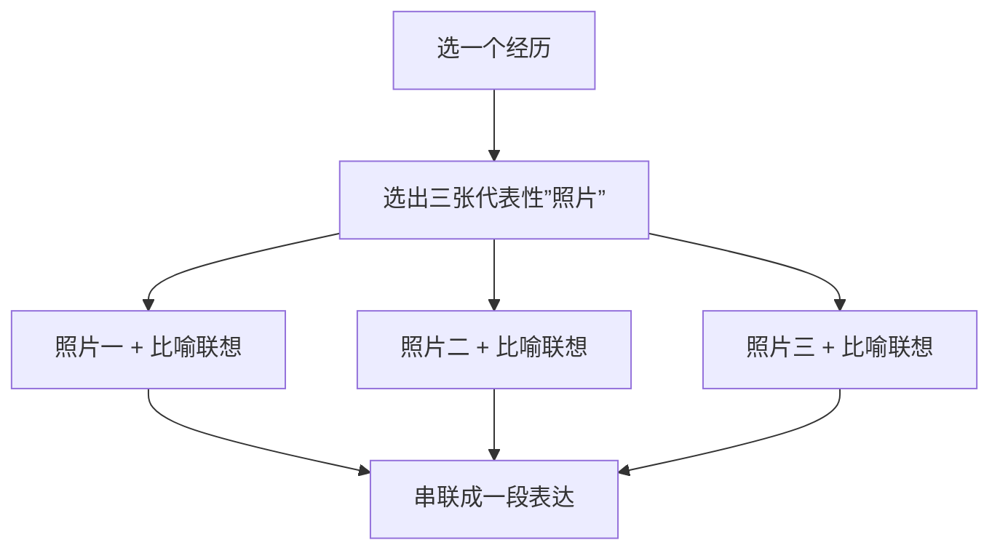

# 第09课：幽默与生动表达

## Learning Objectives

- 区分表达流畅(理性原则)与表达生动(感性原则)
- 掌握"画面感"的构建方法
- 学会使用**快照联想法**(三张照片法)训练生动表达
- 理解情感驱动的表达如何带动自己和听众

## 表达流畅 vs 表达生动

> [!NOTE] 两种原则的对比
> - **表达流畅**是理性原则：让信息以最省力的方式传递给对方,消耗最少能量。
> - **表达生动**是感性原则：让同样的信息**激发最大的情绪和能量**,无论是说话者自己的还是听者的。

同一个故事,同样的信息,表达流畅让人"听懂了",表达生动让人**"有感觉"**。

## 核心方法：快照联想法

很多人在生活中觉得"没什么可说的"——坐地铁、去健身房、日常琐事,这些事太普通了,说出来干巴巴的。但**生动表达不是靠内容的新奇,而是靠观察角度的独特**。

方法很简单：把你经历的一件事,想象成**要发朋友圈的三张照片**。选三张最能代表这次经历的照片,每张照片做一个比喻或联想,然后把它们串起来。

### 示例：坐了一趟人特别多的地铁

这是每个人都会遇到的事,听起来没什么可说的。用快照联想法试试——

| 照片 | 画面内容 | 比喻/联想 |
|------|---------|----------|
| 第一张 | 站在楼上往下看,密密麻麻的人头挤在一起 | 像海浪/麦浪,人一动就一起一伏,风吹麦浪的感觉 |
| 第二张 | 车厢里,周围人的眼睛——表情高度相似,面无表情 | 像沙丁鱼罐头里的鱼,大眼瞪小眼,鱼是最没有表情的动物 |
| 第三张 | 到站时,上下车的人密集交换 | 像城市的血管,进出的人就像细胞在交换营养和代谢废物 |

> [!EXAMPLE] 串起来说
> "今天坐地铁,人真多。刚走进去站在楼上往下看——好家伙,密密麻麻的人头像海浪一样,一动就是一片,我还以为自己到了海边。进了车厢更绝,周围的人面无表情,大眼瞪小眼地盯着,跟沙丁鱼罐头似的。好不容易到站了,门一开,一群人挤进去一群人挤出来——看着这个场景,突然觉得我们就像是城市这个大血管里的细胞,每天上班就是输送营养,下班就是代谢废物……"

### 示例：去健身房的经历

同样,去健身房也可以这么讲：

| 照片 | 画面内容 | 比喻/联想 |
|------|---------|----------|
| 第一张 | 做器械时面部表情扭曲的男士们 | 像性高潮的表情——极致释放的样子 |
| 第二张 | 健美的肌肉线条 | 像豹子、狮子——动物的力量与阳刚 |
| 第三张 | 器械的特写——哑铃、钢管 | 像兵器、刀枪剑戟——现代人的武器 |

## 为什么快照法有效

很多人觉得"没什么可说"的原因,是把事情从头到尾按时间线描述——这种描述最容易落入俗套,越说越没意思。

快照法的本质是**由繁到简,由简到深**：

1. 不要求从头到尾描述——先选择最**有感觉**的瞬间
2. 有感觉的瞬间自然容易产生**联想和比喻**
3. 比喻把普通场景**升华**成超越现实的东西
4. 三段比喻串起来,就成了有画面感的表达

> [!TIP] 带动自己,才能带动别人
> 使用这个方法时你会发现一个神奇的效果：**说着说着,自己变得开心起来了**。
>
> 本来觉得"地铁人多有什么好说的",但当你把人群比喻成海浪、把自己比喻成细胞——你在用艺术化的方式重新观察生活。这个过程本身就是在释放情绪,给自己带来愉悦感。
>
> 表达生动不是"装"出来的。**你自己先进入状态、先有情绪,才能带动别人的情绪。**

## 比喻的力量

生动表达的核心因素是**画面感**。把抽象变成具体,把枯燥变成有颜色、有形状的东西。

> [!WARNING] 练习比天赋更重要
> 表达生动确实有天赋成分,但更可以通过**系统训练**提升。
>
> 快照法就是一个可操作的训练框架——每次遇到一个想讲的故事,先想三张照片,每张想一个比喻,然后串起来。反复练习,你会发现自己的表达越来越有画面感。

## 练习

> [!QUESTION] 三张照片训练
> 选择你最近经历的一件"普通事"——比如做了一顿饭、去了一个公园、看了一场电影。用快照联想法写出三张"照片"和对应的比喻联想,然后试着把它说给一个朋友听。

参考答案框架

**示例：做了顿饭**

- **照片一**：切菜时,刀起刀落,食材被整齐切开 → 像武士在练刀,每一刀都精准
- **照片二**：锅里油热了,菜下锅"滋啦"一声 → 像战斗开始的号角,厨房就是战场
- **照片三**：最后出锅装盘,色香味俱全 → 像完成了艺术品,成就感不亚于画了一幅画

**串起来**：我今天进了厨房就跟进了战场似的——切菜像练刀,下锅像吹号,最后端出来——嘿,艺术品！

## 下一步

学会让表达生动有趣之后,下一课将进入更具挑战性的领域：**辩论中的逻辑攻防**——见 [[0010-bian-lun-yu-luo-ji]]。