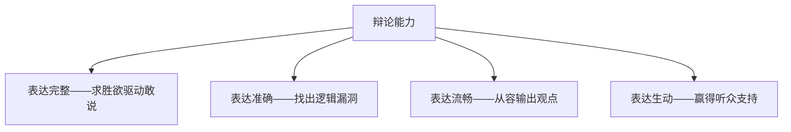
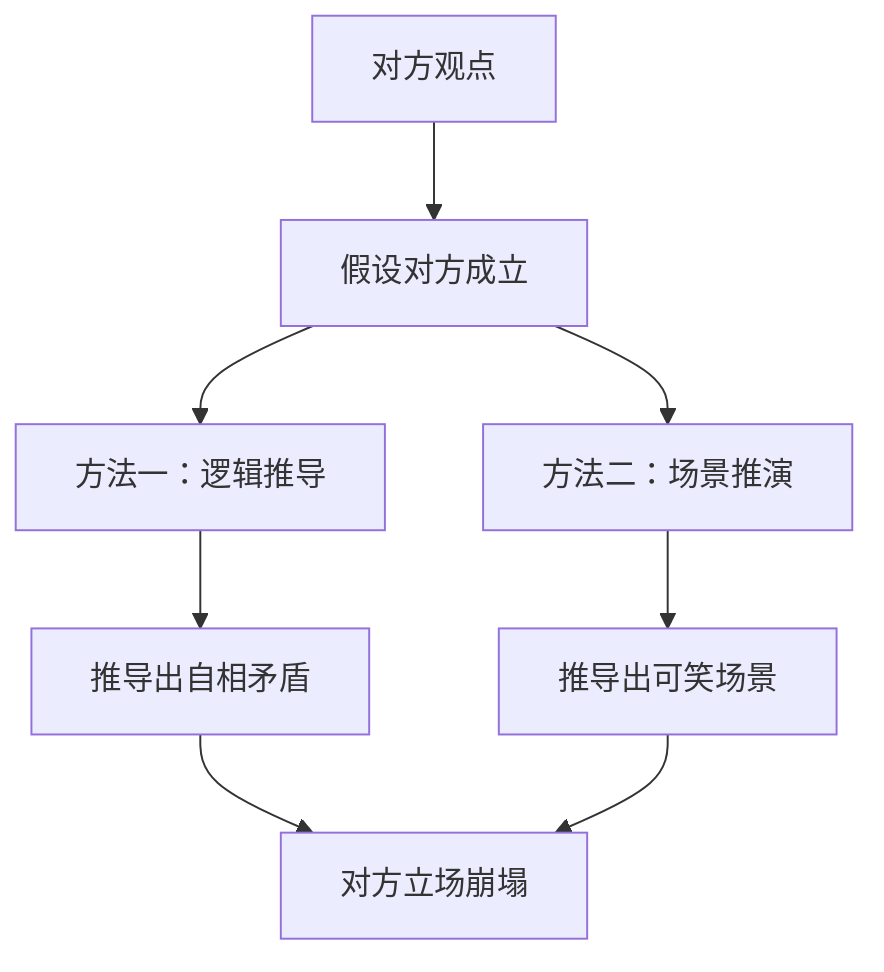
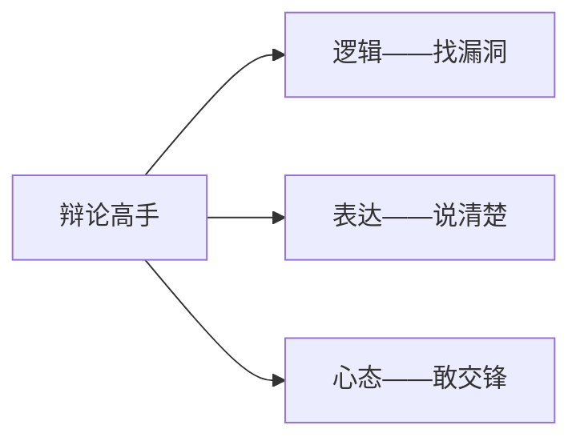

# 第10课：辩论中的逻辑攻防

## Learning Objectives

- 理解辩论作为表达能力综合训练的价值
- 区分"拳击式"辩论与"美式摔跤式"辩论
- 掌握两种逻辑攻防方法：推导自相矛盾 / 推导可笑场景
- 学会在聊天中运用辩论思维引导对方深入表达

## 辩论：表达能力的最佳训练场

辩论是表达课的精华收尾。原因在于：**前四课学的所有能力——表达完整、表达准确、表达流畅、表达生动——在辩论中全部得到体现和应用**。

- **表达准确** → 辩论中找对方漏洞的基础
- **表达流畅** → 从容应对攻防节奏
- **表达生动** → 赢得听众好感和人缘
- **表达完整+敢说** → 靠求胜欲来驱动

> [!TIP] 求胜欲激发表达
> "想说"是表达的心理基础。求胜是人的本能,在辩论中被直接激发——比抽象的"为了存在感"有效得多。

## 两种辩论形态

### 形态一：拳击式(真正的辩论)

像拳击比赛一样,双方**直接互相攻击对方的逻辑漏洞**。你提出观点-说出理由-对手在因果链条中找破绽-击倒你。

代表人物：**苏格拉底**。他站在雅典广场上,让别人随便说一个命题,然后通过严谨的逻辑推理,逐步推导出对方观点中的自相矛盾,让对方哑口无言。

### 形态二：美式摔跤式(表演式辩论)

代表节目：**《奇葩说》**

特点是：每个选手站在自己立场上,各自精彩地表达自己的观点,但**很少主动寻找对方的逻辑漏洞**。更像表演而非竞赛——一方说完票数上升,另一方说完票数又上升,但双方不直接交锋。

> [!WARNING] 两者的区别
> | 维度 | 拳击式辩论 | 美式摔跤式辩论 |
> |------|-----------|--------------|
> | 核心 | 找对方漏洞,攻防 | 表达自己观点 |
> | 逻辑性 | 强 | 中等 |
> | 观赏性 | 看门道 | 看热闹 |
> | 表达能力训练 | 练准确+逻辑 | 练流畅+生动 |

## 两种逻辑攻防方法

### 方法一：推导出自相矛盾

不做直接反对。先同意对方的假设,然后按照对方逻辑推导,看是否会推导出与常理或对方立场的矛盾。

> [!EXAMPLE] 案例："女人应该做个小女人"
> 假设正方观点：女人应该做一个被男人呵护的小女人。
>
> 攻防思路：我不去跟你纠缠"什么是小女人"的定义。我先同意你的说法,然后推导——
>
> "小女人在什么时代才能被呵护？在男尊女卑的社会。但在那样的社会里,小女人没有机会站在公共场合大声说出自己的选择。而你现在站在台上,平等地与男性讨论生活方式——这恰恰是小女人不可能拥有的权利。你在用'不做小女人'的方式,来证明'做小女人'的正确性。"

核心思路：**不辩论定义,推导出对方立场与行为自相矛盾**。

### 方法二：推导出可笑场景

同样是先同意对方的前提,然后把对方的前提在现实中推演,得出一个可笑的、令人难堪的场景。

> [!EXAMPLE] 案例："女人衣着暴露导致男人犯罪"
> 假设有人主张：女性不应该穿着暴露上街,因为会导致男性性冲动甚至犯罪。
>
> 攻防思路：我们不讨论谁对谁错。先假设这个逻辑成立——
>
> 如果真的是因为女性穿得少才让男性有生理反应,那么用仪器检测一下：走在街上的男性是不是80%都勃起了？如果是,那么这些男性跟发情的动物有什么区别？这个环境里的男人也太低等了吧？
>
> 但事实上,在西方社会女性可以穿得很性感上街,不是因为"男人素质高",而是因为多数男人确实**没有**产生这种生理反应。
>
> 如果非要说"就是因为你们穿得少让我们受不了"——那问题不在女人穿得少,而在**这个男人太像动物了**。

## 辩论思维在聊天中的应用

辩论不仅是竞赛,也可以成为日常聊天的工具——尤其是与异性聊天时。

> [!TIP] 用好奇心代替攻击性
> 辩论式聊天 ≠ 抬杠。不需要咄咄逼人地质疑对方,而是用**好奇心**引导对方：
>
> - "你为什么这么看？"
> - "那如果这样的话,那个问题该怎么解释呢？"
> - "听你这么说,是不是意味着这种人就会……"
>
> 你不是在攻击她,而是在**对她的话表现出充分的关注和兴趣**。对方会顺着你的引导不断说下去,越说越深,最后她会觉得："跟你聊天好有收获,不知不觉说了这么多从来没对别人说过的事。"

### 一对一的优势

在一群人中开展辩论式聊天比较困难,因为大家敏感度高、容易觉得被冒犯。但**和女生一对一聊天时**,这是一个绝佳的机会——

女生通常会表达情绪和观点,你只需要追问"为什么"和"如果……那……怎么办",就能不断拓展话题。这种聊天方式比"你今天干了什么""明天要干什么"的寒暄深刻得多。

## 辩论的心态：对人不对事

生活中我们倡导"对事不对人"。但在辩论中,恰好反过来——**对人不对事**。

辩论的观赏性就在于：两个人在竞技,通过语言比谁高谁低。话题只是道具,真正比的**是找出对方的逻辑漏洞、表达失误**。

> [!WARNING] 游戏心态
> 辩论式的"对人不对事"需要**游戏心态**——大家都明白这是玩,不是真的攻击人品。如果你遇到能开得起玩笑、有默契的人,别错过；如果没有,先用轻微试探看看对方反应。

## 总结

辩论能力 = 逻辑能力 + 表达能力 + 游戏心态

## 练习

> [!QUESTION] 辩论思路训练
> 你朋友说："现在年轻人都不结婚,就是因为太自私了,只想着自己过得舒服。"
>
> 请用"推导自相矛盾"或"推导可笑场景"的方法,给出回应思路。

参考答案

**可选思路一(推导自相矛盾)：**

"你说的没错,现代年轻人确实更关注自己的感受了。但是——如果一个人连自己的感受都不尊重,他真的有能力去尊重伴侣、经营好婚姻吗？现代婚姻比以前更需要双方有独立的自我意识,否则就是两个巨婴互相消耗。'自私'这个词,也许应该重新定义一下。"

**可选思路二(推导可笑场景)：**

"你说得对,我特别同意。应该回到过去嘛——父母之命媒妁之言,见了两次面就结婚,管你爱不爱,生三个孩子再说。这样就不自私了,对吧？但最后呢？离婚率高不高？家庭暴力少不少？那到底是'自私'的人不结婚更好,还是'不自私'的人结了再离更好？"

## 下一步

恭喜你完成了全部表达课程！回顾一下整个学习路径——

- [[0007-luo-ji-yu-tiao-li-xun-lian]] — 表达完整：有素材可说的
- [[0008-liu-chang-biao-da-yu-tiao-li]] — 表达流畅：说得久又条理
- [[0009-you-mo-yu-sheng-dong-biao-da]] — 表达生动：让人有感觉
- **第10课：表达攻防——经得起质疑**

把这些能力结合起来,在生活中持续练习,你就能真正成为一个"会说话"的人。