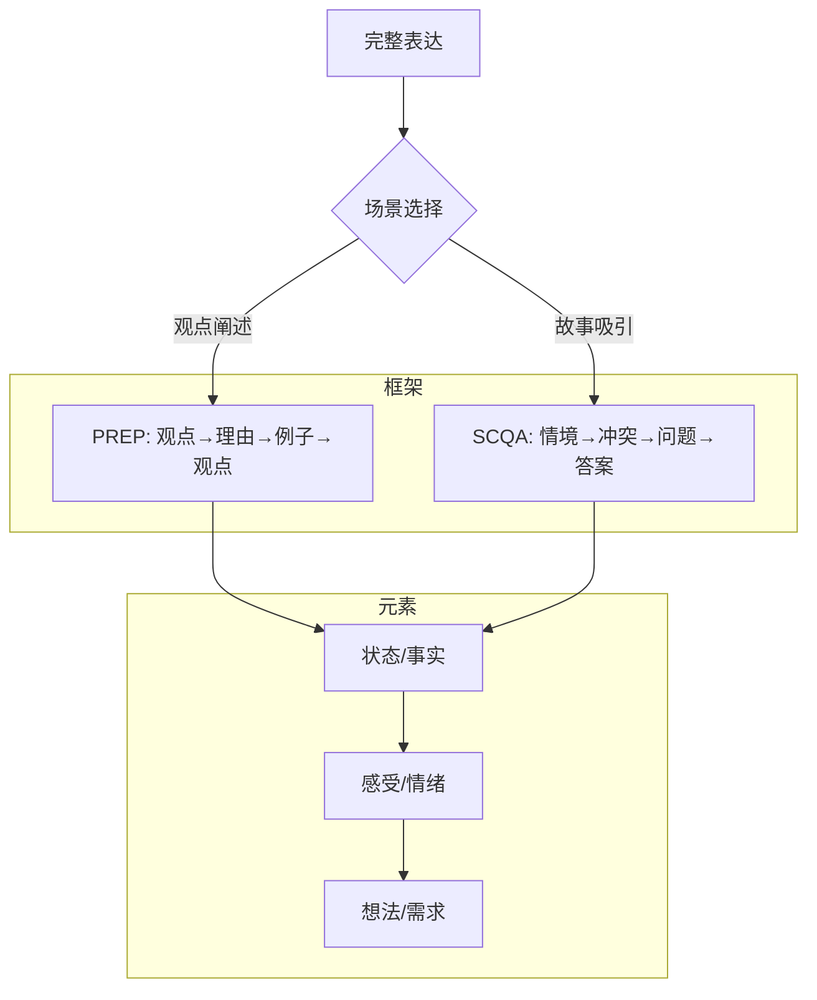

# 补充课01：结构化表达框架（PREP/SCQA）

## 学习目标
- 掌握PREP结构化表达框架
- 掌握SCQA故事化表达框架
- 学会根据不同场景选择合适的框架
- 能够将课程中的表达方法整合为完整表达

## 为什么需要结构化框架

原课程强调了"避免流水账"、"建立事件间的逻辑联系"的重要性，但没有提供具体的结构化工具。结构化表达框架就是这些逻辑联系的"脚手架"。

> [!TIP] 核心认知
> 结构化不是束缚，而是解放。当你有了框架，就不需要一边说一边想"下一句说什么"，可以把全部精力放在内容本身上。

## PREP框架

PREP是最基础、最通用的结构化表达框架，适用于职场汇报、观点阐述、说服他人等场景。

```
P - Point（观点）：先说你的核心观点
R - Reason（理由）：支撑观点的理由
E - Example（例子）：具体的例子或数据
P - Point（观点）：再次强调核心观点
```

### 职场场景示例

**场景**：向领导建议采用新的项目管理系统

> **P（观点）**：我建议我们团队试用Notion来替代目前的Trello。
>
> **R（理由）**：因为Notion整合了文档、数据库和项目管理功能，我们不需要在多个工具之间切换，预计每周可节省3-4小时的沟通成本。
>
> **E（例子）**：上周的版本迭代中，需求文档在石墨、任务在Trello、Bug在Jira，光是同步信息就花了我们半天时间。如果全部放在Notion里，一个页面就能看清楚所有进展。
>
> **P（观点）**：所以从效率角度，我建议先用一个项目试试Notion。

### PREP的变体

- **PEEP**：Point → Explanation（解释）→ Example → Point
- **PRE**：Point → Reason → End（简短版，适用于口头快速回应）

## SCQA框架

SCQA适用于需要"讲故事"来吸引注意力的场景，如开场白、自我介绍、方案推介等。

```
S - Situation（情境）：描述大家都认可的背景事实
C - Complication（冲突）：情境中出现了什么问题
Q - Question（问题）：冲突引发的问题
A - Answer（答案）：你的解决方案或观点
```

### 社交场景示例

**场景**：自我介绍时快速吸引对方兴趣

> **S（情境）**：我大学学的是机械工程，毕业后进了一家传统制造企业。
>
> **C（冲突）**：但干了两年我发现，我最享受的不是跟机器打交道，而是跟人打交道。每天早上上班路上，我都在想怎么跟不同的人聊天更有意思。
>
> **Q（问题）**：所以我就在想，我是不是选错了行业？
>
> **A（答案）**：后来我决定转行做销售。虽然从头开始，但第一年就成了区域销售冠军——因为我确实很享受跟人打交道的过程。

## 与课程中"状态+感受+想法"模型的关系

原课程提出的"状态（事实）+ 感受（情绪）+ 想法（观点/需求）"是表达的**元素粒度**，而PREP/SCQA是表达的**结构框架**。两者是互补关系：



## 表达方式与场景匹配

| 表达方式 | 适用场景 | 不适用场景 |
|---|---|---|
| 状态+感受 | 社交破冰、一对一聊天 | 职场正式汇报 |
| PREP | 职场汇报、观点阐述 | 情感交流、安慰他人 |
| SCQA | 自我介绍、方案推介 | 紧急情况下的简短回应 |
| 有效表达五要素 | 提出请求、解决冲突 | 日常闲聊 |

## 练习

> [!QUESTION] 改写练习
> 请用PREP框架改写下面这段"流水账式"表达：
>
> "我今天去了健身房，然后办了一张卡，然后教练带我熟悉了一下器材，然后他说如果要详细计划得再办私教卡，然后我就觉得有点被骗了，然后我就走了，然后回来路上想了半天觉得不太舒服。"

<details>
<summary>参考答案</summary>

**P（观点）**：我觉得这家健身房的销售方式有问题，不太透明。
**R（理由）**：办卡前没有说明基础服务和私教服务的区别，等付款后才告知还需要额外付费。
**E（例子）**：我办好卡后，教练只是简单示范了几个器材怎么用，然后就说"如果要详细计划需要再办一张私教卡"，完全没有提前告知。
**P（观点）**：所以我认为健身房应该在客户办卡前就清楚说明服务范围，而不是等付款了再加码。

</details>

> [!QUESTION] SCQA练习
> 请用SCQA框架做一个30秒的自我介绍，主题是"我为什么要学习表达"。

## 下一步
- [[lessons/0005-you-xiao-biao-da-wu-yao-su|第05课：有效表达五要素]] — 回到课程中的核心表达方法
- [[lessons/s02-zhi-chang-gou-tong|补充课02：职场沟通专项训练]] — 在职场场景中应用结构化表达