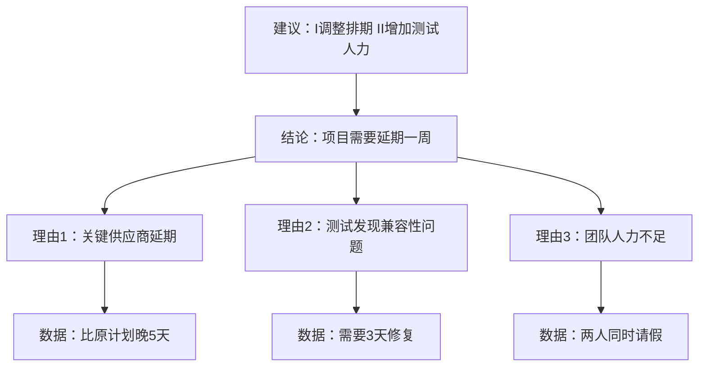

# 补充课02：职场沟通专项训练

## 学习目标
- 掌握向上汇报的黄金结构
- 学会跨部门沟通中的表达策略
- 能够应对会议发言和即兴表达
- 区分社交表达与职场表达的核心差异

## 职场表达 vs 社交表达

原课程的核心场景是"社交"（搭讪、约会、聚会），这些场景中表达的特点是：**情绪优先、氛围导向、自由开放**。而职场表达恰恰相反：**逻辑优先、目标导向、时间受限**。

> [!WARNING] 常见误区
> 很多人在职场中犯的错误，就是把社交表达的"状态+感受"模式直接套用到职场中，结果被领导评价为"说不清楚重点"、"太啰嗦"。

| 场景 | 社交表达 | 职场表达 |
|---|---|---|
| 核心目标 | 拉近关系、增加好感 | 传递信息、达成共识 |
| 表达方式 | 状态+感受+想法 | 结论+论据+建议 |
| 时间控制 | 自由发挥 | 限时、精准 |
| 情绪角色 | 情绪是内容的一部分 | 情绪可能干扰信息传递 |
| 对方期待 | 能聊得来 | 能说清楚 |

## 向上汇报：黄金结构

### 结论先行（金字塔原理）

职场中最稀缺的是时间。领导最想听到的不是"过程"而是"结论"。原课程中提到的"先讲经历变化再讲原因"的模式适合社交但不适合汇报。



### RIDE 说服模型

当需要说服领导或同事接受一个方案时：

- **R**isk（风险）：指出当前方案的风险
- **I**nterest（利益）：你的方案能带来的利益
- **D**ifference（差异）：你的方案与现有方案的不同
- **E**ffect（效果）：实施后的正面效果

## 会议发言速成结构

### 听到问题→大脑空白→怎么办？

这是原课程学员最常遇到的问题。这里提供一个**3秒急救框架**：

```
第1句：复述/确认问题（争取思考时间）
"我理解您的问题是……对吗？"

第2句：给出一个观点（就算不完美也没关系）
"我个人的观点是……"

第3句：用一个例子支撑
"比如上个项目我们就遇到过类似情况……"
```

> [!TIP] 关键认知
> 职场中"说点什么"永远比"说得完美"更重要。沉默带来的负面影响远大于一个不完美的回答。

### 即兴发言的"感谢-感受-愿景"模型

适用于团建、总结会、饭局发言等场景：

| 步骤 | 内容 | 示例 |
|---|---|---|
| 感谢 | 感谢具体的人或事 | "感谢张总给我这个机会来负责这个项目" |
| 感受 | 真实的情绪表达 | "接到任务时压力很大，但团队的支持让我很感动" |
| 愿景 | 未来的期望 | "希望我们能把这个项目做成行业标杆" |

## 跨部门沟通的表达策略

### 核心原则：说对方的"痛点"

原课程中"制造挑战"的方法在职场同样有效——但挑战的对象是**问题本身**，而不是**沟通对象**。

**错误示范**："你们部门这个需求不合理，实现不了。"（评价对方）

**正确示范**："这个需求如果按现有系统架构来实现，可能会遇到两个问题：第一是数据安全风险，第二是响应速度会下降50%。我们是不是可以讨论一个折中方案？"（陈述事实+分析影响+提出建议）

## 练习

> [!QUESTION] 情景改写
> 你负责的项目进度落后了，需要向领导汇报。请用"结论先行"的结构改写下面的表达：
>
> "张总，上周供应商那边说原材料缺货，然后我们的测试又发现了两个Bug，工程师修了三天才搞定，然后小李又请假了……所以项目可能要延期了。"

<details>
<summary>参考答案</summary>

**结论先行版**：
"张总，目前项目预计需要延期一周。主要有三个原因：一是关键供应商原材料缺货导致生产延迟5天；二是测试阶段发现两个兼容性Bug，修复花了3天；三是团队临时有人请假导致人力不足。我的建议是：第一，调整最终交付时间；第二，临时增加一名测试人员来追赶进度。"

</details>

> [!QUESTION] 自我练习
> 回想你最近一次在职场中"没表达好"的场景，用"结论先行"结构重新组织语言，出声练习3遍。

## 下一步
- [[lessons/0007-luo-ji-yu-tiao-li-xun-lian|第07课：逻辑与条理训练]] — 夯实逻辑基础
- [[lessons/s01-jie-gou-hua-biao-da-kuang-jia|补充课01：结构化表达框架]] — 更多表达框架
- [[lessons/s04-gong-zhong-yan-jiang|补充课04：公众演讲基本技巧]] — 进阶演讲