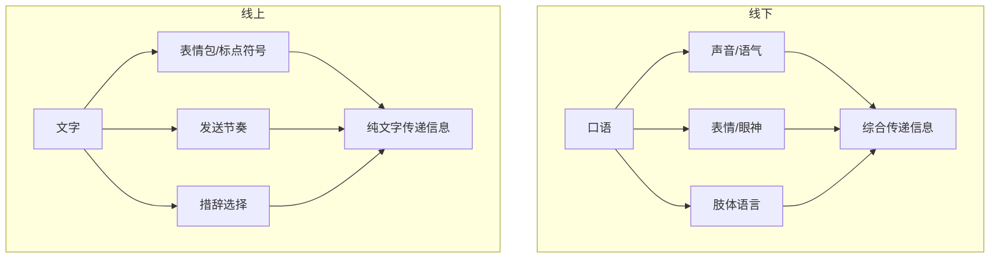

# 补充课03：线上社交表达

## 学习目标
- 掌握微信聊天的节奏控制
- 理解线上表达与线下表达的差异
- 学会用文字传递情绪和态度
- 避免线上聊天的常见陷阱

## 线上 vs 线下表达的核心差异

原课程中大量的训练是围绕"面对面聊天"展开的，但现代社交中，线上聊天（尤其是微信）占据了相当大的比例。线上表达有一些本质不同的特点：

> [!TIP] 关键差异
> 线下聊天是"实时流"，话一出口就收不回来，但可以用表情、语气、肢体语言辅助；线上聊天是"异步缓冲区"，每条消息都可以编辑，但也失去了非语言的辅助。

| 维度 | 线下 | 线上 |
|---|---|---|
| 反馈速度 | 即时 | 可能有延迟 |
| 信息密度 | 低（可慢慢说） | 高（需精简） |
| 情绪传递 | 自动（语气表情） | 需刻意设计 |
| 修改余地 | 几乎无 | 可编辑再发 |
| 尴尬程度 | 沉默尴尬 | 已读不回尴尬 |

## 微信聊天的节奏控制

### 状态+感受的线上版本

原课程提出了"状态+感受"的聊天模式，这个模式在微信中同样适用，但需要调整粒度：

**线下**：一连串的状态描述+感受流露

**线上**：一句话一个状态，或一句话一个感受；给对方留下回应空间

**错误示范**（太长不看）：
> "我今天去了一个特别有意思的地方，是一个在胡同里的独立书店，里面有一只猫，我在那待了一下午看了半本书，感觉特别放松特别治愈。"

**正确示范**（分段发送，留出互动空间）：
> "今天发现了一家藏在胡同里的独立书店。"
> "里面有只猫，特别粘人。"
> "待了一下午，感觉被治愈了。"

### "制造挑战"的线上实现

原课程的核心方法论"制造挑战"在线上同样有效，但需要调整为文字形式：

| 线下制造挑战 | 线上制造挑战 |
|---|---|
| "我觉得不对，应该是……" | "我有一个不太一样的看法😄" |
| 用语气和表情配合 | 用表情包和语气词配合 |
| "我不同意"→对方能看到表情是玩笑 | "我不同意🙅"→用Emoji表明态度 |
| 靠话速和停顿营造节奏 | 靠换行和标点营造节奏 |

## 表情包的合理使用

表情包是线上社交的"肢体语言"，合理使用能大幅提升表达的感染力：

1. **不要只用官方表情**：微信自带表情缺乏个性，适当使用收藏的表情包能展示性格
2. **表情包的时机**：承接对方的话时用表情包＞开启新话题时用表情包
3. **节奏搭配**：文字+表情+文字＞连续刷表情包
4. **分寸感**：刚认识时慎用过于暧昧/恶搞的表情包

## "已读不回"的应对策略

### 心态建设（基于原课心理理论）

原课程第06课的核心观点：**别人对我的反馈不由我的行为决定**。线上聊天中，"已读不回"并不一定意味着"我说错了话"，可能的原因包括：

- 对方正在忙，想等会儿回复然后忘了
- 对方看到了但此刻没有好的回应思路
- 消息太多被刷下去了
- 对方心情不好不想聊天

> [!WARNING] 警惕推论陷阱
> 不要把"对方没回我"自动推论为"我聊得不好"或"他讨厌我"。这种推论本身就是原课程说的"缺乏自我接纳"的表现。

### 实操策略

如果发了消息对方没回：

1. **不要连发多条**：连续追问只会暴露不安全感
2. **间隔一段时间（1-2天）后再发新话题**：用状态+感受的方式开启新话题
3. **不要质问"为什么不回我"**：这是典型的"论证感受的合理性"的错误

## 练习

> [!QUESTION] 改写练习
> 将下面的线下表达改写成适合微信聊天的版本：
>
> "我上周去了云南，在大理古城住了三天，在洱海边骑了一天自行车，还去爬了苍山，山上有一个寺庙特别安静，我在那坐了一个小时感觉特别好。你之前不是说也想去云南吗？"

参考答案

**分段版**：
> "刚从云南回来，在大理待了三天。"
> "洱海边骑车真的太爽了，强烈推荐。"
> "还发现苍山上有个小寺庙，我在那坐了一个小时，什么也没想。"
> ——给对方回应空间——
> "你不是也一直想去云南来着？"

第一段：抛状态；第二段：具体感受+推荐；第三段：独特经历；第四段链接对方

## 下一步
- [[lessons/0003-po-bing-yu-liu-chang-biao-da|第03课：破冰与流畅表达]] — 原课程的核心破冰方法
- [[lessons/0009-you-mo-yu-sheng-dong-biao-da|第09课：幽默与生动表达]] — 让线上表达更有趣