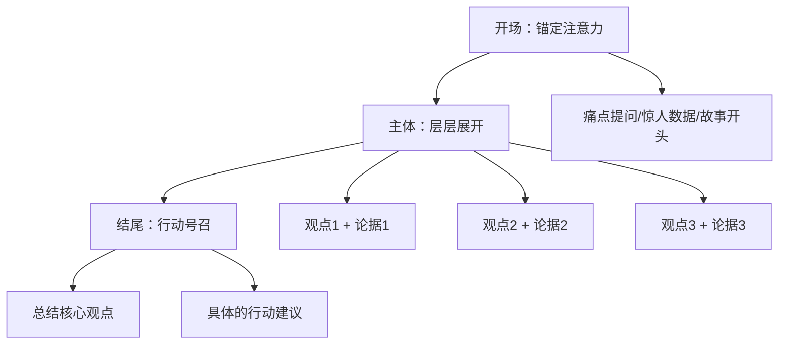

# 补充课04：公众演讲基本技巧

## 学习目标
- 理解演讲紧张的根源并学会管理紧张
- 掌握演讲内容组织的"三段式"结构
- 学会用表达三层结构设计演讲稿
- 能够应对即兴演讲

## 紧张的本质：重新理解生理反应

原课程的第六课关于"紧张是一种精妙的生理反应"的观点，是应对演讲紧张的最佳心态：

> 当你面对公众演讲紧张时，你的身体在做出最精妙的反应——心率加快意味着更多血液流向大脑，让你更警觉；肾上腺素分泌意味着你更有能量。这不是你的敌人，而是你身体的"高性能模式"。

**关键认知转换**：
- ❌ "我的紧张说明我不行" → ✅ "我的紧张说明我的身体在为我做准备"
- ❌ "我必须克服紧张" → ✅ "我可以带着紧张演讲"
- ❌ "听众在评判我" → ✅ "听众希望我成功"

## 演讲内容组织：三段式结构

结合原课程"有效表达五要素"，演讲的内容结构可以简化为：



### 开场方式选择

| 类型 | 适用场景 | 示例 |
|---|---|---|
| 痛点提问 | 解决问题型演讲 | "有多少人曾在会上突然被点名，大脑一片空白？" |
| 惊人数据 | 说服型演讲 | "90%的人在公众演讲前会感到极度焦虑。" |
| 故事开场 | 分享型演讲 | "三年前我第一次搭讪，话到嘴边又咽了回去。" |
| 引语开场 | 正式场合 | "马克吐温说过，世界上只有两种演讲者：紧张的和说谎的。" |

## 即兴演讲：3分钟的快速框架

原课程中"大脑一片空白"的应对方法同样适用于即兴演讲：

```
PREP急救版（30秒准备，1-3分钟讲）：
P - 你的核心观点（一句话）
R - 为什么这么认为（1-2句）
E - 一个具体的例子或数据
P - 重复核心观点，加上行动建议
```

## 从线下到台上的表达方法迁移

原课程中的方法在演讲场景中的变体：

| 原课方法 | 演讲变体 |
|---|---|
| 状态+感受+想法 | 场景+感受+启示 |
| 有效表达五要素 | 现象→影响→原因→方案→呼吁 |
| 描述画面细节 | 用生动的场景描写替代抽象概念 |
| 制造挑战 | 先提出争议性观点，再给出你的论证 |

## 练习

> [!QUESTION] 30秒自我介绍
> 请用SCQA框架（情境-冲突-问题-答案）写一个30秒的自我介绍，主题自选。然后出声练习，计时30秒。

<details>
<summary>示范</summary>

**S**：我之前在一家互联网公司做产品经理。
**C**：每次产品评审会上，我准备得最充分，但总是被开发一句话问住，然后就大脑空白了。
**Q**：我一度怀疑是不是自己逻辑不行。
**A**：后来我发现问题不在逻辑，而在表达节奏——我习惯把最好的观点留到最后说，但听众等不到那时候。现在我会先把结论亮出来，再展开论证。

</details>

> [!TIP] 练习方法
> 录音后回听。大多数人在第一次录音时会发现：自己以为说清楚了，回听才发现跳过了很多关键信息。这是进步最快的方法。

## 下一步
- [[lessons/0005-you-xiao-biao-da-wu-yao-su|第05课：有效表达五要素]] — 演讲内容组织的基础
- [[lessons/s01-jie-gou-hua-biao-da-kuang-jia|补充课01：结构化表达框架]] — PREP/SCQA框架的应用