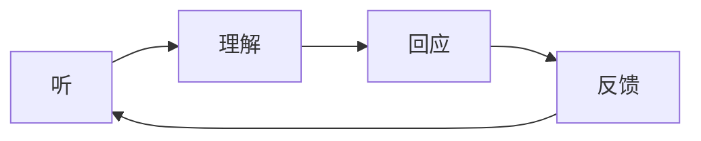

# 补充课05：倾听与反馈的艺术

## 学习目标
- 理解倾听在表达中的核心地位
- 掌握三层倾听模型
- 学会用"共情反馈"替代"解决问题"
- 建立倾听→回应→引导的闭环

## 倾听：原课中被低估的能力

原课程几乎全部聚焦在"怎么说"上，但在真实的沟通中，**听和说同样重要**。很多表达问题的根源不在于"不会说"，而在于"没听进去"。

> [!TIP] 关键认知
> 不会听的人，永远无法真正"说对话"。因为你说的内容是基于你对对方的理解，而理解来自于听。

## 三层倾听模型

| 层次 | 名称 | 行为 | 典型回应 |
|---|---|---|---|
| 1 | 下载式倾听 | 只听自己想听的 | "嗯，对，然后呢？" |
| 2 | 事实式倾听 | 关注事实而非情绪 | "她说了什么？他怎么回应的？" | 
| 3 | 共情式倾听 | 听事实+听情绪+听需求 | "听起来你很 失望，因为他没有看到你的付出？" |

### 共情式倾听的原课基础

原课程第05课关于"表达感受而不是论证感受的合理性"的讨论，反过来就是共情倾听的核心：

> 当别人向你倾诉时，**不要论证他的感受是否合理**，只需要承认和接纳他的感受。

**错误反馈**：
> "你别这么想，其实老板也是为你好。"（论证对方的感受不合理）
> "这有什么好生气的？"（否认对方的感受）

**正确反馈**：
> "听起来确实很让人生气。"
> "如果是我，我也会觉得很不舒服。"
> "你是不是感觉自己的付出没有被看到？"

## 反馈的层级

在对方向你表达后，你的反馈可以分为几个层级：

| 层级 | 名称 | 示例 |
|---|---|---|
| 1 | 敷衍 | "哦，这样啊" |
| 2 | 评判 | "你这就不对了" |
| 3 | 建议 | "你应该……" |
| 4 | 共情 | "听起来你挺难受的" |
| 5 | 共情+探索 | "听起来你挺难受的，是哪一点让你最不舒服？" |

> [!WARNING] 男性思维的陷阱
> 原课中提到，男性思维倾向于"解决问题"而非"共情"。当对方倾诉时，直接跳到"建议"层级（层级3）会让对方觉得"你没听进去"。先在层级4-5停留，等对方情绪平复后再视情况给出建议。

## 听-反馈-引导的闭环

结合原课程的"制造挑战"方法论，完整的沟通闭环如下：

1. **听**：听事实+听情绪+听需求
2. **反馈**：先共情（肯定情绪）→再复述（确认理解）→最后提问（引导深入）
3. **引导**：在充分倾听和共情的基础上，制造有建设性的挑战

### 实战案例

**对方**："最近工作压力好大，老板天天催进度，我觉得自己快撑不住了。"

- ❌ 层级3（建议）："你可以跟老板沟通一下啊。"
- ❌ 层级1（敷衍）："加油，你可以的。"
- ✅ 层级4+5（共情+引导）：
  "听起来你最近确实被压得很紧。这种强度持续多久了？"（共情+开放式提问）
  ——待对方回应后——
  "如果抛开'撑不住'这个感受，具体是哪部分的任务量最大？"（引导思考）

## 练习

> [!QUESTION] 共情反馈练习
> 对方说："我上周面试了一家公司，觉得聊得挺好的，结果今天收到拒信，心情特别不好。"
> 请写出三个不同层级的反馈，并判断每个属于哪个层级。

参考答案

1. "别灰心，肯定有更好的机会等着你。" → 层级1（敷衍，虽然是善意的）
2. "你面试中是不是有什么问题没回答好？" → 层级3（建议/分析，太着急了）
3. "聊得挺好却被拒了，这种感觉确实很不好受。你是觉得哪里出了问题，还是单纯觉得很受打击？" → 层级5（共情+探索，最佳回应）

## 下一步
- [[lessons/0005-you-xiao-biao-da-wu-yao-su|第05课：有效表达五要素]] — 表达与倾听的互补
- [[lessons/s06-fei-bao-li-gou-tong|补充课06：非暴力沟通实践]] — 高级沟通框架