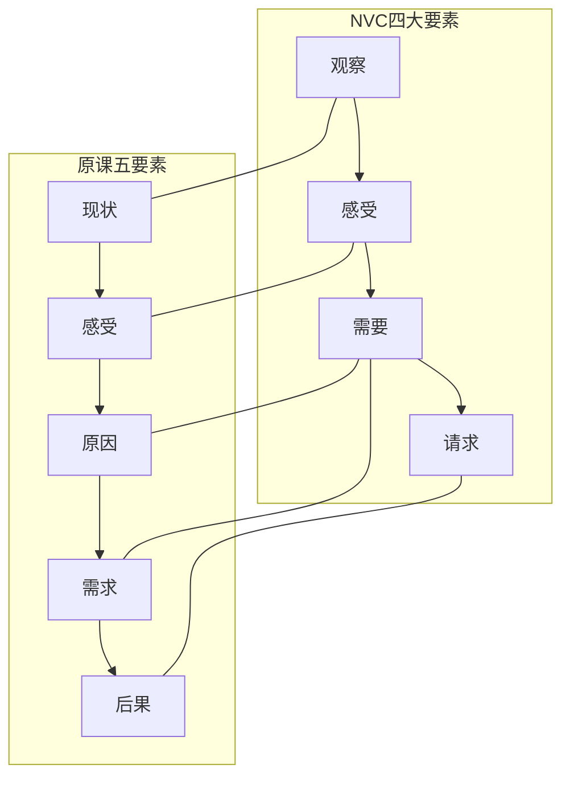

# 补充课06：非暴力沟通实践

## 学习目标
- 理解非暴力沟通的四大要素
- 将原课程的"有效表达五要素"升级为NVC
- 学会在冲突场景中运用NVC
- 区分"请求"和"要求"

## NVC与原课方法的内在联系

在阅读原课程内容时，你会发现在第04课关于"表达感受"的讨论中，已经出现了NVC的雏形：

> "先描述现状，再表达感受，然后陈述需求或原因，最后提出要求。"

这正是非暴力沟通（NVC）的朴素版本。NVC将其系统化为四个要素：

## 四要素详解

### ① 观察（Observation）

> "当我看到/听到/注意到……"

描述客观事实，不加评判。这与原课"描述现状"和"不要评价对方"完全一致。

**区分观察和评判**：

| 评判 | 观察 |
|---|---|
| "你总是迟到" | "这周你有三天在9:15之后才到" |
| "你工作不认真" | "这个报告里有三处数据错误" |
| "他太自私了" | "他午餐没问我就自己吃了" |

### ② 感受（Feelings）

> "我感到……"

表达情绪状态而非想法。原课程特别强调了"表达感受而不是论证感受的合理性"，这正是NVC的第二要素核心。

**区分感受和想法**：

| 想法（不是感受） | 感受（是感受） |
|---|---|
| "我感觉你不尊重我" | "我感到受伤/生气" |
| "我感觉我做错了" | "我感到懊悔/难过" |
| "我觉得他不公平" | "我感到愤怒/挫败" |

### ③ 需要（Needs）

> "因为我需要/看中……"

把感受连接到人类共同的需要。这是NVC区别于原课方法的核心增量——原课的"原因"更多指向个人化的理由（"我有哮喘"），而NVC的"需要"指向人类共通的价值（"我需要被尊重"）。

**常见的人类需要**：
- 被理解、被尊重、被认可
- 安全感、信任、支持
- 自主、选择、自由
- 连接、陪伴、亲密
- 秩序、清晰、意义

### ④ 请求（Request）

> "你是否愿意……"

提出具体的、可执行的行动请求。与原课的"需求"一致——指向具体行为而非抽象状态。

**区分请求和要求**：

| 要求 | 请求 |
|---|---|
| "你必须按时完成" | "你是否愿意在周五前完成？" |
| "以后别再这样了" | "下次你可以提前跟我说一声吗？" |
| "我需要你更负责任" | "你是否愿意每周给我一次进度更新？" |

## 完整对比：原课方法 vs NVC

**场景**：室友在宿舍抽烟，你觉得很不舒服。

| 步骤 | 原课有效表达 | NVC |
|---|---|---|
| 1 | "咱们房间每次推门进来，都是烟雾缭绕" | "当我晚上回宿舍，看到房间里烟雾缭绕"（观察） |
| 2 | "心情非常压抑，很不开心" | "我感到胸口发闷，心情烦躁"（感受） |
| 3 | "因为我有气管炎，对空气质量要求高" | "因为我需要干净的空气来保持健康"（需要） |
| 4 | "我希望以后不要在宿舍抽烟了，或者去阳台抽" | "你是否愿意以后抽烟时去阳台？"（请求） |
| 5 | "否则我可能会向楼委会投诉" | ——（不需要威胁，信任对方的善意） |

## 练习

> [!QUESTION] 改写练习
> 请用NVC四要素改写下面这段"容易引发冲突"的表达：
>
> "你太自私了吧？每次吃饭都不问问别人想吃什么就自己决定了。"

参考答案

**NVC版本**：
"今晚咱们一起吃饭时，你直接说去吃火锅了。（观察）
我感到有点失落。（感受）
因为我希望能一起平等地商量决定，这对我来说很重要。（需要）
下次你可以先问问大家想吃什么再决定吗？（请求）"

> [!QUESTION] 自我觉察练习
> 回想你最近一次沟通不顺利的经历。用NVC四要素拆解：
> - 我观察到了什么客观事实？
> - 我当时真实的感受是什么？
> - 背后是我什么需要没被满足？
> - 如果重来一次，我会提出什么具体的请求？

## 下一步
- [[lessons/0005-you-xiao-biao-da-wu-yao-su|第05课：有效表达五要素]] — NVC的理论基础
- [[lessons/s05-qing-ting-yu-fan-kui|补充课05：倾听与反馈的艺术]] — 沟通的另一半