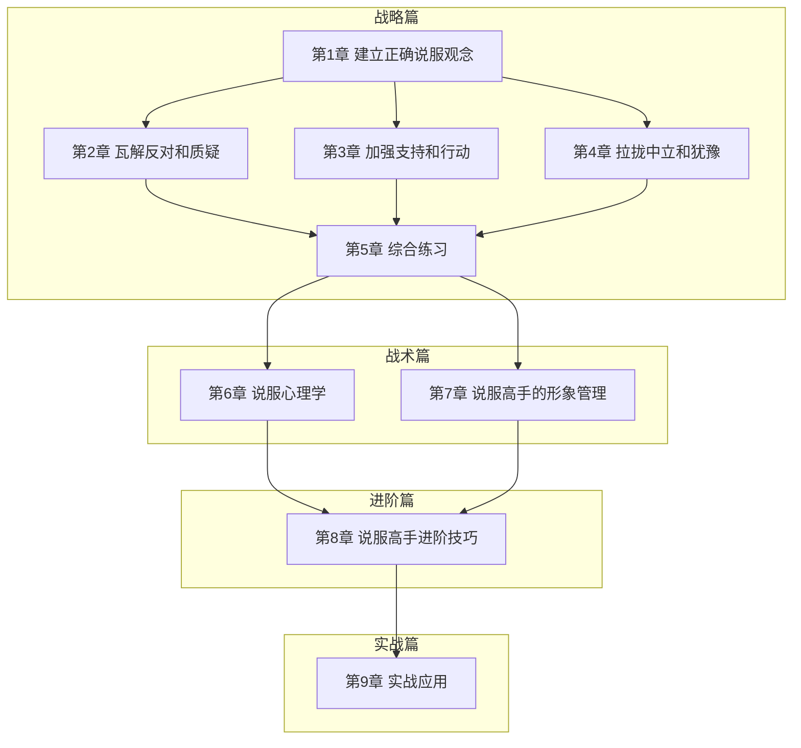
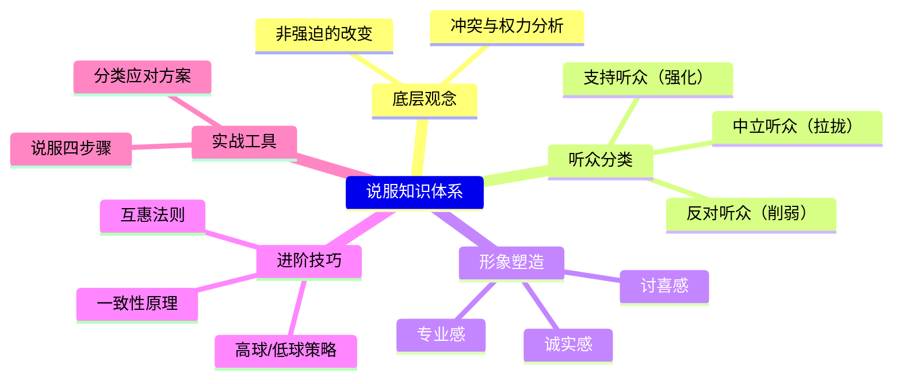

# 课程地图

## 课程总览

| 模块 | 章节 | 课时 | 核心内容 |
|------|------|------|----------|
| 战略篇 | 第1章 | 2课 | 说服的本质、听众分类体系 |
| 战略篇 | 第2章 | 3课 | 道歉、辩护、转化——瓦解反对 |
| 战略篇 | 第3章 | 3课 | 需求清单、抵御、拆分行动——加强支持 |
| 战略篇 | 第4章 | 3课 | 间接告知、涉入、比较——拉拢中立 |
| 战略篇 | 第5章 | 1课 | 综合练习：区分听众、高手邀请信 |
| 战术篇 | 第6章 | 3课 | 粉红泡泡理论、反抗机制 |
| 战术篇 | 第7章 | 5课 | 说服力三要素：专业、诚实、讨喜 |
| 进阶篇 | 第8章 | 7课 | 互惠法则、高球/低球策略、一致性原理 |
| 实战篇 | 第9章 | 8课 | 说服四步骤、分类实战演练 |

## 知识体系图

## 学习进度追踪

| 序号 | 课程 | 课时数 | 状态 | 备注 |
|------|------|--------|------|------|
| 01 | [开营仪式与学习指南](lessons/0001-kai-ying-yi-shi) | 1 | 待学习 | |
| 02 | [说服的本质](lessons/0002-shi-shen-me-shi-shuo-fu) | 1 | 待学习 | |
| 03 | [听众分类体系](lessons/0003-shuo-fu-shui-fen-lei-ting-zhong) | 1 | 待学习 | |
| 04 | [反对听众——道歉的艺术](lessons/0004-mian-dui-fan-dui-dao-qian) | 1 | 待学习 | |
| 05 | [反对听众——辩护与转化](lessons/0005-mian-dui-fan-dui-bian-hu-yu-zhuan-hua) | 1 | 待学习 | |
| 06 | [支持听众——需求清单与激励](lessons/0006-jia-qiang-zhi-chi-xu-qiu-qing-dan) | 1 | 待学习 | |
| 07 | [支持听众——抵御与拆分行动](lessons/0007-jia-qiang-zhi-chi-di-yu-chai-fen-xing-dong) | 1 | 待学习 | |
| 08 | [中立听众——间接告知](lessons/0008-la-long-zhong-li-jian-jie-gao-zhi) | 1 | 待学习 | |
| 09 | [中立听众——涉入与比较](lessons/0009-la-long-zhong-li-she-ru-yu-bi-jiao) | 1 | 待学习 | |
| 10 | [综合练习——高手邀请信](lessons/0010-zong-he-lian-xi-gao-shou-yao-qing-xin) | 1 | 待学习 | |
| 11 | [改变的原理——粉红泡泡](lessons/0011-gai-bian-de-yuan-li-fen-hong-pao-pao) | 2 | 待学习 | |
| 12 | [改变的原理——反抗机制](lessons/0012-gai-bian-de-yuan-li-fan-kang-ji-zhi) | 1 | 待学习 | |
| 13 | [说服力三要素——偷懒的大脑](lessons/0013-shuo-fu-li-san-yao-su-tou-lan-de-da-nao) | 1 | 待学习 | |
| 14 | [说服力三要素——专业的感觉](lessons/0014-shuo-fu-li-san-yao-su-zhuan-ye-de-gan-jue) | 1 | 待学习 | |
| 15 | [说服力三要素——诚实的感觉](lessons/0015-shuo-fu-li-san-yao-su-cheng-shi-de-gan-jue) | 2 | 待学习 | |
| 16 | [说服力三要素——讨喜的感觉](lessons/0016-shuo-fu-li-san-yao-su-tao-xi-de-gan-jue) | 1 | 待学习 | |
| 17 | [互惠法则](lessons/0017-hu-hui-fa-ze) | 2 | 待学习 | |
| 18 | [高球策略与低球策略](lessons/0018-gao-qiu-ce-lve-yu-di-qiu-ce-lve) | 3 | 待学习 | |
| 19 | [一致性原理](lessons/0019-yi-zhi-xing-yuan-li) | 2 | 待学习 | |
| 20 | [核心工具——说服四步骤](lessons/0020-shi-zhan-si-bu-zhou) | 1 | 待学习 | |
| 21 | [实战——反对听众](lessons/0021-shi-zhan-fan-dui-ting-zhong) | 3 | 待学习 | |
| 22 | [实战——支持听众](lessons/0022-shi-zhan-zhi-chi-ting-zhong) | 3 | 待学习 | |
| 23 | [实战——中立听众](lessons/0023-shi-zhan-zhong-li-ting-zhong) | 1 | 待学习 | |
| 24 | [直播答疑精华](lessons/0024-zhi-bo-da-yi) | 1 | 待学习 | |