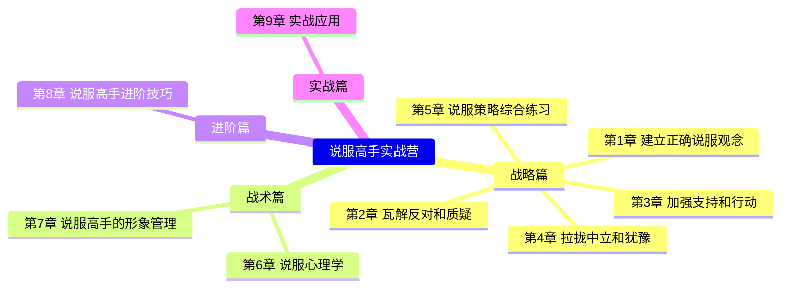

# 说服高手实战营

> 黄执中（奇葩说BB King）主讲 · 35天系统训练课程

## 课程简介

说服不是口才，不是辩论，不是诡辩。说服是一门**以非强迫的方式产生改变**的温柔学科。本课程将带你系统性地建立正确的说服观念，掌握针对不同听众的分类应对策略，并通过大量实战练习将知识转化为技能。

## 适合谁学

- 需要在职场中推动同事、上级、客户配合你的职场人
- 希望改善亲密关系、亲子沟通的家庭关系经营者
- 从事销售、谈判、咨询等需要高频说服他人的专业人士
- 任何想要温和而有效地让改变发生的人

## 课程结构

## 学习路径

建议按章节顺序学习，每章包含理论讲解、案例分析和课后练习：

1. **战略篇（第1-5章）**：建立说服的底层观念，学会对听众分类，掌握针对反对、支持、中立三种听众的核心策略
2. **战术篇（第6-7章）**：深入理解改变的心理机制，打造说服者的个人形象（专业、诚实、讨喜）
3. **进阶篇（第8章）**：掌握互惠法则、高球/低球策略、一致性原理等进阶技巧
4. **实战篇（第9章）**：学习说服四步骤工具，针对不同听众进行实战演练

## 课程大纲

- [[00-course-map|课程地图与学习路径]]
- [[reference/glossary|说服力核心术语表]]
- [[reference/quick-reference|说服技巧速查表]]

### 战略篇

- [[lessons/0001-kai-ying-yi-shi|第01课：开营仪式与学习指南]]
- [[lessons/0002-shi-shen-me-shi-shuo-fu|第02课：说服的本质——非强迫的改变]]
- [[lessons/0003-shuo-fu-shui-fen-lei-ting-zhong|第03课：说服谁——听众分类体系]]
- [[lessons/0004-mian-dui-fan-dui-dao-qian|第04课：面对反对听众——道歉的艺术]]
- [[lessons/0005-mian-dui-fan-dui-bian-hu-yu-zhuan-hua|第05课：面对反对听众——辩护与转化]]
- [[lessons/0006-jia-qiang-zhi-chi-xu-qiu-qing-dan|第06课：面对支持听众——需求清单与激励]]
- [[lessons/0007-jia-qiang-zhi-chi-di-yu-chai-fen-xing-dong|第07课：面对支持听众——抵御与拆分行动]]
- [[lessons/0008-la-long-zhong-li-jian-jie-gao-zhi|第08课：面对中立听众——间接告知]]
- [[lessons/0009-la-long-zhong-li-she-ru-yu-bi-jiao|第09课：面对中立听众——涉入与比较]]
- [[lessons/0010-zong-he-lian-xi-gao-shou-yao-qing-xin|第10课：综合练习——设计高手邀请信]]

### 战术篇

- [[lessons/0011-gai-bian-de-yuan-li-fen-hong-pao-pao|第11课：改变的原理——粉红泡泡]]
- [[lessons/0012-gai-bian-de-yuan-li-fan-kang-ji-zhi|第12课：改变的原理——反抗机制]]
- [[lessons/0013-shuo-fu-li-san-yao-su-tou-lan-de-da-nao|第13课：说服力三要素——偷懒的大脑]]
- [[lessons/0014-shuo-fu-li-san-yao-su-zhuan-ye-de-gan-jue|第14课：说服力三要素——专业的感觉]]
- [[lessons/0015-shuo-fu-li-san-yao-su-cheng-shi-de-gan-jue|第15课：说服力三要素——诚实的感觉]]
- [[lessons/0016-shuo-fu-li-san-yao-su-tao-xi-de-gan-jue|第16课：说服力三要素——讨喜的感觉]]

### 进阶篇

- [[lessons/0017-hu-hui-fa-ze|第17课：互惠法则]]
- [[lessons/0018-gao-qiu-ce-lve-yu-di-qiu-ce-lve|第18课：高球策略与低球策略]]
- [[lessons/0019-yi-zhi-xing-yuan-li|第19课：一致性原理]]

### 实战篇

- [[lessons/0020-shi-zhan-si-bu-zhou|第20课：核心工具——说服四步骤]]
- [[lessons/0021-shi-zhan-fan-dui-ting-zhong|第21课：实战——反对听众]]
- [[lessons/0022-shi-zhan-zhi-chi-ting-zhong|第22课：实战——支持听众]]
- [[lessons/0023-shi-zhan-zhong-li-ting-zhong|第23课：实战——中立听众]]
- [[lessons/0024-zhi-bo-da-yi|第24课：直播答疑精华]]

## 学习建议

1. **顺序学习**：课程内容层层递进，建议按顺序学习
2. **完成作业**：每课后的练习是内化知识的关键
3. **结合实践**：将学到的技巧应用到真实工作生活场景中
4. **社群讨论**：与他人交流案例，获得多元视角