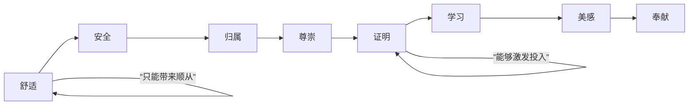

# 第06课：面对支持听众——需求清单与激励

## 学习目标

- 理解"支持听众"的特征与说服目标——增强
- 掌握"自主性难题"的概念及其在说服中的意义
- 学会运用"需求清单"识别并匹配他人的真实需求
- 掌握"上价值"的技巧，推动人从顺从走向投入
- 学会自我激励的方法：重新定义工作的真正任务

## 核心概念

### 1. 支持听众与增强目标

**支持听众** 是那些在态度上与你一致的人。他们可能只是同意你，但还没有站出来行动；可能只是喜欢，但还没有热爱。说服支持听众的核心目标不是改变立场，而是 **增强**——把顺从变成投入，把同意变成行动。

> 你遇到支持听众的频率远多于反对听众。约客户出来喝咖啡聊产品，他愿意出来就是支持听众；老师在课堂上面对学生，他们至少不反对来上课，所以也是支持听众。

### 2. 自主性难题

**自主性难题** 是说服支持听众时的核心挑战——我们要求对方听话很容易，但真正的目的是希望我们不在场时，他仍然能自主地做出正确的决定。

> **顺从** vs **投入**：顺从是"你在我面前我做"，投入是"你不在我依然想做"。

### 3. 需求清单（激励层次）

黄执中老师将马斯洛需求金字塔升级为 **需求清单**，强调人的多种需求是同时存在的，而非层层递进。从低到高（从左到右）排列如下：

**各需求层次详解：**

| 需求层次 | 核心诉求 | 说辞示例 | 效果 |
|---------|---------|---------|------|
| 舒适 | 好处、享受 | "念书可以吃大餐" | 仅顺从 |
| 安全 | 避免损失 | "念书才不会挨打" | 仅顺从 |
| 归属 | 被爱、被接纳 | "好好念书爸妈才会爱你" | 可投入 |
| 尊崇 | 被尊敬、地位 | "让瞧不起你的人刮目相看" | 可投入 |
| 证明 | 自我实现 | "我要证明我可以" | 可投入 |
| 学习 | 掌握、理解 | "朝闻道夕死可矣" | 可投入 |
| 美感 | 秩序、平衡 | "逼死强迫症的整齐" | 可投入 |
| 奉献 | 道德、善良 | "证明自己是个好人" | 可投入 |

### 4. 上价值

**上价值** 是推动一个人的需求层级从低端向高端移动的技巧。同样的要求，诉诸不同的需求层级，效果天差地别。

> **案例：说服下属与讨厌的人合作**
> - 低层诉求："合作才能把事办成"（舒适/安全）——效果有限
> - 高层诉求："跟讨厌的人合作是一种软实力、硬实力"（学习/证明）——更能点燃热情

### 5. 激励落差：主管与员工的认知错位

2018年台湾天下杂志调查显示：

| 角色 | 认为员工最在意的三项 | 员工实际在意的三项 |
|------|-------------------|-------------------|
| 主管 | 待遇、工作环境、升迁机会 | 工作有趣、受到赞扬、归属感 |
| 可控性 | 主管大多无法掌控 | 主管完全可以掌控 |

**关键洞察**：我们都倾向于认为别人在意低阶需求，自己在乎高阶需求。这正是激励失效的主要原因。

### 6. 自我激励：重新定义工作

**公式**："我貌似在（做什么），但我真正的任务是（什么）"

通过重新诠释工作的意义，将日常任务"上价值"，点燃内在热情。

> **优秀麦当劳店经理的自述：**
> - "我貌似在卖汉堡，但我真正的任务是在卖时间——帮现代人节省效率"
> - "我貌似在卖汉堡，但我真正的任务是帮麦当劳维持全球统一标准"
> - "我貌似在卖汉堡，但我真正的任务是教日本年轻人踏入社会"

> **军中的炊事兵**："我貌似在煮饭，但我真正的任务是维持前线士气"

> [!TIP] 关键洞察
> 说服支持听众，不要停留在"告诉你这样做有好处"（舒适/安全），而要提升到"这样做证明了你是什么样的人"（证明/奉献）。上价值不是空谈理想，而是找到行为背后的意义感。

## 案例分析

### 案例一：《华尔街之狼》激励演说

小李子饰演的乔丹·贝尔福特在影片中激励员工时，同时运用了 **尊崇**（"这样才不会被人瞧不起"）和 **归属**（"你是我精心培育出来的战士"）两个高阶需求，成功点燃了员工的热情。

### 案例二：加薪20%的说服测试

- 对自己：最开心的是"公司认可我的身价"（尊崇/证明）
- 对别人：却倾向于说"你可以买一台新车了"（舒适）
- **结论：我们总是低估别人的高阶需求**

### 案例三：保险销售的上价值

| 低层诉求 | 高层诉求 |
|---------|---------|
| "买保险，生病有保障" | "买保险，证明你是个负责任的人" |
| 诉诸安全 | 诉诸尊崇/证明 |

### 案例四：百事可乐 vs 苹果的"卖糖水"段子

乔布斯挖斯卡利的故事之所以是"段子"，因为真正的高手从不认为自己的工作只是"卖糖水"。百事可乐员工的自我定位是"为一代又一代年轻人贩卖渴望"。

## 知识点总结

掌握需求清单并用于激励他人和自己：

1. **识别需求层级**：从舒适、安全、归属、尊崇、证明到学习、美感、奉献
2. **向右侧移动**：越往右的需求越能激发投入，而不是仅带来顺从
3. **上价值技巧**：同样的要求，升华为更高层次的意义
4. **避免激励误区**：不要假定别人的需求比自己低阶
5. **自我激励**：用"我貌似在做X，但我真正的任务是Y"的句式重新定义工作
6. **关注可控制的需求**：兴趣、赞扬、归属感是主管可以给予的，也是员工真正在意的

> [!QUESTION] 自测练习
> 请用今天学到的"上价值"技巧，为以下三种场景设计激励话语：
>
> 1. **运动健身**：如何说服一个朋友开始跑步？（请分别用低层和高层需求各写一个版本）
> 2. **工作汇报**：同事拖延提交报告，如何激励他按时完成？（避免诉诸惩罚/安全，尝试诉诸尊崇或证明）
> 3. **自我激励**：用"我貌似在____，但我真正的任务是____"的句式，重新定义你当前的工作或学习任务。

查看参考示例

**1. 运动健身**
- 低层："跑步能减肥、能让你身材变好"（舒适）
- 高层："你知道能坚持跑步的人，都有一个共同特质——他们能掌控自己的生活。跑步不只是运动，是你向自己证明'我可以'的方式。"（证明）

**2. 工作汇报**
- "这份报告交上去，不只是完成任务。大家都在看——谁能在这个项目里展现出真正的专业水准。这次汇报，是你让所有人记住你能力的机会。"（尊崇/证明）

**3. 自我激励**
- "我貌似在写报告/做表格，但我真正的任务是帮团队理清思路、做对决策。"
- "我貌似在学习/备考，但我真正的任务是掌握一种分析问题的思维框架。"

## 下一步

继续学习 [[0007-jia-qiang-zhi-chi-di-yu-chai-fen-xing-dong|第07课：面对支持听众——抵御与拆分行动]]，了解如何让支持者的态度不被外界动摇，以及如何将态度转化为行动。