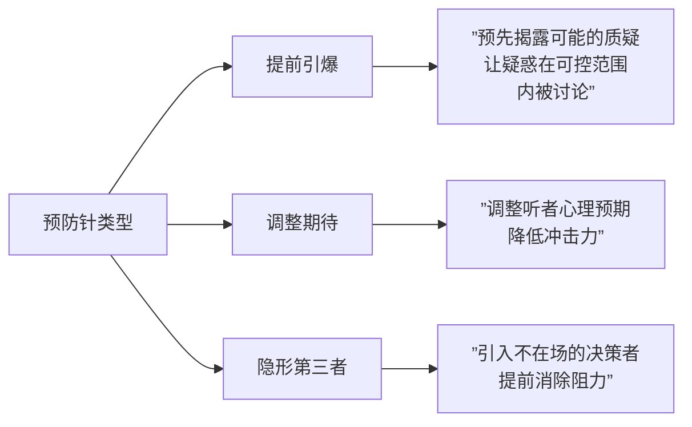
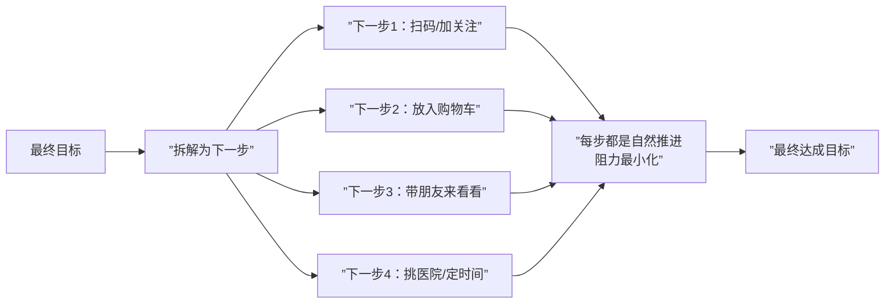

# 第07课：面对支持听众——抵御与拆分行动

## 学习目标

- 理解"预防针"机制及其在抵御外界影响中的作用
- 掌握预防针的三种类型：提前引爆、调整期待、隐形第三者
- 理解"死人原则"——为什么不要说"不要做"
- 学会拆分行动目标，推动人从态度转向行为

## 核心概念

### 第一部分：抵御——预防针策略

**预防针** 是一种先在听众脑中打下的"免疫机制"，让听众对未来的反对意见产生抵抗力。它像疫苗一样，提前让听众接触"弱化版"的反对意见，从而产生免疫力。

#### 预防针的三种类型

**类型一：提前引爆**

预先说出对方心里可能有的质疑，主动将其摊开讨论，避免质疑在暗中发芽壮大。

> **案例：巴黎莱雅广告语"因为你值得"**
> 消费者看到昂贵护肤品的第一个念头是"为什么这么贵"。品牌不等你问，直接回答"因为你值得"——没人会说"我不值得"。

> **案例：7 Plus 保健品销售**
> 销售人员提前告诉阿姨："你回去后，孩子会说太贵了、功效是骗人的。"当子女真的这样说时，阿姨反而产生免疫力，甚至认为"果然人家说得没错"。

**类型二：调整期待**

在说出关键内容之前，先调整对方的心理预期，降低冲击力。

> **常见句式：**
> - "有一句话我不知道该不该说……"
> - "我丑话说在前头……"
> - "我这么说你可能会生气……"
> - "我没有要说服你的意思……"

> **进阶技巧："我知道你应该不是这个意思"**
> 句式：**"我知道你应该不是这个意思，但你这样说会让我误以为_____"**
>
> 效果：即使对方确实有意冒犯，因为你给了台阶，对方通常会顺着说"我真的不是这个意思"，从而化解冲突。

**类型三：隐形第三者**

当决策权不在当前对象一人手中时，提前将不在场的决策者纳入说服框架。

> **案例：房产销售中的"先生"**
> 与其等客户说"我要回去跟先生商量"，不如提前问"您先生也会在意这个吗？"然后在介绍产品时，每一处都用"如果是先生，他会在意这个吗？"来引导客户换位思考。这既让客户替你说服家人，也给客户一个借第三人之口表达顾虑的机会（如"我先生可能觉得有点贵"实际上是她自己觉得贵）。

### 第二部分：拆分行动——行为说服

#### 死人原则

**不要说服别人去做死人也能做到的事**。死人不会抽烟、不会喝酒、不会乱发脾气——所以"不要做某事"是连死人都能做到的，不该是说服目标。

> **为什么"不要"无效？** 大脑听不懂"不"。让一个人"不要想北极熊"，他满脑子都是北极熊。正确的做法是告诉他"去想企鹅"。

**案例：**
- ❌ "不要再噗噗噗了" —— 孩子不知道要做什么
- ✅ "噗噗噗的时候要避开人" —— 明确的行动指令
- ❌ "别抽那么多烟" —— 无效
- ✅ "试试看多嚼口香糖" —— 有效

#### 最可能改变 vs 最需要改变

**不要说服别人去做他最需要改变的事**。最需要改变的事往往也是最痛苦的事，业余者撑不住。应该选择 **最有可能改变** 的目标。

> **健身教练的启示：**
> - 专业教练（补短板）："你手臂最弱，先练手臂"——太痛苦，撑不住
> - 高明教练（扬长板）："你腿部力量强，先练腿"——有成就感，容易坚持

> **关键原则：** 先让人习惯"改变"本身，再逐步扩大到更多改变。

#### 下一步思维

**不要盯着最后一步，要找下一步。** 所有复杂的说服目标都可以被拆解为无数个小步骤。

**案例：健康检查的拆分**
女朋友说服黄执中去做健康检查：
1. 先说服一起挑医院（不承诺检查）
2. 再说服找出两天有空的时间（不承诺检查）
3. 最后在选好的医院、空出来的时间去做检查——水到渠成

**案例：公益募捐**
- 不说"请捐钱"（门槛太高）
- 而说"请花三分钟看这个短片"（门槛低）
- 看完短片后，捐款的意愿自然提升

> [!TIP] 关键洞察
> 抵御与行动是增强支持的两翼。抵御是"守"——防止支持者被挖走；行动是"攻"——把态度转化为行为。两者共同构成"增强"目标。拆分行动的精髓在于：**永远让人做"下一步"而非"最后一步"**。

## 案例分析

### 案例一：7 Plus 保健品的预防针

这是课程中最完整的预防针案例。销售人员预测了客户回家后可能遇到的所有质疑（太贵、骗人、没必要），并提前打了预防针。使得子女的劝说全部在"射程范围之内"，反而让母亲更加相信销售方。

### 案例二：统一教的预防针

文鲜明牧师在礼拜中主动提及外界对邪教的批评，让信徒在笑声中产生免疫力。当家人再质疑时，信徒的反应是"果然被牧师说中了"。

### 案例三：奇葩说比赛中的预防针

黄执中在《奇葩说》第五季中的结辩，为了让后续发言的对手无法"挖票"，大量使用预防针技巧。他预判了对手可能的攻击角度，提前植入自己的叙事框架。

### 案例四：说服老公减肥的拆解

学员询问如何说服老公减肥：
1. 第一步：不说"减肥"（死人原则），而是说"多在家吃饭"或"天天量体重"
2. 进一步拆解：先说服他一起挑选体重秤、再设定一个小目标……

## 知识点总结

### 抵御三招
1. **提前引爆**：先说出对方的疑虑，在可控范围内解决
2. **调整期待**：用"我知道你不是这个意思"等句式降低对抗
3. **隐形第三者**：把不在场的决策者拉入说服框架

### 行动三原则
1. **死人原则**：永远说服人"去做什么"，而不是"不去做什么"
2. **最可能优先**：选择阻力最小的改变，而非最重要的改变
3. **下一步思维**：把最终目标拆解为连续的"下一步"，每一步都容易做到

> [!QUESTION] 自测练习
> **练习1：设计预防针**
> 你是一个项目经理，要向客户提案一个创新方案。客户可能会质疑"预算太高"和"没有先例"。请分别为这两个质疑设计一段"提前引爆"式的预防针话术。
>
> **练习2：拆分行动**
> 你的朋友想要开始写作，但一直没有动笔。请用"下一步思维"，设计至少3个逐步推进的行动步骤（从最简单到最难）。
>
> **练习3：死人原则改造**
> 将以下"不要"句式改成"去做"句式：
> - "开会不要迟到"
> - "写作业不要马虎"
> - "不要对孩子发脾气"

查看参考示例

**练习1：预防针设计**
- 回应"预算高"："我知道你第一眼看到预算可能会觉得有点高，我想提前解释一下——这个方案的效果和投入是完全匹配的，我们等会儿一起看看ROI分析。"
- 回应"没有先例"："你可能会想，这个方案好像没别人做过——其实我们看重的是一个新赛道的先发优势，没有先例反而意味着蓝海。"

**练习2：拆分行动**
1. 下一步1：每天写下3个想写的主题（不需要写正文）
2. 下一步2：选一个主题，写100字的草稿（不限质量）
3. 下一步3：设定每周固定写作时段，每次只写15分钟
4. 最终：形成写作习惯后再追求质量和长度

**练习3：死人原则改造**
- ❌ "开会不要迟到" → ✅ "下次试试提前5分钟到会议室"
- ❌ "写作业不要马虎" → ✅ "每写完一题回头检查一遍"
- ❌ "不要对孩子发脾气" → ✅ "生气时先深呼吸三次再说话"

## 下一步

继续学习 [[0008-la-long-zhong-li-jian-jie-gao-zhi|第08课：面对中立听众——间接告知]]，进入"中立听众"的说服策略，学习如何应对那些"不知道、不关心、不确定"的听众。