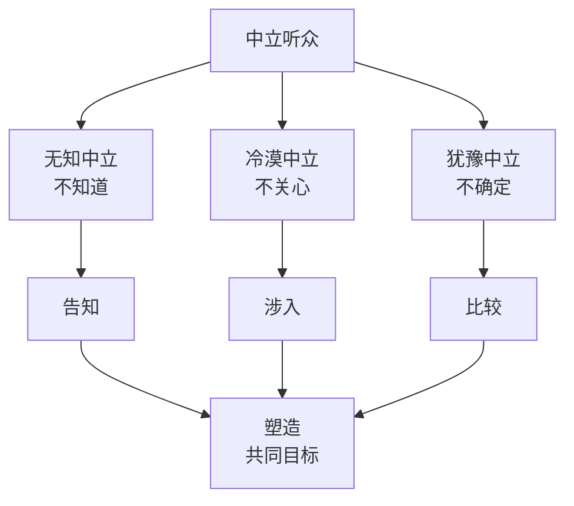

# 第08课：面对中立听众——间接告知

## 学习目标

- 理解中立听众的三种类型：无知中立、冷漠中立、犹豫中立
- 掌握中立听众的说服目标——塑造
- 学会区分"直接告知"与"间接告知"的使用场景
- 掌握间接告知的核心技巧：让对方自己得出结论

## 核心概念

### 1. 中立听众的三种类型

面对中立听众，首先要判断对方中立的原因：

| 类型 | 表现 | 核心障碍 | 对应策略 |
|------|------|---------|---------|
| **无知中立** | "不知道" | 信息不足 | 告知 |
| **冷漠中立** | "不关心" | 缺乏兴趣 | 涉入 |
| **犹豫中立** | "不确定" | 难以选择 | 比较 |

### 2. 直接告知 vs 间接告知

**直接告知**：适合对领域完全陌生、接受能力较弱的听众。直接给出信息，不绕弯子。

> **示例**：主持人介绍来宾时直接念头衔："黄执中是史上唯一蝉联国际大学生辩论赛两届全程最佳辩手……"

**间接告知**：适合对领域略有所知、教育程度较高、对单向灌输有警觉的听众。通过绕弯子的方式，让听众自己推导出结论。

> **核心原理**：**人喜欢自己得出的答案，而不是被别人灌输的答案。**

### 3. 间接告知的技巧

**技巧一：用参照物来烘托**

不直接说"我很厉害"，而是巧妙地让受众自己得出这个结论。

> **案例：黄执中介绍自己的辩手生涯**
> - 直接告知："我打了400多场比赛，只输了21场"
> - 间接告知列举对手的重视程度：
>   - 有人自称"秒杀大魔王黄执中的男人"——仔细一看是20年前赢过一场
>   - 有人讲座标题是"赢过黄执中的林正疆"
>   - 结论由听者自己得出："能让对手如此重视，该有多厉害？"

**技巧二：用故事/情境代替陈述**

不直接说结论，而是讲一个让受众自动推导出结论的故事或情境。

> **案例：法拉利广告**
> 镜头拍摄一台法拉利在赛道上飞驰，最后字幕打出："你猜摄影师是坐在什么车上拍的？"——答案：BMW。
> 观众自己得出结论："BMW比法拉利更快、更稳。"

**技巧三：用幽默/意料之外的设计**

笑话之所以好笑，正是因为信息是"间接"呈现的——听众需要自己在脑中绕个弯。

> **案例：经典冷笑话**
> 爸爸说"再考不及格就别叫我爸爸"。
> 第二天小明回家："大哥……"
> 如果直接解释就不好笑了。间接表达才有幽默效果。

### 4. 间接告知在广告中的运用

广告面对大量中立听众，间接告知是极为有效的策略。

**经典案例：BMW vs 法拉利**

| 版本 | 方式 | 效果 |
|------|------|------|
| 直说"我们很快" | 直接告知 | 平平无奇 |
| 拍法拉利飞驰，问"摄影师坐什么车上拍的" | 间接告知 | 观众自己得出"BMW更快"的结论 |

### 5. 间接告知在人际关系中的运用

**案例：马薇薇"送礼物"**
在《奇葩说》中，马薇薇赢了黄执中后表现得异常开心，喊着"赢了黄执中"。这不是炫耀，而是朋友之间相互抬轿子的技巧——她用间接的方式告诉所有人"黄执中很厉害"。

> [!TIP] 关键洞察
> 间接告知的本质是"把推理的乐趣留给受众"。人对自己推导出的结论深信不疑，对别人灌输的结论却会本能地质疑。所以真正高明的说服，不是把答案塞给对方，而是把线索铺在对方眼前，让他自己走到答案那里。

## 案例分析

### 案例一：不同场景下的告知策略

| 场景 | 对象 | 策略 | 话术 |
|------|------|------|------|
| 校内讲座介绍嘉宾 | 全体学生 | 直接告知 | 宣读头衔和成就 |
| 行业论坛介绍专家 | 业内人士 | 间接告知 | 列举行业知名人士对他的评价 |
| 电梯演讲介绍项目 | 投资人 | 间接告知 | 讲一个"同行都想合作的案例" |

### 案例二：幽默笑话的"间接"机制

笑话之所以好笑，正是因为它让听众自己完成了"拼图"——你给线索，听众自己得出那个荒诞的结论。如果把笑点直接说出来，就不好笑了。这也解释了为什么很多人"把笑话讲死"——因为他们把该由听众自己领悟的部分提前剧透了。

## 知识点总结

1. **诊断听众类型**：面对中立听众，先判断他是无知、冷漠还是犹豫
2. **选择告知方式**：
   - 听众背景弱、信息量少 → 直接告知
   - 听众有基础、有判断力 → 间接告知
3. **间接告知三绝招**：
   - 用参照物烘托（举对手的重视程度）
   - 用情境让听者自己推导（广告中的悬念）
   - 用幽默实现"绕弯子"（笑话让听者自己领悟）
4. **核心心法**：不要替对方下结论，让他自己走到结论那里

> [!QUESTION] 自测练习
> **练习1：改写直接告知为间接告知**
> 你需要在内部会议上介绍一个新同事，他很厉害——是上一家公司的年度销售冠军。请分别用直接告知和间接告知的方式介绍他。
>
> **练习2：设计间接告知广告**
> 假设你是某款降噪耳机的市场经理。用"间接告知"的方式设计一句广告语或一个广告创意，让消费者自己得出结论："这款耳机降噪效果真好。"（提示：可以试试"留白"或用"对比"的手法）
>
> **练习3：分析生活中的间接告知**
> 回想你最近看到的一个广告、一条朋友圈或一次对话，其中使用了"间接告知"的技巧。写下来并分析它是如何让你自己推导出结论的。

查看参考示例

**练习1：直接改间接**
- 直接告知："这位是张明，上一家公司年度销售冠军。"
- 间接告知："张明来的那天，他前老板给我打了三个电话——两个是挽留，一个是警告我别亏待他。"

**练习2：降噪耳机广告创意**
- 创意1（对比法）：画面中一个人在地铁上戴着耳机闭目养神，周围人在吵架，字幕："猜他听到了什么？"——答案是"什么也没听到"。
- 创意2（留白法）：画面是一间嘈杂的咖啡馆，主角戴上耳机，画面瞬间变成黑白默片，一切安静下来，只有字幕："有时候，最好的声音是没有声音。"

**练习3：分析框架**
- 某个场景/广告中，对方没有直接说结论
- 给出的线索是：______
- 我自己推导出的结论是：______
- 为什么这个结论比直接告诉更让我印象深刻：______

## 下一步

继续学习 [[0009-la-long-zhong-li-she-ru-yu-bi-jiao|第09课：面对中立听众——涉入与比较]]，了解如何应对"冷漠中立"和"犹豫中立"的听众——如何激发兴趣，以及如何帮助犹豫的人下定決心。