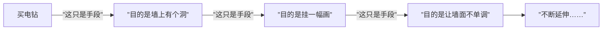
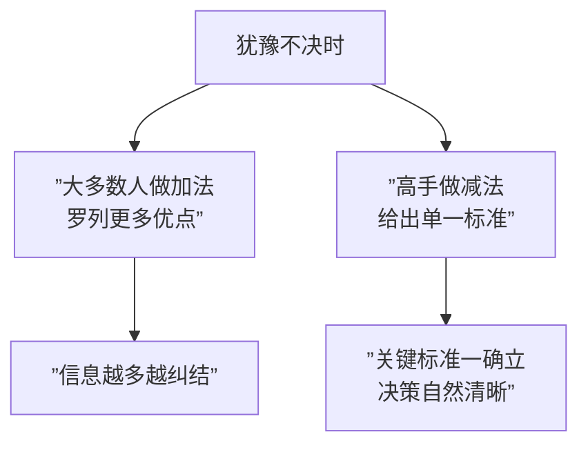

# 第09课：面对中立听众——涉入与比较

## 学习目标

- 理解"涉入"的核心问题是"这件事跟我有什么关系"
- 掌握创造需求和延伸需求两种激发兴趣的方法
- 学会用"时间相关、场景相关、个人相关"三种标准帮助人做决策
- 理解"认知减负"原理，学会用减法思维说服

## 核心概念

### 第一部分：涉入——激发冷漠听众的兴趣

**涉入** 解决的是冷漠中立的问题——对方不关心你的议题。核心要回答一个问题：

> **"这件事跟我有什么关系？"**

现代社会最昂贵的不是金钱，而是 **注意力**。让人"付出注意力"（pay attention）中的"pay"就是一种付费行为。

#### 方法一：创造需求（创造一个问题）

与其说自己有一个好的解答，不如说"你有没有注意到一个你从未意识到的问题"。创造需求比创造解决方案更有意义。

> **经典案例：李斯德林漱口水**
> 李斯德林不是发明漱口水的，而是发明了"口臭"（Halitosis）这个词。在1920年之前，没人觉得呼吸有味道是问题。李斯德林通过广告灌输焦虑：
> - "你没有舞伴？不是因为你不好——是因为你有口臭"
> - "孩子不愿意亲近你？不是因为你管教太严——是因为你有口臭"
> - "别人在背后议论你？可能是在说你的口臭"
>
> 它卖的不是解药，而是先创造了一个所有人都自认为不需要的问题。

#### 方法二：延伸需求（"如果这只是手段……"）

哈佛商学院名言："消费者真正想要的不是电钻，而是墙上的洞。"但还可以继续推导：

**延伸公式：** 问自己三遍"如果这只是手段，真正的目的是什么？"

> **案例：宜家的收纳柜广告**
> - 表层：卖柜子
> - 延伸一层：卖空间
> - 再延伸：卖整洁的环境
> - 更深一层：**帮人们挽留心爱的事物**（所以不必断舍离）
>
> 结论：宜家不是卖柜子的公司，而是"帮人挽留心爱之物"的公司。

> **案例：保险的延伸**
> - "我卖的不是保险，是安全"
> - "安全也只是手段——我卖的是面对挑战的勇气"
> - "有了保险兜底，人才敢去闯、敢去冒险"
>
> 黄执中妈妈偷偷为他买保险的故事：买的不是保险，而是"让儿子可以自由追求辩论梦想的勇气"。

> **案例：贵妇人果汁机**
> 电视购物名人张简松山说："我不是卖果汁机，我卖的是让老公疼你的机会。再笨的老公都会操作，你给他一个表现的机会。"把产品转化成情感需求。

### 第二部分：比较——帮助犹豫的人下決心

**比较** 解决的是犹豫中立的问题——对方公说公有理、婆说婆有理，难以取舍。

#### 核心原则：给标准而不是给选项

帮犹豫的人做决定，不是帮他找出更多优点（加法），而是帮他找出比较 **标准**（减法）。

#### 三种比较标准

**1. 时间相关**

以"时间维度"作为判断标准。适合与长期/短期、时效性相关的决策。

| 场景 | 标准 | 对应话术 |
|------|------|---------|
| 挑相机颜色 | 不退流行 | "黑色是经典色，永不过时" |
| 挑家具 | 能用多久 | "红木用三代 vs 便宜家具用坏前先看腻" |
| 年轻人加班 | 未来发展 | "年轻时时间不值钱，机会才值钱" |

**2. 场景相关**

以"特定使用场景"作为判断标准。你的产品不需要在所有场景都占优，只要在关键场景胜出即可。

| 场景 | 标准 | 对应话术 |
|------|------|---------|
| 挑相机颜色 | 耐刮 | "户外拍摄容易刮花，银色刮了看不出来" |
| 挑果汁机 | 好清洗 | "马达再好，不好洗的话用两次就摆着了" |
| 安全性行为 | 社交情境 | "皮夹里放保险套是绅士礼仪，关键时刻拿得出来" |

**3. 个人相关**

以"你是谁"作为判断标准。将决策与个人身份、个性、价值观绑定。

| 场景 | 标准 | 对应话术 |
|------|------|---------|
| 挑相机颜色 | 展现个性 | "红色代表你热情奔放的性格" |
| 服装广告 | 做自己 | "太咖、太白、太妹？——Well, this is me" |
| 接新职位 | 你的目标 | "你是要追求稳定，还是追求挑战？" |

#### 认知减负

人在纠结时，最想听到的不是更多信息，而是"你刚才想的那些都不重要，真正重要的只有一件事"。

**认知减负的本质是减法：** 减少对方的判断负担，而不是增加信息量。

> **案例：日本饮料广告**
> "才华重要还是努力重要？才华重要因为……努力重要因为……"（信息轰炸后观众陷入纠结）→ "都不重要，健康才重要"（认知减负，观众恍然大悟）。

> **案例：三个选项的实验**
> 周末选择：在宿舍温习、去听演唱会、去听专业讲座。三个选项并列时，大部分人反而选了最中庸的"温习功课"——因为大脑在两个"极端"选项间挣扎时，第三个"安全"选项突然变得很吸引人。

> [!TIP] 关键洞察
> 涉入的关键是帮对方找到"利益关联点"——把"与我无关"变成"与我有关"。比较的关键是帮对方"做减法"——让决策从复杂变简单。两招共同回答了一个问题：**"我为什么要在这件事上花时间和注意力？"**

## 案例分析

### 案例一：期末演讲的涉入困境

| 题目 | 问题 | 解决方案（创造需求） |
|------|------|-------------------|
| 教挑卫生巾 | 一半男生觉得与自己无关 | "好男人要知道女孩的需求，这是你了解的机会" |
| 教品酒 | 学生不觉得有必要学 | "品酒是锻炼感官的好方式，像学钢琴一样防止感官迟钝" |

### 案例二：马东老师的职场课——加班能拒绝吗？

马东老师给出了三种比较标准：

1. **场景相关**：可以拒绝老板，不可以拒绝客户（老板是劳动法管，客户是合同管）
2. **时间相关**：年轻时不要拒绝加班（时间不值钱，机会才值钱）
3. **个人相关**：如果你觉得工作是妨碍而不是生活的一部分——那你别上班了

### 案例三：Sony CyberShot 相机的颜色选择

销售人员针对不同剩余库存颜色，用不同标准引导：
- 剩黑色 → **时间相关**："黑色经典，不退流行"
- 剩银色 → **场景相关**："银色耐刮，户外拍摄看不出来"
- 剩红色 → **个人相关**："红色代表你的热情个性"

## 知识点总结

### 涉入篇
1. **回答"与我何干"**：始终围绕"这件事跟你有什么关系"来构建信息
2. **创造需求**：不要只给解答，先制造一个对方从未意识到的问题
3. **延伸需求**：问三遍"如果这只是手段，目的是什么"，找到更深层的意义

### 比较篇
1. **不要做加法**：罗列更多优点只会让人更犹豫
2. **三种比较标准**：
   - 时间相关（长期/短期、持久/时效）
   - 场景相关（某个关键场景下的优势）
   - 个人相关（与个人身份/价值观绑定）
3. **认知减负**：让人在信息焦虑中听到"唯一重要的事"

> [!QUESTION] 自测练习
> **练习1：延伸需求练习**
> 请用"如果这只是手段"公式，为以下产品做三层延伸，找出真正的情感需求：
> - 一款智能手表
> - 一本时间管理笔记本
> - 一份宠物保险
>
> **练习2：切换比较标准**
> 你的朋友在犹豫"要不要换工作"，请分别用时间相关、场景相关、个人相关三种标准给他建议。
>
> **练习3：认知减负设计**
> 设计一段话，让一个在"该考研还是该工作"之间纠结的人，瞬间觉得"只有一个标准才是真正重要的"。

查看参考示例

**练习1：延伸需求**
- 智能手表：买手表 → 看时间 → 管理健康 → **掌握对自己身体的掌控感**
- 时间管理笔记本：买个本子 → 记录日程 → 提升效率 → **对抗焦虑，获得"一切都在掌控中"的安全感**
- 宠物保险：买个保险 → 应对宠物生病 → 减少经济负担 → **让爱没有后顾之忧，不必在"花钱"和"救命"之间做选择**

**练习2：三种标准（示例）**
- 时间相关："你现在是职业早期，试错成本低，换工作比十年后容易得多"
- 场景相关："如果你当前的工作让你每天起床都很痛苦，那这个场景下的损失就已经很大了"
- 个人相关："你是一个勇于挑战的人还是一个追求安稳的人？这个问题比工作本身更重要"

**练习3：认知减负话术**
"考研和工作哪个好？薪资重要、平台重要、城市重要、行业前景重要……这些看似都重要，但其实只有一件事才真正决定你未来三年会不会后悔——你是选择了自己主动想要的，还是被动逃避了某个选项。其他都不重要。"

## 下一步

进入综合练习环节，学习 [[0010-zong-he-lian-xi-gao-shou-yao-qing-xin|第10课：综合练习——设计高手邀请信]]，将前几课的知识融会贯通，设计属于自己的"高手邀请信"。