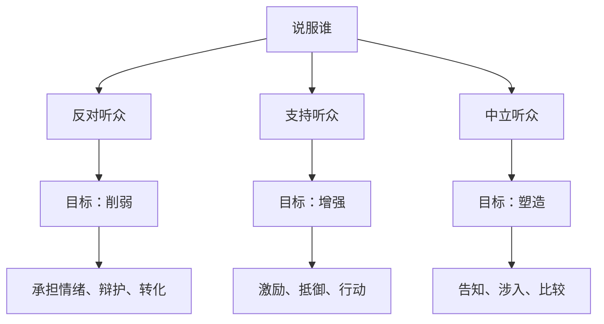
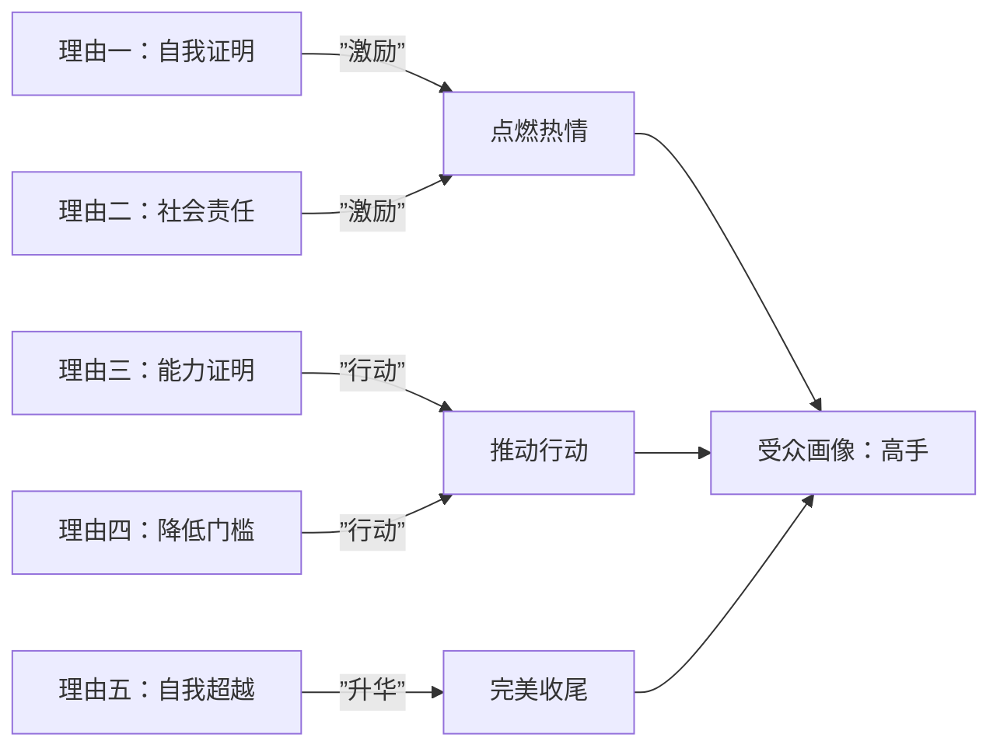

# 第10课：综合练习——设计你的高手邀请信

## 学习目标

- 综合运用前九课的知识分析真实说服案例
- 学会从"说服谁、说服什么"两个维度复盘他人的说服策略
- 掌握设计"高手邀请信"的结构化方法
- 培养"内行看门道"的说服分析能力

## 核心概念

### 综合框架回顾

### 复盘方法论：问三个问题

在分析任何一个说服案例时，问自己三个问题：

1. **说服谁？** —— 目标受众是支持、反对还是中立听众？
2. **说服什么？** —— 目的是增强、削弱还是塑造？
3. **为什么这样做？** —— 每个策略选择背后的理由是什么？

## 案例分析：罗振宇的公开信

### 背景

得到APP创始人罗振宇发布了一封视频公开信，邀请各行各业的高手来得到做课程。黄执中老师用这封信作为综合练习的案例。

### 五个理由逐层拆解

**理由一：自我证明**
> "分享经验是你内心真实的欲望……留下一点成型的知识给这个世界……总不能让这些宝贵的经验随风而逝吧？"

- 诉诸需求：**证明**（自我实现）
- 预期效果：激励投入

**理由二：社会责任感**
> "这是行业高手的社会责任……让这个行业里的人赢得更多尊严。"

- 诉诸需求：**奉献**（社会责任）
- 预期效果：激励投入

**理由三：能力证明**
> "我们已经打了个样……餐饮业五门课已经上线……我们有能力做到。"

- 功能：**行动说服**之"降低风险认知"
- 预期效果：让人相信"这事靠谱"

**理由四：降低门槛**
> "你只需要接受采访……写稿、制作我们来做……我们有内容合作者当你的助产师。"

- 功能：**行动说服**之"降低行动难度"
- 预期效果：让人相信"这事不难"

**理由五：自我超越**
> "你的经验会启发、滋养、成就另一个我辈中人……这样的缘分真的很奇妙。"

- 诉诸需求：**奉献**（启发他人、成就他人）
- 预期效果：提升意义感，完美收尾

### 案例分析要点

**1. 受众定位：支持听众 + 中立听众**

这封信没有针对反对听众（没有辩护、没有解释误会），而是面向：
- 得到既有用户（支持听众）—— 激励他们更投入、转化为行动
- 不了解得到的高手（中立听众/无知）—— 告知他们这是做什么的
- 不关心得到的高手（中立听众/冷漠）—— 涉入，告诉他们"这跟你有什么关系"

**2. 为什么没提"钱"和"名气"？**

| 课堂同学的建议 | 为什么不采用 |
|--------------|------------|
| "可以帮你增加知名度" | 目标受众已是各行高手，不缺知名度 |
| "平台为你背书" | 高手不需要通过这个来证明自己 |
| "有丰厚的报酬" | 谈钱反而降低格调，高手更在乎意义和价值 |

**3. "种一棵树"的间接告知**

> "种一棵树最好的时间是十年前，其次是现在。"

用间接告知的方式替代直白的"现在就行动"，更适合高认知水平的受众。

**4. 行动的下一步**

结尾不是"快来报名"，而是"把这封信转发给你身边的高手"——把最终目标拆解为**更容易达成的下一步**。

### 高手的"自我人设"

不同领域的高手如何看待自己的"真正任务"：

| 角色 | 表层工作 | 真正任务 |
|------|----------|----------|
| 百事可乐高管 | 卖可乐 | 为年轻人贩卖渴望 |
| 苹果公司 | 卖手机 | 改变世界 |
| 保险业务员 | 卖保险 | 帮助人变得更勇敢 |
| ​得到合作高手 | 做课程 | 启发和滋养我辈中人 |

> [!TIP] 关键洞察
> 复盘他人说服案例时，最关键的思维习惯不是"我可以怎么改进"，而是 **"他为什么不这么做"**。每一项没有被采用的策略背后，都藏着对受众的深刻理解。学会问"为什么不"，才能真正内行看门道。

## 实战演练：设计你的高手邀请信

### 步骤一：明确你的受众

回答以下问题：
1. 你要说服的是谁？（支持/反对/中立？具体画像是什么？）
2. 他们的核心需求是什么？（需求清单的哪个层级？）
3. 他们最大的疑虑是什么？（需要抵御什么？）

### 步骤二：设定说服目标

根据受众类型设定目标：

| 受众类型 | 主要目标 | 次要目标 |
|---------|---------|---------|
| 支持听众 | 激励（从顺从到投入） | 行动（从态度到行为） |
| 中立听众 | 告知/涉入（建立认知） | 比较（帮助决策） |
| 混合型 | 分层设计，逐一覆盖 | 注意主次顺序 |

### 步骤三：构建你的"五个理由"

参考罗振宇的结构：

1. **第一层：点燃热情**（诉诸证明/尊崇/归属）
2. **第二层：赋予意义**（诉诸奉献/学习）
3. **第三层：建立信任**（证明能力，降低风险感知）
4. **第四层：降低门槛**（让行动看起来很容易）
5. **第五层：升华收尾**（回到更高层次的意义）

### 步骤四：设计"下一步"

不要以"请立刻行动"结束，而是设计一个**阻力最小的下一步**。

## 知识点总结

1. **系统化分析框架**：区分受众类型 → 设定说服目标 → 选择对应策略
2. **说服理由的设计原则**：
   - 先激励（点燃热情）→ 再行动（降低门槛）→ 再升华（赋予意义）
   - 不诉求受众已经拥有的东西（如高手不缺的名气）
   - 不诉求与受众身份不匹配的东西（如对高手谈钱）
3. **复盘习惯**：不仅想"如何更好"，更要想"他为什么不这么做"
4. **下一步行动**：把"请加入我们"转换成"请转发给一个适合的人"

> [!QUESTION] 自测练习
> **练习1：分析一封真实的邀请信**
> 找一封你收到过的"邀请信"（邀请加入社群、参加会议、使用产品等），用今天的框架分析：
> 1. 目标受众是谁？属于哪种类型？
> 2. 用了哪几个理由？分别诉诸什么需求？
> 3. 如果是你来做，你会做哪些调整？为什么？
>
> **练习2：设计你自己的高手邀请信**
> 假设你要邀请一位比你优秀的人加入你的项目/团队。请设计一封"高手邀请信"（300-500字），包含：
> 1. 明确的受众画像（一句话描述你要邀请的人）
> 2. 至少3个理由（分布在不同需求层次）
> 3. 一个"下一步"行动建议（不是最终目标，而是下一步）
> 4. 至少一处"间接告知"的表达
>
> **练习3：为什么要这样做？**
> 完成练习2后，额外写一段分析：你选择的每个理由，为什么认为它对你要说服的那个人有效？如果你的策略被拒绝了，可能是低估了对方的哪个需求？

查看参考示例

**练习2：高手邀请信示例**

> "我认识你三年了。三年前那次分享会上，你讲的那个观点，我到现在还在用。
>
>
> 这些年我看着你在这个领域越走越深，有很多东西——你知道，别人不知道。那些东西如果就放在你脑子里，太可惜了。
>
> 我们正在做一个项目，想把像你这样有真功夫的人的经验变成课程。不是那种"成功学"大课，是实实在在的行业方法论。
> 你可能会担心做课太花时间——我们已经想好了：你只管聊，写稿、编辑、制作，我们团队来做，你只需要做你最擅长的事：把真东西讲出来。
>
> 别急着答应。先看看我们做过的几个案例（我发你链接），如果觉得方向靠谱，找个下午喝杯咖啡聊聊。
>
> 有些东西值得留下来。"

**分析：**
- 受众画像：有真功夫但不善于/没时间做课的高手
- 理由一（尊崇）："那些东西只有你知道"——肯定其独特性
- 理由二（行动降门槛）："你只管聊，我们来写"——降低行动阻力
- 理由三（自我超越）："有些东西值得留下来"——留下遗产的深层需求
- 下一步："先看看案例，喝杯咖啡聊聊"——不是"加入我们"

## 下一步

至此，本阶段"支持听众与中立听众的说服策略"学习结束。回顾前10课的笔记，进行阶段性复习。接下来可以进入后续关于"说服原理与修辞"的学习。