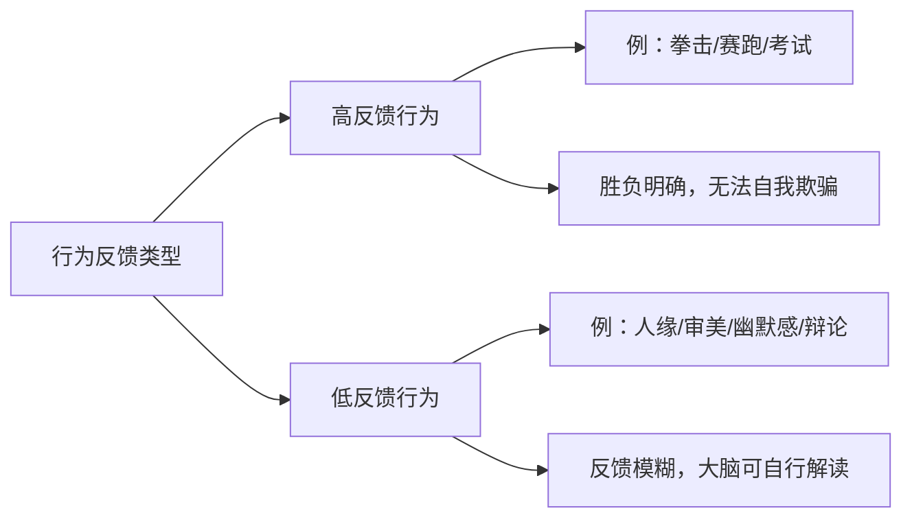
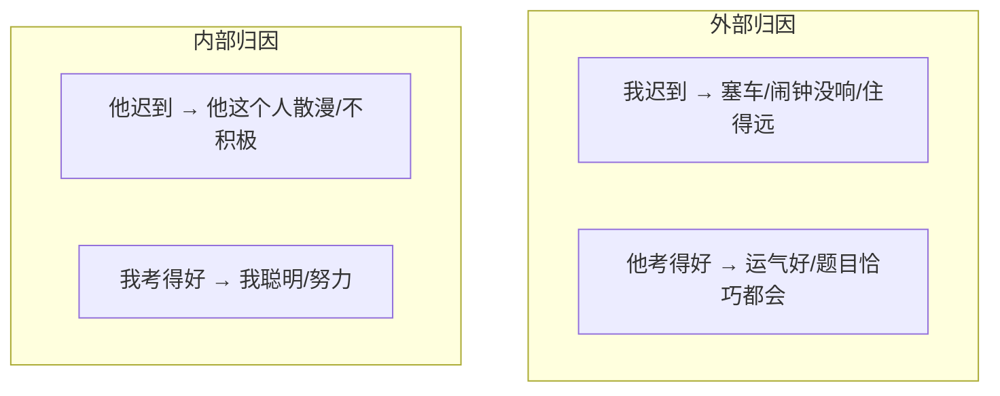

# 第11课：改变的原理——粉红泡泡

## 为什么人会抗拒改变

说服之所以困难，根源不在于缺乏技巧，而在于我们忽略了改变的心理机制。黄执中老师用一个核心隐喻贯穿始终——**粉红泡泡**。

### 每一个人都有一个"舒适泡泡"

我们的大脑为了保护自己不被粗糙的现实刺伤，会包裹在一个粉红色的泡泡里。这个泡泡让我们：

- 觉得自己比同龄人判断力更强
- 觉得自己婚姻不会出问题
- 觉得自己能活到平均寿命以上
- 觉得自己比一般人更不易受广告影响

> [!note] 自认优于平均水准
> 调查显示：66%的人认为自己的批判思考能力高于平均值，只有5%的人承认自己低于平均值。而这是**数学上不可能**的——这就是粉红泡泡的威力。

这正是诈骗能够成功的根本原因：**每一个人都觉得自己"没那么傻"**。

---

## 粉红泡泡的两大支柱

### 1. 模糊反馈 (Ambiguous Feedback)

根据反馈的清晰度，行为可分为两类：

在低反馈行为领域，大脑可以自由发挥粉红泡泡的保护功能：

- **人缘不好的人**，可以觉得自己很受欢迎
- **笑话不好笑的人**，可以认为是对方没有幽默感
- **打扮不得体的人**，可以觉得自己很有品味

> [!tip] 达克效应 (Dunning-Kruger Effect)
> 能力最差的那群人，在自我评估时往往最高。因为**缺乏逻辑的人，恰恰没有能力判断自己缺乏逻辑**。

### 2. 错误归因 (Attribution Bias)

**交替使用的规律：**
- 我的失败 + 别人的成功 → **外部归因**（偶然、不可控，不足以定义我）
- 我的成功 + 别人的失败 → **内部归因**（稳定、可控，足以证明我）

> [!example] 归因在生活中的体现
> **被背叛 vs. 背叛别人：**
> - 几乎每个人都举手说自己被背叛过
> - 几乎没有人举手说自己背叛过别人
>
> 不是课堂变成了"受害者互助会"，而是每一个人都把"我背叛别人"归因为：情势所逼、不得已、这不算背叛（外部归因）；而"我被背叛"则归因为：那个人人品有问题（内部归因）。

---

## 理性是为粉红泡泡服务的

> [!important] 核心洞见
> 人的理性，**不是**用来消除粉红泡泡的。
> 人的理性，是**为粉红泡泡找证据**的。

就像那个看到女童受害新闻的父亲，他会"理性地"分析受害女孩有没有穿着不当、深夜出门，并不是因为他冷血，而是因为他的大脑需要相信"我的女儿是安全的"——只要受害女孩做错了什么，这种悲剧就可以通过"做对事情"来避免。

---

## 粉红泡泡与抑郁症

现代研究表明：**抑郁症患者不是更悲观，而是更真实。**

- 正常人的大脑会生产粉红泡泡，美化现实，保护自己
- 抑郁症患者大脑生产粉红泡泡的机制坏了，现实赤裸裸地刮过去——受伤了

这就是为什么"你乐观一点"、"你想开一点"对抑郁症没有用——他不是不想想开，而是他的大脑已经失去了那个能力。

---

## 自测练习

练习1：生活中找出你的粉红泡泡

回想最近一周，找出一个你**自我感觉良好**的例子，分析它属于哪种情况：

1. 这件事属于高反馈还是低反馈行为？
2. 你对这件事的自我评估是否可能高于实际水平？
3. 如果你是旁观者，会怎么评价你自己在这件事上的表现？

**示例：**
- 场景：你在会议上提出了一个建议，自我感觉"讲得特别好"
- 高/低反馈：低反馈——很少有人当面批评你的发言
- 可能的偏差：你可能忽略了自己发言中的逻辑跳跃
- 旁观者视角：同事们可能只是礼貌性点头

练习2：替换归因方式

回想一次你和他人发生冲突的经历，分别用外部归因和内部归因来解释：

**对方的做法：**
- 内部归因（他这个人怎样）：
- 外部归因（他遇到了什么情况）：

**你自己的做法：**
- 内部归因（我这个人怎样）：
- 外部归因（我遇到了什么情况）：

思考：如果互换归因方式，你对整件事的理解会有什么不同？

练习3：即时应用——面对"被拒绝"

假设你向客户/领导/心仪对象提出了一个请求，被拒绝了。请列出你脑中自然冒出的三个"原因分析"：

1. _______________
2. _______________
3. _______________

判断每一原因是 **内部归因** 还是 **外部归因**。
如果全部是外部归因——你的粉红泡泡正在保护你。这是否一定不好？不，但要意识到它的存在。

