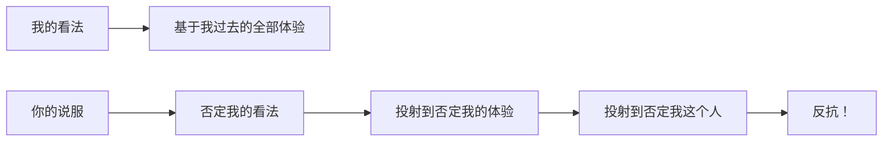
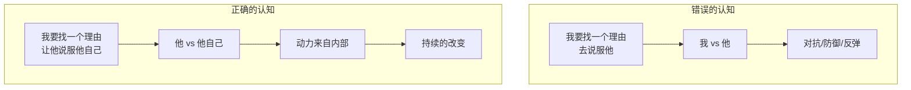

# 第12课：改变的原理——反抗机制

## 没有人喜欢被改变

> [!danger] 核心认知
> **没有人喜欢被改变。**
>
> 这里的"没有人"不是"很少人"，而是**真的没有人**。

为什么？因为每一个人的看法，都是他**过去人生的总和**。

### 看法来自体验

"苹果很好吃" = "我这辈子吃苹果的体验都不错"
"苹果很难吃" = "我这辈子吃苹果的体验都很糟"

当你说服一个人"苹果很好吃"时，在你看来是一个口味的讨论，在他听来却是对他**个人体验的否定**——"你是说我过去的体验都是假的？是我蠢？是我误解了？"



---

## 说服 = 胜负

对大多数人来说，理解"说服"的方式就是——**说服 = 说服**。

这两者在他们的潜意识里发音相同，含义相同：

- "我被说服了" = "我被打败了"
- 你来说服我吧 = 来，我们决斗吧

这就是为什么你越摆出充分的理由、越拿出斩钉截铁的证据，对方越愤怒、越抗拒。因为他感受到的是：**你一定要我输。**

### 逆反心理的底层逻辑

当改变的压力过大时，人会产生心理反抗机制（Reactance）：

- 你越是推，他越是往回顶
- 你的理由越充分，他找反例的动力越强
- 这就像弹簧——**外力越大，反作用力越大**

> [!example] 常见的反抗表现
> - 父母催婚 → 孩子更不想结婚
> - 老板强制要求 → 员工消极抵抗
> - 你越说"这个产品好" → 客户越觉得你在推销
>
> 不是对方不讲道理，而是**没有人想在"被逼着改变"的状态下做出改变**。

---

## 最强大的说服：自我说服

> [!tip] 黄金法则
> 世界上最好的理由，都比不上他自己给自己找的理由。**所有的说服，本质上都是自我说服。**

我们的工作是**帮助他说服他自己**，而不是我们说服他。

### 从"我赢了"到"我想通了"

| 状态 | 对方感受 | 结果 |
|------|---------|------|
| 被说服 | 我输了，被你打败 | 心理抗拒，即使当面接受后续也会反弹 |
| 自己想通了 | 我也隐约有这想法，只是你帮我说清了 | 真心接受，持续改变 |

**黄执中的亲身经验：**
在《奇葩说》中，那些被他说服而改票的观众，没有一个会说"我被黄执中说输了"。
他们说的永远是：

> "我以前也隐约有这种想法，只是没有你讲得那么清楚，你把它讲出来了——我好同意。"

他不是被说服的，他是在你的帮助下，**想通了**。

---

## 说服的本质转变



---

## 课堂总结：改变原理的全景图

```
改变原理
├── 自认优于平均水准（为什么人容易被说服）
│   └── 每个人都觉得"我没那么傻"
├── 粉红泡泡（大脑的保护机制）
│   ├── 模糊反馈 → 低反馈行为中自我感觉良好
│   └── 错误归因 → 内外归因交替使用，保护自我形象
│       └── 强大的自我合理化能力
└── 没有人喜欢被改变（说服的本质）
    ├── 看法 = 过去人生的总和
    ├── 说服 = 胜负（对方的感受）
    └── 所有说服都是自我说服
```

---

## 自测练习

<details>
<summary>练习1：识别"说服=胜负"的时刻</summary>

回想最近一次你和别人的争论（工作、家庭、社交媒体都算）：

1. 对方说了什么让你开始觉得"他在逼我认输"？
2. 你的心理反应是什么（愤怒、防御、更坚定自己的立场）？
3. 如果换一种表达方式，对方可以让你觉得"哦，原来是这样，我想通了"，那会是什么样的表达？

**关键洞察：** 意识到你在说服别人时，对方也可能处在与你相同的感受中。

</details>

<details>
<summary>练习2：帮他找理由说服自己</summary>

选择一个你一直想说服的人（伴侣、同事、父母）和一件事，按照以下框架重新设计你的沟通策略：

**目标：** （TA应该做什么改变）

**旧方式：** （你以前怎么说的——列出你的理由和证据）

**新策略 —— 帮他自我说服：**
1. TA过去的哪段经历可能与这个改变方向一致？
2. 有没有TA自己曾经表达过的观点可以call back？
3. 你能不能只说"冰山的一角"，让TA自己推导出结论？

**示例：**
- 目标：让老公少打游戏
- 旧方式："你天天打游戏对身体不好/浪费时间"
- 新策略："你上周不是说过羡慕老张去健身房精神变好了吗？"（引用他自己说过的话，让他自己联想到改变）

</details>

<details>
<summary>练习3：粉红泡泡全回顾</summary>

结合上一课的粉红泡泡理论和本课的反抗机制，分析下面这个场景：

**场景：** 你劝朋友不要买一款他觉得"性价比超高"的产品，但你知道那是个智商税。

1. 粉红泡泡角度：他的粉红泡泡在怎么保护他？
2. 反抗机制角度：如果你直接说"你被骗了"，他的反应会是什么？
3. 自我说服角度：怎样提问可以让他自己意识到问题？

**提示：** "你这产品哪里好？"比"这产品不好"有效得多。让他自己说出好在哪里，然后他自己可能会意识到问题。

</details>