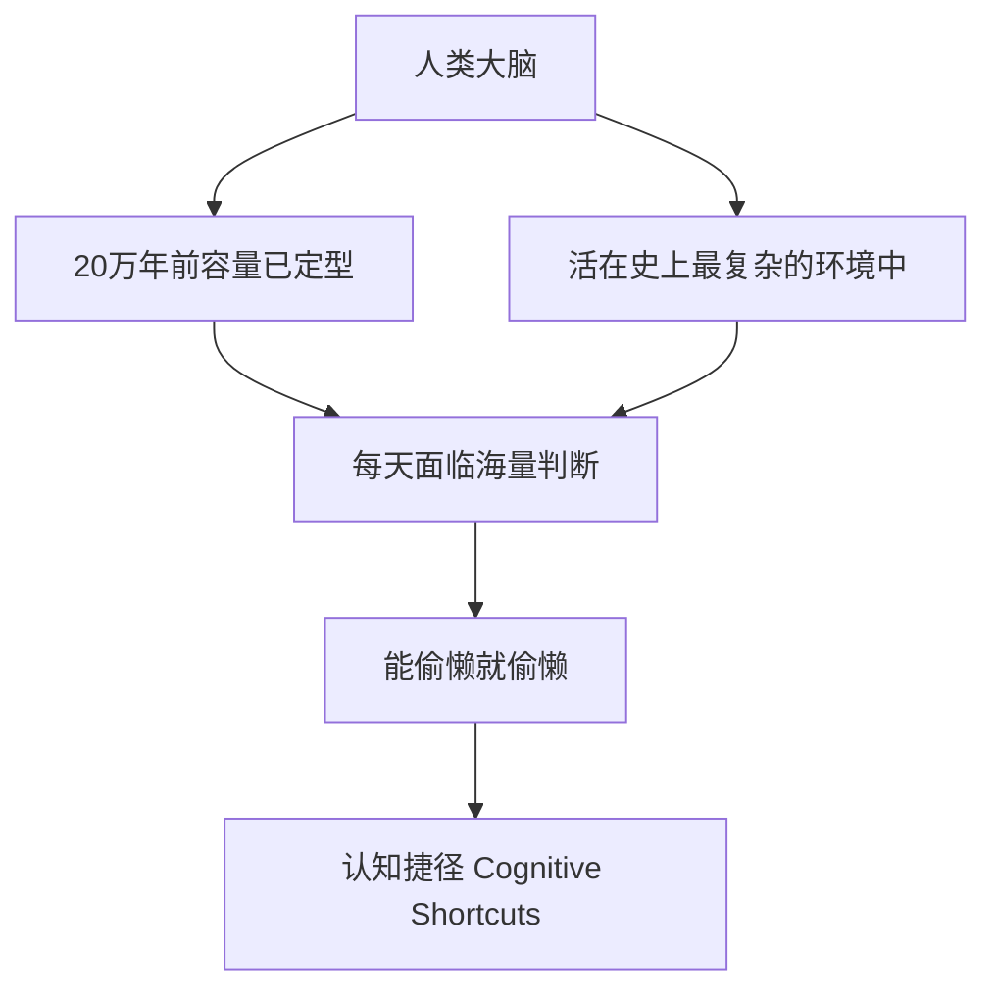
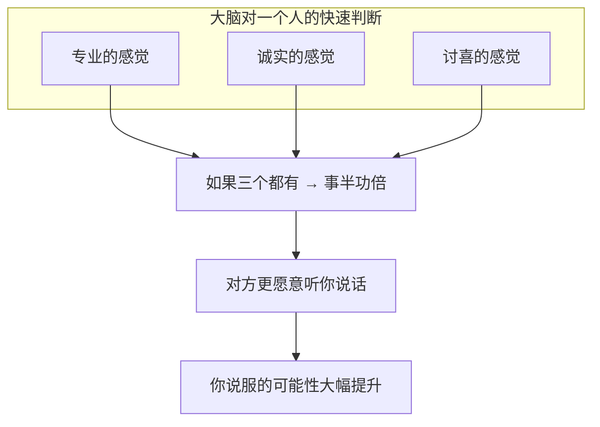

# 第13课：说服力三要素——偷懒的大脑

## 引言

正式进入说服力三要素（专业、诚实、讨喜）之前，必须先理解一个前提：**我们有一个超级喜欢偷懒的大脑。**

> [!quote] 卡尼曼的双系统理论
> - **系统1**：快速、直觉、自动、无意识——占日常判断的95%以上
> - **系统2**：缓慢、理性、费力、需要主动启动——只有在必要时才启用
>
> 说服的战场主要在**系统1**，不在于系统2。

---

## 大脑的三大认知捷径

### 1. 标签

我们的大脑需要一个标签来快速理解事物：

- "这是苹果"——标签帮你瞬间归类，不必认识每一颗苹果的名字
- "这是老师"——标签帮你确定关系，不必重新定义每一次互动

> [!tip] 标签不是坏的
> 追求"撕下标签"是理想状态，但**大脑不这样运作**。标签是偷懒的必需品。
>
> 你不需要认识课桌上每一颗苹果分别叫Jonathan、Helen还是Jimmy。它们都是苹果。够了。

### 2. 偏见 (Prejudice)

偏见 = **pre-judgment = 预先判断**

你不需要亲自咬过每一颗苹果才知道苹果的味道——**酸酸甜甜的**。这就是偏见。

- 偏见不是道德问题，是**效率问题**
- 只要准确率在60%左右，这个偏见就会留在你的大脑里作为参考
- 如果准确率是零（比如"戴眼镜的人都是贼"），大脑会自然淘汰它

### 3. 刻板印象 (Stereotype)

刻板印象 = **放大个人经验，以偏概全**

- 你去一家店吃了一碗面，觉得不好吃 → 你对这家店产生"这家店难吃"的印象
- 有人说不公平——你只吃了一碗面，还有很多你没吃过
- 但你的大脑说：**我没有时间吃完你所有的东西再做判断**

> [!note] 一叶知秋
> 你不需要看遍所有的落叶，才知道秋天来了。
> 看到一片落叶掉下来——就够了。

---

## 预判断何以必要

黄执中引用了摄影师的作品《Judging America》来说明一个反直觉的道理：

| 形象（左图） | 真实身份（右图） | 你会在什么情境下用什么方式对待他？ |
|-------------|-----------------|----------------------------------|
| 3K党打扮 | 全职牧师 | 凌晨加油站看到左边造型——掉头就走 |
| 园丁打扮 | 财富500强CEO | 你会跟他聊"花开了没有"还是"中美贸易战"？ |
| 持枪大汉 | 哈佛毕业生 | 深夜街头你敢问他的毕业院校吗？ |
| 狂野造型 | 纽约护士 | 生病时你会找左边那位帮你打针吗？ |

> [!important] 核心结论
> 这位摄影师的**本来意图**是呼吁"不要有刻板印象"，但他的作品恰恰证明了**刻板印象多么必要**——因为没有预判断，你连基本的社交分寸都无法拿捏。

---

## 说服力三要素总览

理解了"大脑爱偷懒"之后，我们就可以进入三个最有威力的标签：

| 要素 | 核心 | 关键技巧 |
|------|------|---------|
| 专业 | 专业的感觉 ≠ 真的专业 | 触发与导航、细节、数字、习惯 |
| 诚实 | 诚实的感觉 ≠ 真的诚实 | 跳出立场、坦诚缺陷、利益一致、主动承诺 |
| 讨喜 | 讨喜的感觉 ≠ 会讲段子 | 感兴趣、聊失败、找相似 |

> [!warning] 三者兼备是最理想状态
> 三个都不具备时，说服将极其困难。但只要有一到两个，就可以发挥作用。
>
> 接下来的三节课将分别深入讲解每个要素。

---

## 自测练习

练习1：觉察你的「系统1」判断

今天之内，留意三次你**快速下判断**的时刻，填写下表：

| 场景 | 你的第一判断 | 这属于标签/偏见/刻板印象？ | 准确吗？ |
|------|-------------|--------------------------|---------|
| 例：看到穿西装的人走进来 | "这是个商务人士" | 标签 | 可能对也可能错 |
| 1. | | | |
| 2. | | | |
| 3. | | | |

**延伸思考：** 如果取消这些快速判断，你的生活会变得更好还是更糟？

练习2：重新设计沟通策略

你即将向一位重要客户/领导汇报工作。根据"大脑爱偷懒"原理：

1. 你的汇报中，哪些信息对方会**用系统1处理**（快速接受或拒绝）？
2. 哪些信息你希望对方**启动系统2**（仔细思考）？
3. 对于系统1的信息，你如何设计让它看起来"感觉是对的"？
4. 对于系统2的信息，你如何引导对方愿意花力气去思考？

**提示：**
- 你的头衔、着装、语气 → 系统1
- 你的数据、案例、逻辑推演 → 系统2
- 先建立系统1的"感觉对"，系统2才有机会被启动

练习3：自我分析——你常用的认知捷径

想一想你最近认识的一个新朋友或新同事：

1. 你第一次见到TA时，第一印象是什么？（在几秒内形成的判断）
2. 这个第一印象后来被证实是准确的还是有偏差的？
3. 如果让你和TA交换大脑（TA带着你的认知捷径，你带着TA的），你们对彼此的初印象会有什么不同？

**进阶思考：** 既然你自己也靠认知捷径判断他人，那对方也在用认知捷径判断你。这对你的"说服准备"意味着什么？

