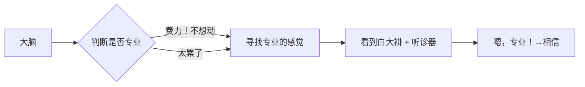
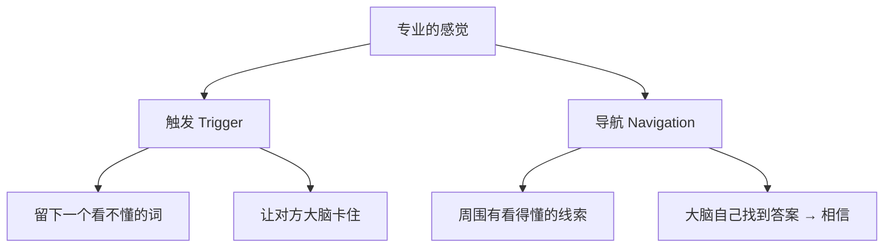

# 第14课：说服力三要素——专业的感觉

## 专业 ≠ 专业的感觉

> [!important] 核心观点
> 我们要的不是专业，是**专业的感觉**。
>
> 判断一个人到底专不专业是**很费力**的。大脑爱偷懒，它要的不是真正的专业，而是一个**暗示**——有专业的感觉就够了。



---

## 专业感的心理学实验

| 组别 | 专家描述 | 听众感受 | 结果 |
|------|---------|---------|------|
| 第一组 | 用艰深术语："恶性肿瘤产生、肝肿大细胞增生、淋巴萎缩" | 听不懂 | **说服力高一倍** |
| 第二组 | 用浅白话："这物质会造成肝癌和免疫系统疾病" | 听得懂 | 满意度高，可信度低 |

> [!tip] 反直觉结论
> **当你听不懂的时候，就是专家最有说服力的时候。**
>
> 大脑的推理：我很想搞懂这件事→但看起来好费力→你好像已经懂了→那就听你的吧。

---

## 核心技巧：触发与导航



### 广告案例解析

**雀巢能恩水解奶粉广告：**
- 看不懂的词（触发）："HA水解技术"、"能恩水解3"
- 导航线索：旁边写着"台湾小儿科医师推荐"、"第一品牌"
- 大脑自动推导：虽然不知道水解是什么，但医生推荐+第一品牌→应该不错

**如果广告只写"台湾小儿科医师推荐"：**
→ "自吹自擂，我不信。"

**加了看不懂的术语之后：**
→ "我从广告里学到了东西，这家有技术含量！"

> [!note] 注意平衡
> - 满屏术语不行——完全听不懂会放弃
> - 满屏大白话不行——没有"学到东西"的感觉
> - 最佳组合：**一个看不懂 + 周围有导航线索**

---

## 建立专业感的三个指标

| 指标 | 本质 | 示例 |
|------|------|------|
| 细节 | 深入 | 伦敦裁缝问："你平常放左边还是右边？" |
| 数字 | 准确 | "50篇稿子，41篇10万+" vs "写了几十篇" |
| 习惯 | 自律 | 厨师打蛋先打到小碗再倒进去 |

### 1. 细节

**伦敦裁缝的故事：**
马东去伦敦做裤子，裁缝量完下半身还量上半身，问了一句："你平常是放左边还是放右边？"

> 马东说：从那之后，我没有办法跟这个裁缝争论任何事情。他说什么就是什么。

因为那个细节让人感觉：**你懂的比我多得多。** 你在我不知道的事情上花了功夫。

### 2. 数字

| 版本 | 内容 | 效果 |
|------|------|------|
| 初版 | "我写过几十篇稿子，读者反应挺好的" | 菜鸟 |
| 优化版 | "一年写了50篇稿子，41篇10万+，9篇20万+" | 有数据了 |
| 专业版 | "80%的文章在合格线以上，行业平均转发300-400，我有一篇达到3000+" | **专业！** |

数字的力量不在于数字本身，而在于数字**赋予意义**——让对方知道这个数是大还是小、好还是坏。

### 3. 习惯

阿基师打蛋的习惯：先打到小碗再倒进大碗。

> "这是饭店厨师养成的习惯——万一有个蛋臭了，只浪费一个蛋。哪怕现在只做两人份，习惯不改。"

你看不到菜的味道，但你从**习惯中感受到专业**。

**黄执中的课前习惯：** 工作前只吃麦当劳——不是爱吃，而是确保全世界口味一致，不给状态留任何意外。

当主办方听到"请给黄老师准备麦当劳"——专业感已经在上台前就建立了。

---

## 退而求其次：时间与代价

如果以上三个指标都没有，还可以：

| 方式 | 示例 | 原理 |
|------|------|------|
| 时间 | "这家老店开了20年"、"我煮了10年的馄饨" | 长久≈专业 |
| 代价 | "我们团队研究了一个礼拜"、"我当年打球把膝盖都磨坏了" | 付出过代价≈懂行 |

> [!caution] 注意
> 时间和代价只是退而求其次的选择。十年煮馄饨不代表好吃，只是运气好没倒闭。但——它确实能给人专业的感觉。

---

## 自测练习

<details>
<summary>练习1：在你自己领域里找到"细节"</summary>

思考你的工作或专业领域，找出**一个外行人根本不知道的细节**：

1. 你这个行业里，外行人最常忽略的是什么？
2. 你做过哪些外行人以为"没必要"但内行知道很重要的动作？
3. 怎样用一句话把这个细节变成一个"专业感触发器"？

**示例（程序员）：**
"别人以为写代码就是打字快，但其实我花在命名上的时间比打字多得多——一个好名字可以省掉后面十倍的注释。"

**示例（HR）：**
"你以为面试就是从简历里挑人，其实我读简历的时候会先看跳槽间隔——不是看平均，而是看每次间隔的变化趋势。"

</details>

<details>
<summary>练习2：为你的汇报注入"数字"</summary>

找出你最近一个月的工作成果，用"数字+意义"包装：

**初级版：** 列出数字
- "我写了X篇报告"

**专业版：** 用数字赋予意义
- "我写了X篇报告，其中Y篇被领导采纳（采纳率Y/X = Z%），这个数字比团队平均水平高出____"

练习：将你的一项工作成果重新表达为"专业版"。

</details>

<details>
<summary>练习3：设计你的"触发与导航"</summary>

假设你要向客户介绍一款产品/服务，设计一段话术：

1. 先插入一个客户**听不懂但觉得很高端**的术语（触发）
2. 马上提供一个**客户听得懂且认同**的结论（导航）

**示例（健身教练）：**
"这个训练方案基于**神经肌肉适应**的原理（触发），简单说就是让你的肌肉学会更高效地发力，同样的动作能多燃烧30%的热量（导航）。"

```plaintext
你的触发词：_______________
你的导航结论：_______________
```

</details>