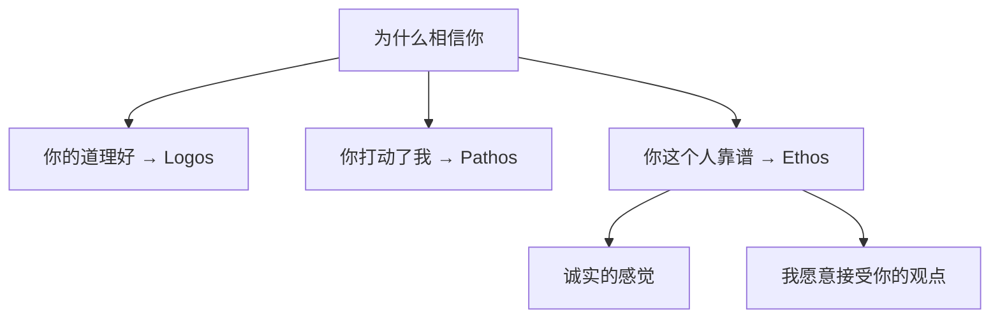
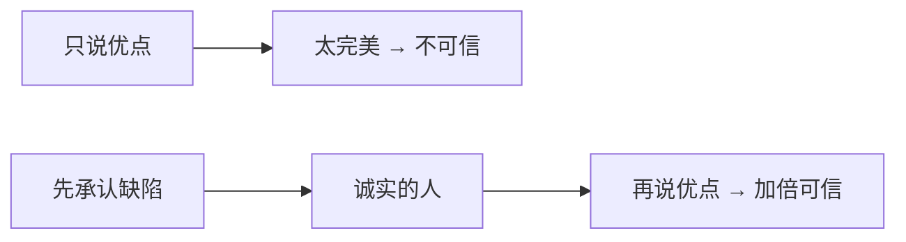
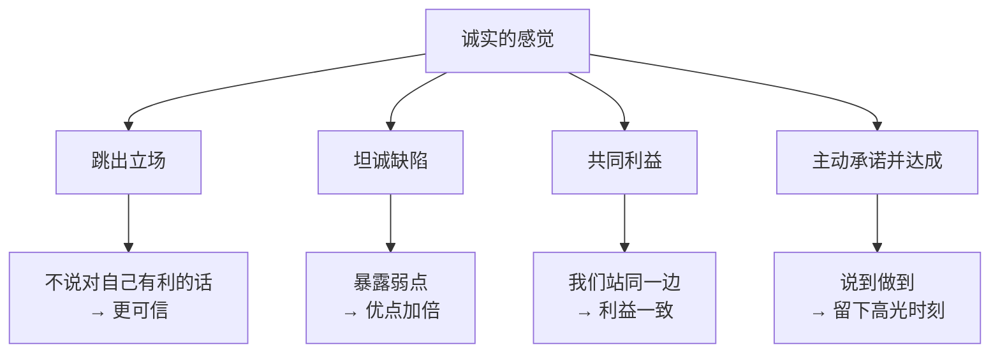

# 第15课：说服力三要素——诚实的感觉

## 诚实 ≠ 诚实的感觉

和"专业"一样，这里谈的不是诚实本身，而是**诚实的感觉**。

> [!quote] 古典修辞学三路径
> 亚里士多德将说服路径分为三种：
> 1. **Logos（说之以理）** ——道理
> 2. **Pathos（动之以情）** ——情感
> 3. **Ethos（服之以德）** ——**人品**
>
> Ethos 翻译过来就是：我相信你这个人，所以我愿意听你讲话。

---

## 建立诚实感的四个技巧

### 技巧一：跳出立场

> [!tip] 公式
> 当你**没有为自己的立场说话**时，说的话特别可信。

**餐厅服务员 Vincent 的秘诀：**
1. 客人点完菜，无论点什么，Vincent 都迟疑一下，小声说：
   > "别跟我老板说——今天的鱼不太好，我推荐你换一道。"
2. 他推荐的价格**差不多甚至更便宜**
3. 从此这桌客人对他**言听计从**
4. 最后推荐甜点——几乎人人都会加单

**原理：** 跳出立场 = "你不是站在店家那边，你是站在我这边。"

**更多例子：**
- 理发师说"你这发质不需要做这个项目" → 每个推荐你都会认真考虑
- 理专说"按公司规定我得推荐这个，但我个人建议你再观望一下" → 信任感建立
- 二手车销售说"这台车性价比高但外观有小刮痕，看你在不在意" → 比只说优点可信得多

---

### 技巧二：坦诚缺陷 (Pratfall Effect)

> [!quote] 出丑效应
> 适当暴露弱点，会让你的优点**加倍可信**。

**李佳琦的双重话术：**
- 对不推荐的产品："这个颜色不适合中国女生"、"这个显色度不够"、"口红不跟嘴"
- 对他推荐的产品：真诚推荐 → 观众："他都说不好的真不好，那他说好的一定真的好"

**罗永浩的自我攻击：**
在采访中让"另一个自己"疯狂吐槽自己：
- "你不是说收购苹果吗？"
- "怎么现在跟网红混一起了？"
- "你算个屁企业家"

明明知道有脚本，看完仍然会觉得：**他在讲真心话。**

> [!important] 关键提示
> 诚实的感觉与诚实本身是两回事。即使内容是精心设计的，也可以让人感受到诚实——因为技巧是对的。

---

### 技巧三：共同利益

> [!important] 信任的关键
> 信任的关键不在于谁对谁错，而在于**你能否让对方意识到我们有共同的利益。**

**麦当劳 "蚯蚓肉" 谣言的解决：**

| 时间 | 策略 | 效果 |
|------|------|------|
| 1978年 | 开记者会、开放工厂参观、诉诸法律 | 无效——"你能证明的只是参观那天没有蚯蚓肉" |
| 1992年 | 总经理说："一磅汉堡肉$1.5，一磅蚯蚓肉$6——蚯蚓比牛肉贵，我掺它干嘛？" | **谣言从此消失** |

> **"你不用担心我往牛肉里掺蚯蚓，你反而要担心有人往蚯蚓里掺牛肉——蚯蚓比较贵。"**

**原理：** 利益一致 = "我们站在同一边"。

**抢匪的困境与解法：**
抢匪说"我不会伤害你" → 没人信
聪明抢匪说："你们的东西有保险，我抢的是保险公司的钱" → 受害者配合度大增

**"为了你好" vs "对我们都有好处"：**
- "为了你好" = 我高尚，但不可信（我为什么要为你牺牲？）
- "这对我们都有好处" = 利益一致，更可信

---

### 技巧四：主动承诺并达成

> [!caution] 不要用防守策略建立信任
> - "你可以查我手机" → 只能证明今天没问题，明天呢？
> - "日久见人心" → 只能证明这段时间没问题，无法累积信任
> - **防守只能避免扣分，不能加分**

**进攻策略 = 主动承诺 + 达成：**

| 场景 | 老公A（防守） | 老公B（进攻） |
|------|-------------|-------------|
| 老婆问几点回来 | "十点"（讨好） | "十一点前"（保守承诺） |
| 实际回到家 | 十一点半 | 十点五十 |
| 老婆感受 | 骗人！查手机！找人证！ | 说到做到，靠谱！ |

> [!note] 高光时刻
> 人对你的印象不是平均计算的，而是来源于**几个关键的高光时刻**。
>
> 迪士尼每晚放烟火就是这个道理——多年后你记不住排队的不耐烦，只记得**那晚的烟火好漂亮**。

主动承诺并达成 = 制造你的"高光时刻"。

---

## 诚实感全景图

---

## 自测练习

练习1：设计一个"跳出立场"的对话

选择一个常见的说服场景（销售、推荐、谈判），设计一段跳出立场的话术：

**场景：** _______________
（例如：你是卖保险的，你想让客户购买重疾险）

**常规说法：** "我们的重疾险保障很全面……"（显而易见是推销）

**跳出立场的话术：**
"说实话，按你的情况，**如果你只是想** _______，那没必要买这个。但如果你想 _______，那这个方案会比较合适。我不建议你 _______，我建议你 _______。"

**自检：** 让对方感受到"他不是在推销，他在帮我做决策"。

练习2：坦诚缺陷练习

找一个你经常需要说服别人的事情（可以是你的产品、观点、方案），列出：

**三个优点：**
1. _______________
2. _______________
3. _______________

**一个真实的缺陷：**
_______________

**组合话术：**
"这个方案在 _______（缺陷）方面确实不如其他方案，但正因如此，它在 _______（优点1）和 _______（优点2）上做到了极致，而这对你来说才是最重要的。"

**原理：** 承认一个你不在意的缺陷，让对方相信你说的所有优点。

练习3：找出"共同利益"

设想一个你难以说服的情境（比如说服老板批准预算、说服伴侣同意某个决定），完成以下分析：

| 我的立场 | TA的立场 |
|---------|---------|
| _______________ | _______________ |

**表面矛盾：** _______________

**潜在的共同利益：** _______________
（提示：拉高层次——不只是金钱，还可以是安全感、省心、成就感等）

**用共同利益重新表述：**
"我希望你做A，不只是为了我，而是因为A也会给你带来 _______，这对我们都有好处。"

练习4：本周的"主动承诺"实验

在本周内，找到至少一个场景主动做出一个**保守承诺**并提前达成：

| 场景 | 你承诺了什么 | 实际做到的时间 |
|------|-------------|---------------|
| 职场： | | |
| 生活： | | |
| 社交： | | |

**效果观察：** 对方有没有表现出"哇，你这个人说到做到"的反应？

