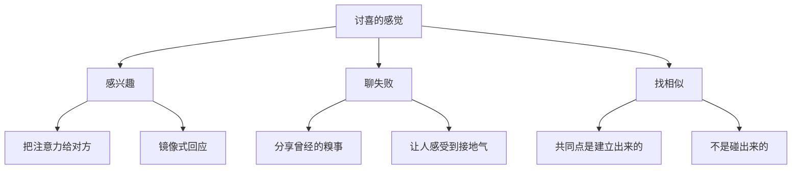
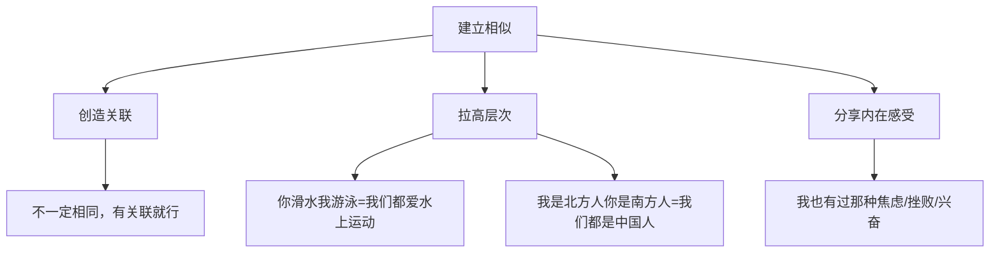
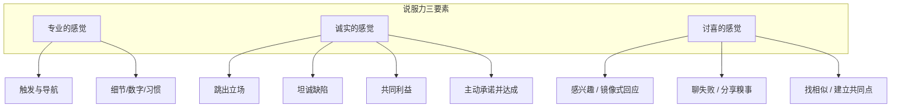

# 第16课：说服力三要素——讨喜的感觉

## 讨喜的力量

> [!quote] Roger Ailes 名言
> **只要民众喜欢你，他们几乎会原谅你犯的每一件错事。**
>
> 相反的，如果他们不喜欢你，那你做得再好也是枉然。

讨喜不需要口若悬河、满口段子。有些人虽然不讲笑话，但你会不由自主地想和他亲近。

---

## 建立讨喜感的三个技巧

---

### 技巧一：感兴趣

> [!quote] 什么是"有趣的人"？
> Warren Bennis（南加大领导学院创办人）：
> **"我并不是个有趣的人，但我能让对方成为一个有趣的人。"**

**两封明信片的对比：**

| | 明信片 A（无趣） | 明信片 B（讨喜） |
|--|-----------------|-----------------|
| 内容 | 我们去京都喂鹿了、老公升副总裁了、孩子得冠军了 | 你那台破车后来怎么处理的？你女儿申请到音乐学校了吗？ |
| 焦点 | **我**的生活多精彩 | **你**的生活我关心 |
| 感觉 | 凡尔赛，炫耀 | 他对我感兴趣，好温暖 |

> [!important] 关键洞察
> 你之所以觉得一个人"有趣"，不是因为他发生了什么有趣的事，而是**他让你觉得自己很有趣**。

---

#### 镜像式回应 (Mirror Response)

当对方在讲你完全不懂的事情时，依然可以让对方觉得："你好懂我，聊天好愉快。"

**三种最简单的镜像式回应：**
1. **"真的吗？"** ——表达惊讶和兴趣
2. **"然后呢？"** ——引导对方继续
3. **"所以你的意思是……"** ——用自己的话复述对方的核心点

#### 说话的"爽感"不对称

| | 说话的人 | 听话的人 |
|--|---------|---------|
| 时间感受 | 过得飞快——"我才讲五分钟？" | 一秒一秒在数 |
| 爽感 | 高——表达本身就是奖励 | 不一定高 |

> [!tip] 约会铁律
> 如果你想让对方觉得"和你在一起时间过得好快"——让对方说，你来听。
>
> 如果一场约会90%都是你在讲（孔雀开屏），对方会感觉时间过得好慢。
>
> 如果90%都是她在讲，她会觉得"怎么才聊一会儿就两点了？"

---

### 技巧二：聊失败

> [!question] 两个故事，你想听哪个？
> A. 黄执中如何以第一名考进大学，毕业时当优秀毕业生代表上台领奖
> B. 黄执中大学换了三所学校，先念会计、再念法律、再念企管，都没毕业

**答案：B。** 我们喜欢听别人的**失败、倒霉、糗事**。

| 话题 | 感觉 | 效果 |
|------|------|------|
| "我是怎么赚到第一个100万的" | 炫耀、有压力 | 不想听 |
| "我是怎么亏了第一个100万的" | 接地气、有共鸣 | 想听 |

> [!note] 分享失败的关键
> 分享的必须是**已经过去的失败**——你已经走出来了，可以笑谈了。
>
> 分享的本质不是诉苦，而是：
> - **我怎么走出来的**
> - **我怎么成长的**
> - **我怎么变得更好的**
>
> 这才是人们喜欢听失败的原因——我们想看到一个人在挫折中的成长。

---

### 技巧三：找相似

> [!important] 核心原则
> 共同点不是**碰出来**的，是**建立**出来的。

**"我们都一样"游戏：**
两人一组，三分钟内找出尽可能多的共同点（但不能是肉眼可见的，比如"都有眼睛"）。

**高手 vs 新手：**

| 新手（碰运气） | 高手（建立关联） |
|---------------|----------------|
| "我做金融的，你也是吗？"→"不是→下一位" | "我做金融的。""你老公是做金融的？那我们一样，我们亲近的人都在金融业。" |
| "你是广州人？我也是广州人！" | "你是广州人，我念书时也在广州——我们都跟广州有缘分。" |
| "你喜欢游泳？我也喜欢游泳！" | "你喜欢滑水，我喜欢游泳——我们都喜欢水上运动。" |

**找相似的三种技巧：**

---

## 三要素全景回顾

| 要素 | 一句话心法 |
|------|-----------|
| 专业 | 用"一个看不懂的词 + 看得懂的结论"让大脑觉得"你懂" |
| 诚实 | 跳出立场说一句"不该说的"，你就成了自己人 |
| 讨喜 | 让对方觉得他是**今天房间里最有趣的人** |

---

## 自测练习

练习1：24小时镜像式回应挑战

在未来24小时内，至少在三个对话中使用**镜像式回应**，记录效果：

**技巧要点：**
- 对方说完一句话，不要急着评价或转移话题
- 不要急着讲自己的类似经历
- 用"所以你的意思是……"、"真的吗？然后呢？"把球丢回去

| 对话场景 | 对方说了什么 | 你的镜像回应 | 对方反应 |
|---------|-------------|-------------|---------|
| 1. | | | |
| 2. | | | |
| 3. | | | |

**复盘：** 对方有没有继续说下去？有没有觉得"跟你聊天好愉快"？

练习2：准备一个"失败成长故事"

回想一个你曾经失败、但现在可以笑谈的经历，按以下结构准备：

1. **当初发生了什么**（描述糗事/失败——要具体、有画面感）

2. **当时的感受**（沮丧、丢脸、想放弃——真实的情感）

3. **怎么走出来的**（转折点是什么？谁帮了你？想通了什么？）

4. **现在怎么看**（这段经历给了你什么？成长了什么？）

**使用场景：** 下次认识新朋友或团队破冰时，用这个故事代替"我是哪里人、做什么工作"的枯燥自我介绍。

练习3："我们都一样"实战游戏

找一个和你**表面上差异很大**的人（不同行业、不同地区、不同年龄段），玩"找共同点"游戏：

**规则：**
1. 不可以找肉眼可见的共同点（都是人类、都有五官）
2. 每一轮只能找1个共同点，然后深入聊聊
3. 至少找到5个共同点

**示例路径：**
- 外在关联：你朋友在XX行业 → 我亲戚也在XX行业
- 拉高层次：你喜欢XX运动 → 我喜欢YY运动 → 我们都好动
- 内在感受：你为孩子上学焦虑 → 我为父母健康焦虑 → 我们都为家人操心

**挑战：** 5个之后，你们是否已经找到了"相见恨晚"的感觉？

练习4：综合三要素——说服力自检清单

在准备一次重要的说服场景（汇报、谈判、面试、约会）之前，用以下清单自检：

**专业的感觉**
- [ ] 我有没有准备一个"触发与导航"的关键术语？
- [ ] 我有没有用"细节/数字/习惯"来展示专业？
- [ ] 如果以上都没有，我能否用"时间/代价"来建立专业感？

**诚实的感觉**
- [ ] 我有没有"跳出立场"的表述？（说一句"不应该说"的话）
- [ ] 我有没有主动"坦诚一个缺陷"？
- [ ] 我有没有让对方感受到"我们的利益是一致的"？
- [ ] 我能否主动承诺一件事并提前达成？

**讨喜的感觉**
- [ ] 我准备让对方多说话还是自己多说话？
- [ ] 我准备好镜像式回应了吗？
- [ ] 我有没有准备好一个"失败故事"来拉近距离？
- [ ] 我能找到几个和对方的"共同点"？

**至少具备两个要素，再开口。**

