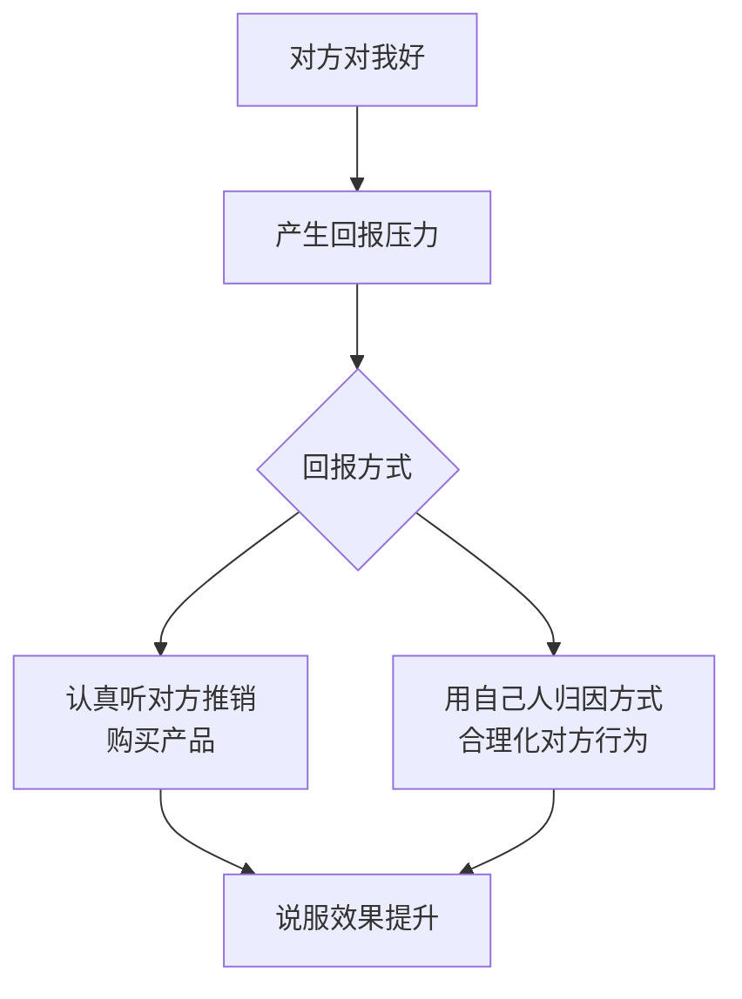
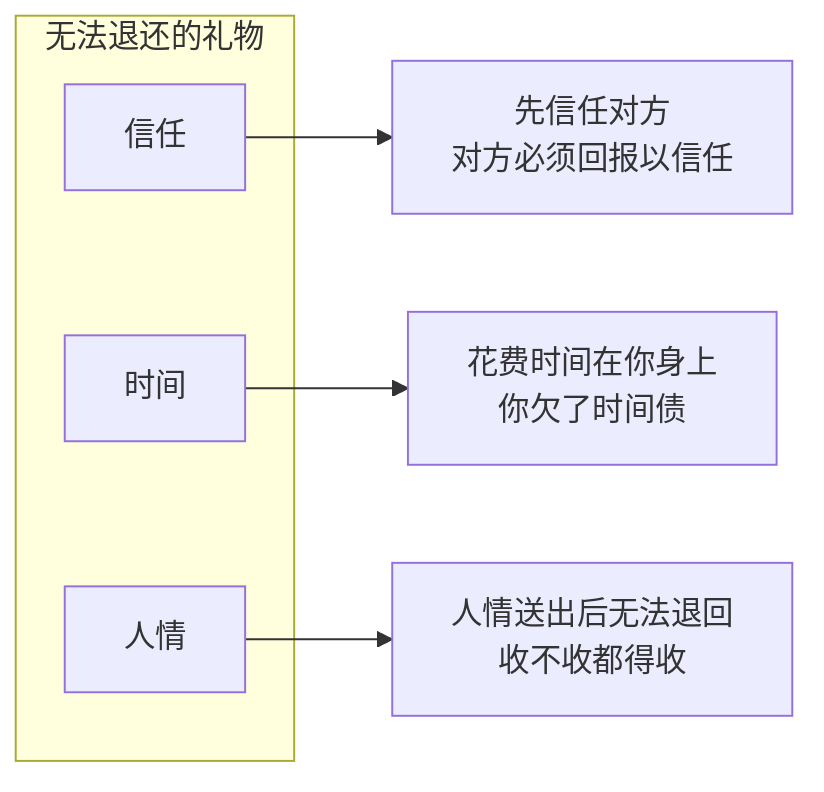

# 第17课：互惠法则

## 学习目标

- 理解互惠法则的心理学机制（群性）及其在说服中的作用
- 掌握"先给后取"策略的核心逻辑
- 学会送出"无法退还的礼物"——信任、时间与人情
- 识别特殊性与针对性在激发互惠中的关键作用
- 警惕过度馈赠的反效果

## 核心概念

### 互惠法则的本质

互惠法则由罗伯特·西奥迪尼（Robert Cialdini）在其《影响力》一书中提出，是人类社会最古老也最强大的驱动力之一。它的本质源于人类作为群居生物的演化遗产——**你对我好，我就有压力要回报**。

> [!TIP] 关键洞察
> 互惠的力量不在于礼物的物质价值，而在于它在大脑中按下一个"我必须回报"的按钮。即便是一杯免费的水，也能产生和一瓶可乐同样的互惠效果。

### 可乐实验

经典的可乐实验揭示了互惠法则的运作方式：

**实验设计**：大学生在休息室等待时，实验人员假扮的同学递上一瓶可乐。之后，该同学开始推销抽奖券。

**实验结果**：
- 事前被请喝可乐的一组：购买彩票的意愿是另一组的两倍以上
- 即使可乐换成一杯免费的水，效果依然显著

**延伸实验**：当实验人员以粗鲁方式接电话时：
- 没喝可乐的人：内部归因——"这个人没家教、粗鲁"
- 喝了可乐的人：外部归因——"是对方太烦人，他勇于拒绝，是个真汉子"

喝过可乐的人会用"自己人"的归因方式来解释对方的负面行为，这是互惠的另一种回馈形式。

### 计程车诈骗案例

这是一个教科书级别的互惠法则应用：

1. 乘客先给司机1000元押金，说"怕你担心我会跑，钱先放你这里"
2. 下车买茶叶后回来说茶叶太贵，要回1000元，再向司机"借"3000元
3. 司机明知风险却难以拒绝——因为对方刚"送"了价值1000元的信任
4. 司机说不出"万一你跑了怎么办"，因为对方刚刚信任了他

**核心机制**：对方送的不是1000元，而是**信任**——这是无法退还的礼物。

### 奎什纳教团募款

美国奎什纳教团转型募款方式：
- 旧方式：流浪汉模样弹吉他募款，效果极差
- 新方式：穿白衬衫的年轻人送上一朵小白花（免费礼物）
- 结果：收到花的人路过募款箱时感到压力，纷纷投钱

人们发现：只要把花丢掉（象征退回了礼物），压力就消失了。但如果是小国旗（不能丢），压力就无法解除。

## 如何送出有份量的"礼物"

### 三大无法退还的礼物

#### 1. 信任

先付出信任，对方会感受到压力，必须回报以信任。计程车案例就是典型。

#### 2. 时间

销售人员在你身上花费的时间是不可退还的礼物。

- 百货公司售货员跟在身边介绍：你在占用她的时间，产生回报压力
- 登门推销吸尘器：单亲妈妈花了40分钟帮你吸地，最后你无法空手让她离开
  - 1000美金的吸尘器太贵？那10美金的万能抹布就变成了"赎罪券"
  - 你不买吸尘器是因为贵，但什么都不买就太没有人情了

#### 3. 人情

人情债最难还——荆轲刺秦王的故事中，燕太子丹用极端方式送出无法退还的人情：
- 荆轲随口夸千里马的肝好吃 → 太子丹杀马取肝
- 荆轲夸宫女手漂亮 → 太子丹砍下手呈上
- 相比之下，曹操送给关羽的金银财宝都可以退还，所以关羽"封金辞曹"毫无心理负担

### 特殊性与针对性

> [!TIP] 关键洞察
> 互惠的关键不在于"我给了你什么"，而在于"我本可以不给，但我特意为你做了这件事"。

**特殊性**：我本来可以不做这件事
**针对性**：我是专门为你做的

海底捞案例：
- 服务员特意为包间客人拿来刚出锅的虾片："怕你们出去拿的时候已经凉了"
- 这比公司规定"每位客人赠送一份虾片"的互惠效果强得多

陌生老板的一碗面 vs 妈妈的一百碗面：
- 面店老板：本来不用为你煮面，但特意为你做了 → 感恩
- 妈妈：你也要吃饭，我也要吃饭，顺带做了 → 感受不到针对性

### 过度馈赠

> [!WARNING] 大恩如大仇
> 礼物太贵重，对方"无以为报"时，大脑会用粉红泡泡机制启动自我合理化：
> "这不是你给我加的薪，是我本来就该拿这么多的"

加薪2000元 → 努力工作回报公司（互惠启动）
加薪20000元 → 原来我之前都领少了（自我合理化）

## 案例分析

**案例一：超市试吃**
你很难试吃小香肠后不认真听介绍就直接走人。吃人家烤的小香肠，就觉得有义务听介绍，这就是最简单的互惠机制。

**案例二：送礼被拒**
有人想送印有孩子照片的杯子给一位妈妈，但对方一直拒绝。真正的解决方案不是换个形式的杯子，而是送"关注"——"我一直在关心你的孩子，有什么好的我会想着你"。这个"在意"本身就已经是礼物了。

## 实战应用

### 三步启动互惠法则

1. **送出无法退还的礼物**
   - 信任：先相信对方
   - 时间：认真投入时间了解对方
   - 人情：让对方感受到你的特别关照

2. **强调特殊性与针对性**
   - "我本来不用这么做"
   - "但我是为了你才做的"
   - 让对方感受到这是专属的关照

3. **避免过度馈赠**
   - 礼物价值不宜过高
   - 让对方"有回报的可能"，而不是"无以为报"

> [!QUESTION] 自测练习
> 你是一家健身房的销售。一位潜在客户走进店里，看起来有些犹豫。你如何运用互惠法则来开启对话，让对方更有可能听你介绍会员方案？

查看答案

**参考答案：**
1. **送出时间的礼物**：主动花10分钟带客户参观全部设施，认真介绍每个区域的功能。不要急着推销，而是让他感受到你在认真投入时间。
2. **送出专业知识的礼物**：免费帮他做一次体态评估或体能测试，给出一份简单的建议。这本来是要收费的服务，你特意为他做了。
3. **强调针对性**："我看您最近应该很少运动（观察到的细节），所以我特意带您看了我们最受欢迎的几个区域，您应该会喜欢这个动感单车区。"
4. **避免过度**：不要一上来就送大礼包或巨额折扣。
5. **拒绝与退让（下一课内容）**：如果对方对年卡没兴趣，可以退一步说："那至少让我帮您安排一次免费体验课，您感受一下再决定？"

关键在于：先让他欠你一个"人情（时间+关注）"，再提出下一步请求。

## 下一步

- **[第18课：高球策略与低球策略](./0018-gao-qiu-ce-lve-yu-di-qiu-ce-lve.md)**：学习如何利用对比法则，通过"先大后小"和"先小后大"的策略来提高说服成功率
- **[第19课：一致性原理](./0019-yi-zhi-xing-yuan-li.md)**：探索如何通过建立人设承诺，让对方做出与自己人设一致的行为