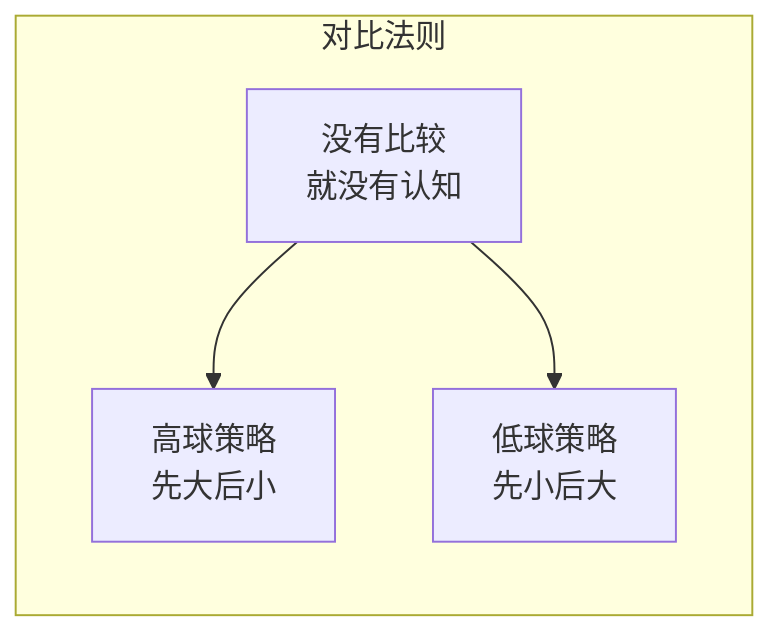
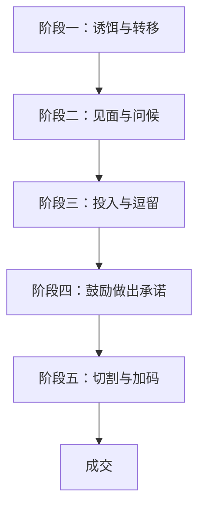

# 第18课：高球策略与低球策略

## 学习目标

- 理解对比法则的心理学基础——"没有对比就看不到东西"
- 掌握高球策略（Door-in-the-Face）：先提大要求被拒，再提真正的小要求
- 掌握低球策略（Foot-in-the-Door）：先从小承诺开始，逐步升高
- 学会在不同场景中选择合适的策略
- 理解"拒绝与退让"策略中责任感与满意度的提升机制

## 核心概念

### 对比法则的基础——人只能看到差异

马蒂斯曾说："我画的不是物体，我画的是差异。"人对世界的认知建立在比较之上：

- 视觉上：我们看到的是物体与背景的边缘差异，而非物体本身
- 认知上：老师凶不凶？——和谁比？同学好不好？——和谁比？
- 消费上：高露洁有107款牙膏，97%成分相同，但每一点微小差异都为消费者提供了"比较"的乐趣

### 高球策略（Door-in-the-Face）

**定义**：先提出一个对方几乎必然会拒绝的过高要求，被拒后，再提出你真正想要的那个较小要求。

**经典实验——少年犯动物园**：
- 直接请求：83%的人拒绝"周末带少年犯去动物园玩一天"
- 拒绝与退让：先问"每周花两小时辅导少年犯课业，持续两年"（全部拒绝），再问"那周末带他们去动物园玩一天呢？" → 50%的人同意

**加拿大社区服务实验**验证了后续行动率：
- 直接请求组：29%答应，实际出席率50%
- 拒绝与退让组：76%答应，实际出席率85%

**美国捐血实验**验证了长期参与率：
- 直接请求组：日后愿再来捐血的比例43%
- 拒绝与退让组：日后愿再来捐血的比例84%

> [!TIP] 关键洞察
> 对方拒绝你的那一刻，恰恰是他最容易答应你的时刻。因为：
> 1. **互惠让步**：你觉得我让步了，你也应该让步
> 2. **责任感**："我争取到的结果，我要负责"
> 3. **满意度**："我通过谈判获得了更好的条件"

### 低球策略（Foot-in-the-Door）

**定义**：先让对方做出一个小的承诺，然后逐步升高要求，让对方一步步走向最终目标。

**Gasio的汽车销售五步法**：

**阶段一：诱饵与转移**
- 给出一个极低的价格，让客户到店
- 客户到店后，以各种方式"转移"——车卖完了、价格听错了、转给另一个销售
- 关键是：**只要人到现场，成功了一大半**

**阶段二：见面与问候**
- 绝对不问是非题（"需要帮忙吗？"）
- 只问开放题（"您喜欢这辆车的哪一点？"）
- 延长对话时间，让对方投入更多

**阶段三：投入与逗留**
- 带客户逛一圈，先看最贵的车，再看便宜的
- 投入时间越长，空手而归的心理压力越大
- 即使客户说"告诉我价格就好"，也绝不报价

**阶段四：鼓励做出承诺**
- "您愿意出多少？夸张点也没关系"
- 只要客户出价，心理上就等于拥有了这辆车（心理所有权）

**阶段五：切割与加码**
- 永远不一次性加价，而是拆成小议题
- "加2000换五年保固好吗？""加3000送免费换机油"
- 每一次都是"加一点点"，而非大幅跳价

**低球策略的核心机制——逐步升高承诺**：

人的每一次改变，都只跟**前一步**做比较，而不是跟第一步做比较。

> [!TIP] 关键洞察
> 所有看起来突破底线的行为，都是下一次改变的起点而已。每一次突破，下一次就直接从突破点开始，永远不会倒退。

## 案例分析

### 案例一：拒绝后还能要什么？

销售遇到客户拒绝购买时，不要只锁定一个目标。对方拒绝后，你还可以要：

1. **推荐**："那您可以帮我推荐其他可能有兴趣的朋友吗？"
2. **转发**："不买没关系，可以帮我转发链接吗？"
3. **反馈**："可以告诉我为什么这个产品吸引不了你吗？"

对方刚拒绝你，正是最不好意思的时刻，最容易帮你这些小忙。

### 案例二：夜总会招聘——深水区的低球策略

1. 登报招聘正经会计（真需要）
2. 会计人手不够时"帮忙端端水果"
3. 端水果发现工资不如端盘子的，主动要求转岗
4. 端盘子时发现陪酒工资更高，主动要求陪酒
5. 一步步走入深渊

**关键**：每一步只比前一步多改变"一点点"，当事人不会觉得有什么了不起，回首才发觉变化好大。

### 案例三：恋爱中的低球

- 牵手后，下一次见面直接从牵手开始
- 接吻后，下一次直接亲吻
- 发生关系后，下一次直接发生关系
- 每次突破都是下一次的起点，永远不会倒退

### 案例四：校园霸凌——零容忍的必要性

霸凌不是突然发生的，而是一连串低球策略的累积：
1. 嘲笑绰号 → 2. 丢小物品 → 3. 丢书包 → 4. 推倒 → 5. 脱裤子 → 6. 殴打脱衣拍照

**为什么需要零容忍？** 因为低球一旦启动就停不下来，唯一的方法是一开始就不准有。

## 实战应用

### 如何选择策略？

| 场景 | 推荐策略 | 原因 |
|------|---------|------|
| 需要对方做出大改变 | 高球策略 | 先提更难的要求，让对方觉得退让后的要求更合理 |
| 需要对方持续投入 | 低球策略 | 从小承诺开始，逐步升高 |
| 销售破冰 | 高球 → 拒绝 → 退让 | 先推高端产品，再推主力产品 |
| 改变习惯/培养行为 | 低球策略 | 先做最小行动，逐步加大 |
| 募款/公益 | 高球策略 | 先问能否持续奉献，再问单次帮助 |

### 实战技巧清单

**高球策略要点**：
- 高球要足够高，让对方觉得拒绝是合理的
- 退让的要求必须是你的真实目标
- 退让要及时提出，不要留空白

**低球策略要点**：
- 第一步越小越好，让对方几乎不可能拒绝
- 每一步只比前一步大一点点
- 永远不要一次性要求大幅度改变

> [!QUESTION] 自测练习
> 你是一个公益组织的负责人，需要在社区推广垃圾分类。你准备采用高球策略来募捐，请问你会如何设计对话？

查看答案

**参考设计：**

**第一步（高球）**：
"您好，我们正在推动社区垃圾分类计划。您是否愿意每周花3小时，担任我们社区的垃圾分类督导员，持续一年？"

（对方大概率会拒绝——"我太忙了""我没时间"）

**第二步（退让——真实目标）**：
"完全理解，这个要求确实比较高。那您是否愿意在这个周末，花1小时参加我们社区的垃圾分类宣传活动？只需要帮忙发发传单就好。"

**为什么有效？**
1. 从"每周3小时持续一年"退让到"周末1小时"，对比鲜明
2. 对方刚拒绝了你，有压力要回报你的让步
3. 对方会认为这个周末的活动是他"争取来的"，责任感更强
4. 如果他周末参加了，未来转换成长久志愿者的概率更高

**进阶**：如果对方连周末1小时都不行，你还能再退到什么程度？
- "那至少可以帮我们把宣传海报转发到朋友圈吗？"
- "或者您可以扫码关注我们的公众号，获取更多环保信息？"

记住：拒绝之后，你还能要到别的东西。

查看答案：低球策略练习

**如果对方愿意周末参与，如何用低球策略让对方成为长期志愿者？**

1. **第一次**："感谢您来参加活动！结束后方便留个联系方式吗？我们以后有活动可以通知您。"
2. **第二次**："这次有个小任务——拍张垃圾分类的照片发朋友圈可以吗？就一分钟。"
3. **第三次**："下周六还有一场活动，只需您来1小时，行吗？"
4. **第四次**："我们缺一个小组长，就负责通知和协调几个人，每次也就多花10分钟，您愿意试试看吗？"

每一步都只比前一步多一点点，对方不会觉得有什么了不起，但回头看已经走了很远。

## 下一步

- **[第17课：互惠法则](./0017-hu-hui-fa-ze.md)**：互惠法则为高球策略提供了基础——拒绝后对方让步的互惠压力
- **[第19课：一致性原理](./0019-yi-zhi-xing-yuan-li.md)**：一致性与低球策略密切相关——小承诺锁定人设后，后续行为自然被牵引